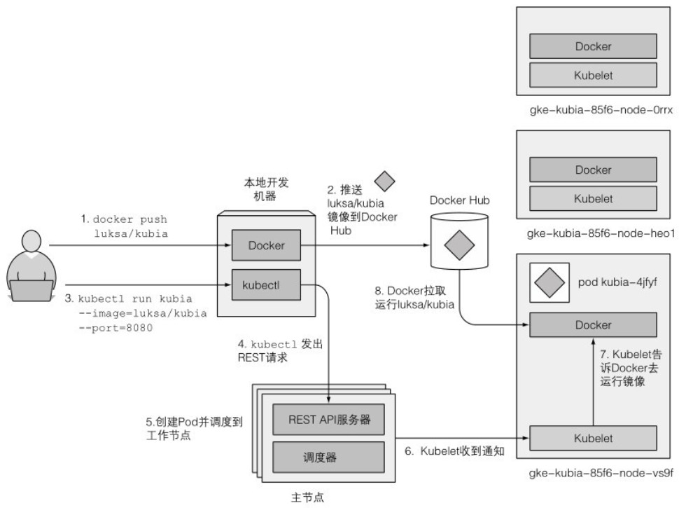
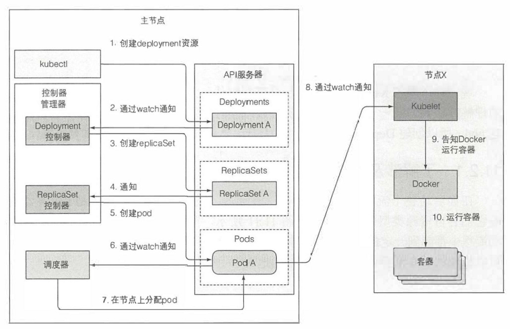

# 发布流程

## 应用发布流程

在Kubernets中发布应用流程如下:

- 首先需要将应用打包进一个或多个容器镜像.
- 将打包好的镜像推送到镜像仓库.
- 将应用描述发布到API服务器.
- API服务器通过调度器指示可用工作节点上的Kubelet拉取镜像运行容器.

可以用下图来作为简单示例:




## 事件链

以一个包含Deployment清单的YAML文件举例,各控制器协同工作如下:



- 创建Deployment资源

  kubectl通过HTTP POST请求发送清单到API服务器.API服务器检查Deployment定义,创建Deployment资源,将其储存到etcd,返回响应给kubectl.

- Deployment控制器生成ReplicaSet

  通过监听API服务器的Deployment控制器收到新Deployment对象通知时,会按照Deployment当前定义,发送创建ReplicaSet请求给API服务器,创建ReplicaSet资源.

- ReplicaSet控制器创建pod资源

  ReplicaSet控制器接收到新ReplicaSet对象通知时,考虑到replica数量,pod选择器,检查是否有足够的满足选择器的pod.之后控制器会基于ReplicatSet的pod模板,发送创建pod请求给API服务器,创建pod资源.

- 调度器分配节点给新pod

  新创建的pod目前保存在etcd中,没有关联运行节点.调度器监控到这样的pod后,为其选择最佳节点分配给pod.pod的定义现在包含它应该运行在哪个节点.

- Kubelet运行pod容器

  节点上Kubelet通过API服务器监听pod变更,发现有分配到本节点的pod后,会检查pod定义,然后命令容器运行时来启动pod容器.


## 集群事件

控制面板组件和Kubelet执行动作时,都会发送事件给API服务器.发送事件通过创建事件资源来实现.可以通过kubectl get events命令获取事件.

更常见方式是搭配--watch参数,在发布时来持续观察事件:

```sh
[root@server4-master ~]# kubectl delete -f kubia-st.yaml 
statefulset.apps "kubia" deleted
[root@server4-master manifests]# kubectl get events --watch
LAST SEEN   TYPE     REASON    OBJECT        MESSAGE
0s          Normal   Killing   pod/kubia-0   Stopping container kubia
0s          Normal   Killing   pod/kubia-1   Stopping container kubia
0s          Normal   Killing   pod/kubia-2   Stopping container kubia
0s          Warning   FailedToUpdateEndpoint   endpoints/kubia-public   Failed to update endpoint default/kubia-public: Operation cannot be fulfilled on endpoints "kubia-public": the object has been modified; please apply your changes to the latest version and try again
```


## 发布后工作

应用运行起来后Kubernets的工作:

- API服务器会不断确认应用部署状态是否和描述一致,如果实例之一停止了正常工作,比如进程崩溃或停止响应,Kubernetes会自动重启它.

- 如果整个工作节点宕机无法访问,故障节点上运行的所有容器会调度到新节点运行.

- 当程序运行时,可以手动随时调整副本数量,也可根据节点状态实时指标自动调整副本数.
- 当容器在集群内频繁调度时,服务代理将确保服务始终可用.

