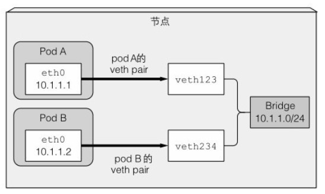
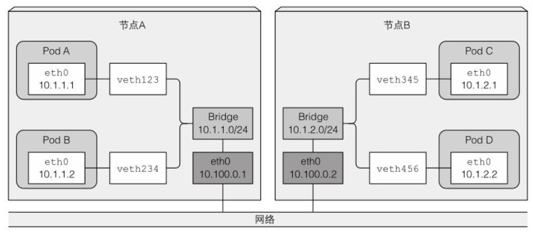

# 网络

## 网络插件

在K8s中网络由CNI(Container Network Interface)插件建立,可部署于K8s集群之外.无论用哪种网络技术,要能满足pod可以跨工作节点互相通信,且通信时会保留源和目标IP地址,没有使用NAT网络地址转换操作.

pod到节点通信也应用了无NAT通信,只有pod和Internet上的服务通信时,向外发送包的源地址会被改成Node的IP地址.

常用的CNI插件有:Calico, Flannel, Romana, Weave Net等.要使用CNI,启动Kubelet需要加入--network-plugin=cni参数.

安装一个网络插件只需部署一个包含DaemonSet以及其他支持资源的YAML.DS会向所有集群节点部署一个网络代理,然后绑定CNI接口到节点.

## Ip地址

K8s中有三种网络地址,三种IP之间通信采用的特殊路由规则:

- Node IP

  每个节点的物理网卡的IP地址.K8s集群外节点访问集群内的服务时,必须通过Node IP通信

- Pod IP

  每个Pod的IP地址,由Docker引擎根据Docker0网桥的IP地址段进行分配,通常是一个虚拟的二层网络.

  Pod能够彼此直接通信,而真实流量通过Node IP所在物理网卡流出.

 - Cluster IP
   
   Service上的Cluster IP是一个虚拟IP,来源于Cluster IP地址池,仅仅作用于Service对象.
   
   Cluster IP无法被PING通因为没有实体网络对象来响应.只能结合Service Port组成一个具体的通信端口,单独IP不具备通信能力.

## 同节点Pod通信

基础容器(Pause容器)启动前会为容器创建一个虚拟网络接口对(veth pair),其中一个对的接口保留在主机的命名空间中(名为vethXXX,可在节点中直接查看到),而其他的对被移入容器网络命名空间,并重命名为eth0,两个虚拟接口就像管道的两端.

主机网络命名空间的接口会绑定到容器运行时配置使用的网络桥接上,从网桥地址段中取IP地址赋值给容器内的eth0网络接口,所有容器数据都通过eth0发送给网桥,再到目标pod.

如下图所示:

如果pod A发送网络包到pod B,报文会通过pod A的veth对到网桥然后经过pod B的veth对,所有节点上的容器都会连接到同一网桥.

## 不同节点Pod通信

有多种连接不同节点上的网桥方式,可以通过overlay或underlay网络,或者常规的三层路由.

跨整个集群的pod的IP地址必须唯一,所以跨节点的网桥必须使用非重叠地址,段防止IP地址冲突.例如节点A上的网桥使用10.1.1.0/24地址段,则节点B上的网桥使用10.1.2.0/24地址段.

通过三层网络支持跨节点通信,两个节点的路由表会被配置成图下这样:

上面方案仅对节点之间连到相同网关,之间没有任何路由时有效.否则路由器会丢包,因为源和目标IP都是私有IP地址.

使用SDN(软件定义网络)技术可以简化问题,让节点忽略底层网络拓扑,就像连接到同个网关.从pod发出的报文会被封装,通过网络发送到其他pod网络,然后解包以原始格式传递给其他pod.

