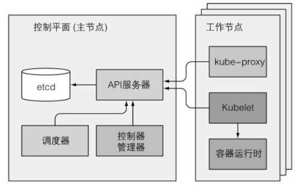

# 节点和组件

## 节点

一个k8s集群由很多节点组成,这些节点被分为两种类型:

- 主节点(Master)
  集群的控制节点,承载控制和管理整个集群系统.负责如为用户暴露API,跟踪其他服务器的健康状态,以最优的方式调度工作负载,以及编排其他组件之间的通信等任务.可以运行多个Master以提高可用性.

- 工作节点(Node)
  运行用户实际部署的应用,由Master管理.负责接收来自Master的工作指令,并依据指令创建或销毁pod对象,以及调整网络规划以合理地路由和转发流量等.Node运行在Linux系统上,可以是物理机或虚拟机.

Node可以在运行期间动态加入到集群中,K8s将所有Node的资源集结在一起,形成一台超级服务器.用户将应用部署在其上时,Master会使用调度算法将其自动指派指某个特定的Node运行.

主节点和工作节点中的组件联系如下图:



### 主节点

主节点的控制面板负责控制并使得整个集群正常运转.它包含多个组件,组件可以运行在单个主节点上或者通过副本分别部署在多个主节点以确保高可用性.这些组件是:

- API 服务器(kube-apiserver)
  负责其他控制面板组件的通信,提供了HTTP Rest接口的关键服务进程,是集群的前端接口.
- Scheculer 调度器(kube-scheduler)
  调度应用,为应用的每个可部署组件分配一个工作节点.
- Controller Manager 控制器管理器(kube-controller-manager)
  执行集群级别的功能,如复制组件,持续跟踪工作节点,处理节点失败等,保证资源处于预期状态.
- etcd 分布式持久化储存
  一个可靠的分布式数据储存,能持久化储存群集配置和各种资源的状态信息.当数据发生变化时,etcd会快速地通知相关组件.

可以通过API服务器暴露的ComponentStatus的API资源查询:

```sh
[root@server4-master ~]# kubectl get componentstatuses
Warning: v1 ComponentStatus is deprecated in v1.19+
NAME                 STATUS      MESSAGE                         ERROR
scheduler            Healthy     ok 
controller-manager   Healthy     ok     
etcd-0               Healthy     {"health":"true","reason":""}    
```

### 工作节点

工作节点是运行容器化应用的机器.运行,监控和管理应用服务的任务是由以下组件完成:

- 容器运行时(Container runtime)
  负责镜像管理以及pod和容器的真正运行(CRI).默认为Docker Engine,也可用其他类型容器引擎.

- Kubelet(kubelet)
  与API服务器通信,并管理它所在节点的容器,与容器运行时交互,是Node的客户端.当调度器确定在某个Node上运行pod后,会将具体配置信息发送给Kubelet来创建和运行容器,并向Master报告运行状态.同时也负责Volume(CVI)和网络(CNI)的管理.

- Proxy 服务代理(kube-proxy)
  每个Node都会运行Proxy服务,它负责将访问Service的数据流转发到后端容器(服务发现).如果有多个pod副本,还负责组件之间的负载均衡网络流量.

可以通过kubectl describe命令来查询工作节点的详细信息:

```sh
[root@server4-master manifests]# kubectl describe node server4-master 
Name:               server4-master
Roles:              control-plane,master
Labels:             beta.kubernetes.io/arch=amd64
                    beta.kubernetes.io/os=linux
                    kubernetes.io/arch=amd64
                    kubernetes.io/hostname=server4-master
                    kubernetes.io/os=linux
```


## 组件

除了控制面板和运行在节点上的组件,K8s集群还依赖第三方组件以提供完整功能,主要有下面几个:

- CoreDNS: 为集群提供服务注册和服务发现的DNS解析服务.
- Dashboard: 用来管理集群中的应用和集群本身的Web UI.
- Heapster: 容器和节点的性能监控分析系统,已被抛弃,由Prometheus结合其他组件取代.
- Ingress: 在应用层实现HTTP负载均衡机制,它仅是一组路由规则的集合,需要通过Ingress Controller发挥作用.
- 容器网络接口插件: 常用的有Flannel和Calico.

K8s系统组件之间只能通过API服务器通信.API服务器和其他组件的连接基本都是由组件发起的.只有使用kubectl获取日志,attach连接到容器(附属到容器中运行的主进程上)或运行kubectl端口转发时,API服务器会向Kubelet发起连接.

控制面板的组件可以简单地分割在多台服务器上,多个实例并行工作以提高可用性.但是调度器和控制管理器在给定时间内只能有一个实例起作用,其他实例待命状态.

控制面板的组件部署方式可以是作为pod来运行,Kubelet是唯一一直作为常规系统组件来运行的组件:

```sh
[root@server4-master ~]# kubectl get po -o custom-columns=组件:metadata.name,节点:spec.nodeName --sort-by spec.nodeName -n kube-system 
组件                                       节点
coredns-7f6cbbb7b8-jtqxp                 server4-master
coredns-7f6cbbb7b8-vvtxz                 server4-master
etcd-server4-master                      server4-master
kube-apiserver-server4-master            server4-master
kube-controller-manager-server4-master   server4-master
kube-proxy-d455c                         server4-master
kube-scheduler-server4-master            server4-master
kube-proxy-fnvff                         server5-node1
kube-proxy-wkgjf                         server6-node2
[root@server4-master ~]# kubectl get po -o custom-columns=组件:metadata.name,节点:spec.nodeName --sort-by spec.nodeName -n calico-system
组件                                         节点
calico-kube-controllers-767ddd5576-b7dpp   server4-master
calico-node-qfsms                          server4-master
calico-typha-7b6f4887f8-mkf7m              server4-master
calico-node-2cp86                          server5-node1
calico-typha-7b6f4887f8-8755m              server5-node1
calico-node-gnfth                          server6-node2
calico-typha-7b6f4887f8-7qmzm              server6-node2
```

如上所示,所有的控制面板组件在主节点上作为pod运行.每个工作节点运行kube-proxy和位于calico-system命名空间的网络插件.