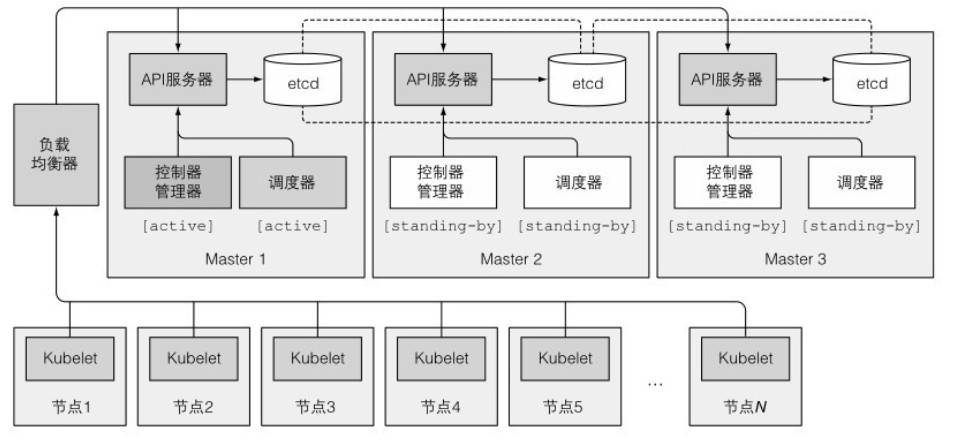

# 高可用集群

## 应用高可用

在K8s上运行应用最重要的理由是,保证运行不被中断,尽量少人工接入基础设置导致的宕机.

最普遍的做法是使用Deploy资源运行应用,配置合适数量的副本集,其他交给K8s来处理.即使应用不支持水平扩展,仍然可以使用Deploy来发布单个副本,当应用不可用时,会快速替换为一个新的.

还可以在运行一个活跃的应用同时再运行一个附加的非活跃复制集,通过领导选举机制来确保只有一个有效.这样保证领导者宕机时,非活跃复制集立马顶上.


## 集群高可用性

整个K8s中最重要的是Master控制节点,假如Master所在的服务器宕机,会导致k8s集群不可用.因此可以通过运行多个主节点的方式提高可用性.下面是三主节点高可用集群图示:




## Etcd集群

因为etcd本身就设计给分布式系统,所以只需要将其运行在合适数量机器上,使得它们能够互相感知.实现方式是修改每个实例配置包含其他实例的列表,etcd会跨实例复制数据.

3个节点允许其中1个节点宕机,最好是5到7个节点,这样集群可以分别容忍2或3个节点宕机.超过7节点数量反而会影响性能.


## 多实例API服务器

API服务器是无状态的,因为数据储存在etcd中,API服务器不做缓存,所以可以运行随意数量API服务器,它们之间不需要感知对方存在.

通常一个API服务器会和每个etcd实例搭配,因为每个API服务器只和本地etcd实例通信.这样etcd实例便无需任何负载均衡器,只需要对API服务器做负载均衡就可以了.


## 控制器和调度器的高可用性

因为控制器和调度器都会积极地监听集群状态,发生变更时做出相应操作.所以多实例运行这些组件会导致它们执行同一个操作,产生竞争状态,从而造成非预期影响.

因此当运行这些组件的多实例时,给定时间内只有一个实例有效.它们之间通过选举机制来确定活动实例(--leader-elect选项默认为true),其他实例处于待命状态,只有领导者宕机时,剩余实例将选举新领导者接管工作.

控制器和调度器可以和API服务器与etcd搭配运行.如果运行在不同机器上,需要通过负载均衡器连接到API服务器.


## 选举领导机制

控制平面组件使用的领导选举机制在选举领导时,组件不需要互相通信.实现方式是在API服务器中创建一个资源,例如Endpoint资源:

```sh
[root@server7-master ~]# kubectl get endpoints kube-scheduler -n kube-system -o yaml
apiVersion: v1
kind: Endpoints
metadata:
  annotations:
    control-plane.alpha.kubernetes.io/leader: '{"holderIdentity":"server7-master_6725412a-94ed-4d16-ae7f-3f6cd7543c40","leaseDurationSeconds":15,"acquireTime":"2021-11-03T07:46:00Z","renewTime":"2021-11-03T08:09:49Z","leaderTransitions":1}'
```

在注解中control-plane.alpha.kubernetes.io/leader里面有个holderIdentity字段,包含当前领导者名字.

其原理是乐观锁保证如果有多个实例尝试写内容到资源,只有一个会成功.第一个成功将名字填入holderIdentity字段的实例会成为领导者.

一旦成为领导者,默认每2秒钟必须更新holderIdentity字段,这样所有其他实例就知道它是否工作.一旦停更一阵子,其他实例会尝试将自己名字写到资源中顶替领导者.

