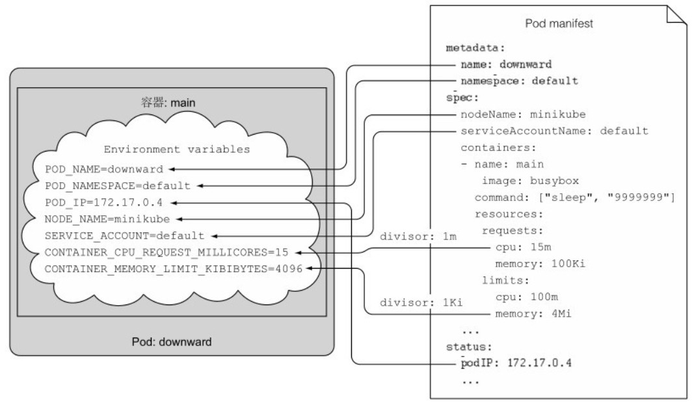
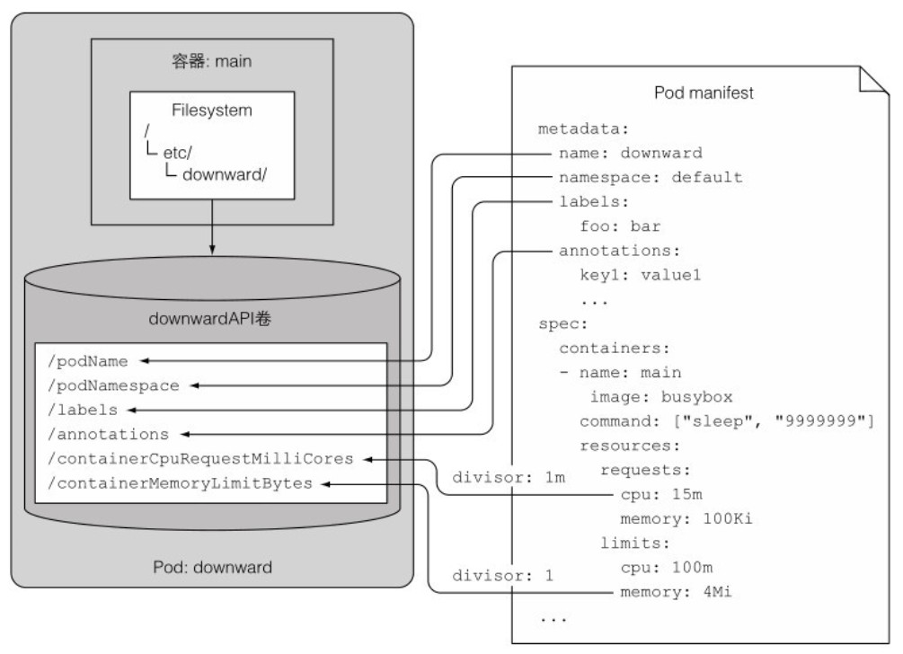
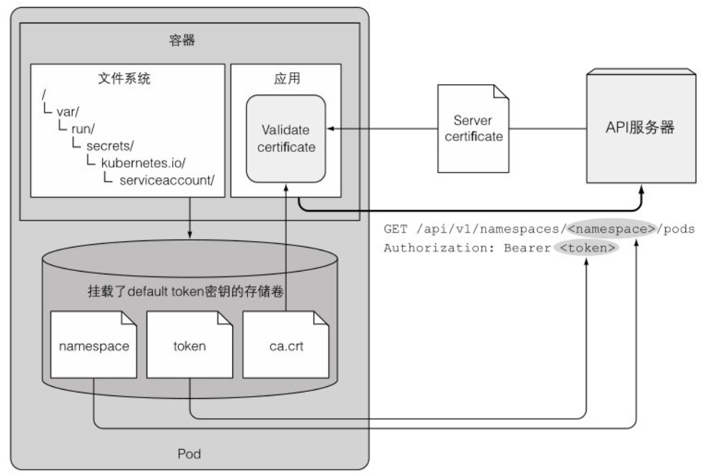

# API服务器

K8s API服务器作为中心组件,其他组件或客户端都会调用它.API服务器以RESTful API的形式提供了可以查询,修改集群状态的CRUD(Create, Read, Update, Delete)接口,将状态储存到etcd中.

API服务器除了提供一种一致的方式将储存对象,也对这些对象做校验,保证对象合法性.除了校验还会处理乐观锁.

API服务点的客户端之一是kubectl.

## 工作流程

当kubectl通过一个HTTP POST请求将配置文件内容发布到API服务器后,API处理的流程如下:

- 通过认证插件认证客户端

  首先API服务器需要认证发送请求的客户端.通过轮流调用配置在API服务器上的单或多个认证插件,直到确认请求发送者的身份.根据认证方式,用户信息可以从客户端证书或HTTP标头获取.插件抽取客户端的用户名,用户ID和归属组.

- 通过授权插件授权客户端

  API服务器还可以配置使用单或多个授权插件,来决定认证用户是否可以对请求资源执行请求操作.一旦确认了用户拥有权限,API服务器进入下一步操作.

- 通过准入控制插件验证AND/OR修改资源请求

  如果请求尝试创建,修改或者删除资源,请求需要经过准入控制插件的验证.这些插件会因为各种原因修改资源,可能会初始化资源定义中漏配的字段为默认值,可能修改并不在请求中的相关资源,同时也会因为某些原因拒绝一个请求.

  如果请求只是尝试读取数据,则不会做准入控制的验证.

  常用的准入控制插件包括:AlwaysPullImages, ServiceAccount, NamespaceLifecycle, ResourceQuota等.

- 验证资源以及持久化储存

  请求通过了所有的准入控制插件后,API服务器会验证储存到etcd的对象,然后返回一个响应给客户端.


## 资源变更

API服务器只负责启动控制器,以及其他一些组件来监控已部署资源的变更.控制面板可以请求订阅资源被创建,修改或删除的通知.

客户端通过创建到API服务器的HTTP连接来监听变更.每当更新对象,服务器把新版本对象发送至所有监听该对象的客户端.

kubectl工具作为API服务器的客户端之一也支持监听资源.例如部署应用时,可以通过在get命令后加--watch参数,每当有变化就会收到通知:

```sh
[root@server4-master ~]# kubectl get po --watch
NAME      READY   STATUS    RESTARTS   AGE
kubia-0   1/1     Running   0          19h
kubia-1   1/1     Running   0          19h
kubia-2   1/1     Running   0          19h
```


## Downward API

对于不能预先知道的数据,K8s Downward API允许我们通过环境变量或文件(downwardAPI卷)来对外暴露(传递给pod中的容器)pod的元数据,这种方式主要是将在pod的定义和状态中取得的数据作为环境变量和文件的值.

目前可以给容器传递以下数据:

- Pod名称
- Pod的IP
- Pod所在命名空间
- Pod运行节点名称
- Pod运行所属的服务账户名称
- 每个容器请求的CPU和内存使用量
- 每个容器可使用的CPU和内存限制
- Pod标签
- Pod注解

由于可以在pod运行时修改Pod的标签和注解,因此不能通过环境变量来暴露修改后的新值.

Downward API在处理部分数据已在环境变量中的现有应用时特别有用,不需要修改应用或者写脚本来暴露元数据.

### 通过环境变量暴露

创建一个简单的单容器来暴露pod常见的7种数据:

```sh
[root@server4-master ~]# vi dow.yaml
apiVersion: v1
kind: Pod
metadata:
  name: downward
spec:
  containers:
  - name: main
    image: busybox
    command: ["sleep", "9999"]
    resources:
      requests:
        cpu: 15m
        memory: 500Ki
      limits:
        cpu: 100m
        memory: 8Mi
    env:
    - name: POD_NAME
      valueFrom:
        fieldRef:
          fieldPath: metadata.name
    - name: POD_NAMESPACE
      valueFrom:
        fieldRef:
          fieldPath: metadata.namespace
    - name: POD_IP
      valueFrom:
        fieldRef:
          fieldPath: status.podIP
    - name: NODE_NAME
      valueFrom:
        fieldRef:
          fieldPath: spec.nodeName
    - name: SERVICE_ACCOUNT
      valueFrom:
        fieldRef:
          fieldPath: spec.serviceAccountName
    - name: CONTAINER_CPU_REQUEST_MILLICORES
      valueFrom:
        resourceFieldRef:
          resource: requests.cpu
          divisor: 1m
    - name: CONTAINER_MEMORY_LIMIT_KIBIBYTES
      valueFrom:
        resourceFieldRef:
          resource: limits.memory
          divisor: 1Ki
```

其中fieldRef参考的数据,来自使用kubectl get po downward -o yaml展示的结果,resourceFieldRef参考的是spec.containers中的resources.如下图所示:



对于暴露的资源请求和限制变量,通过divisor设置了一个基数单位,最后暴露的是实际数据除以基数单位得到的值.例如CPU请求基数1 millicore,环境变量展示的值为15,内存限制基数1 Kibibyte,环境变量展示的值为8192.

创建完pod后,查询容器中所有的环境变量:

```sh
[root@server4-master ~]# kubectl exec downward -- env
SERVICE_ACCOUNT=default
CONTAINER_CPU_REQUEST_MILLICORES=15
CONTAINER_MEMORY_LIMIT_KIBIBYTES=8192
POD_NAME=downward
POD_NAMESPACE=default
POD_IP=10.244.244.211
NODE_NAME=server6-node2
```

所有在这个容器中运行的进程都可以读取并使用需要的变量.

### 通过downwardAPI卷传递

使用卷来暴露元数据需要显示地指定元数据字段:

```sh
[root@server4-master ~]# vi dow-v.yaml
apiVersion: v1
kind: Pod
metadata:
  name: downward
  labels:
    foo: bar
  annotations:
    key1: value1
    key2: |
      multi
      line
      value
spec:
  containers:
  - name: main
    image: busybox
    command: ["sleep", "9999"]
    resources:
      requests:
        cpu: 15m
        memory: 500Ki
      limits:
        cpu: 100m
        memory: 8Mi
    volumeMounts:
    - name: downward
      mountPath: /etc/downward
  volumes:
  - name: downward
    downwardAPI:
      items:
      - path: "podName"
        fieldRef:
          fieldPath: metadata.name
      - path: "podNamespace"
        fieldRef:
          fieldPath: metadata.namespace
      - path: "labels"
        fieldRef:
          fieldPath: metadata.labels
      - path: "annotations"
        fieldRef:
          fieldPath: metadata.annotations
      - path: "containerCpuRequestMilliCores"
        resourceFieldRef:
          containerName: main
          resource: requests.cpu
          divisor: 1m
      - path: "containerMemoryLimitBytes"
        resourceFieldRef:
          containerName: main
          resource: limits.memory
          divisor: 1
```

downward卷被挂载到/etc/downward/目录下,卷类型为downwardAPI,卷包含的文件会通过卷定义中的downwardAPI.items属性来定义.如下图所示:



在容器中查看:

```sh
[root@server4-master ~]# kubectl exec downward -- ls -lL /etc/downward
total 24
-rw-r--r--    1 root     root           337 Mar 15 22:12 annotations
-rw-r--r--    1 root     root             2 Mar 15 22:12 containerCpuRequestMilliCores
-rw-r--r--    1 root     root             7 Mar 15 22:12 containerMemoryLimitBytes
-rw-r--r--    1 root     root             9 Mar 15 22:12 labels
-rw-r--r--    1 root     root             8 Mar 15 22:12 podName
-rw-r--r--    1 root     root             7 Mar 15 22:12 podNamespace
[root@server4-master ~]# kubectl exec downward -- cat /etc/downward/labels
foo="bar"
```

当暴露容器级的元数据时,如资源限制或请求,必须指定容器名称.虽然方式复杂一些,但可以将一个容器的资源字段传递到处在同一pod中的另一个容器.


## Kubernetes API

通过Downward API的方式获取的元数据相当有限,如果需要知道其他pod或其他资源的信息,只能通过直接与API服务器进行交互.

### K8s REST API

可以通过kubectl cluster-info命令来获取服务器的地址,但是不能通过curl直接交互:

```sh
[root@server4-master ~]# kubectl cluster-info 
Kubernetes control plane is running at https://192.168.2.204:6443
CoreDNS is running at https://192.168.2.204:6443/api/v1/namespaces/kube-system/services/kube-dns:dns/proxy
[root@server4-master ~]# curl https://192.168.2.204:6443 -k
{
  "kind": "Status",
  "apiVersion": "v1",
  "metadata": {
    
  },
  "status": "Failure",
  "message": "forbidden: User \"system:anonymous\" cannot get path \"/\"",
  "reason": "Forbidden",
  "details": {
    
  },
  "code": 403
```

代码403表示未授权访问,可以通过启动proxy代理与服务器交互:

```sh
[root@server4-master ~]# kubectl proxy
Starting to serve on 127.0.0.1:8001
[root@server4-master ~]# curl 127.0.0.1:8001
{
  "paths": [
    "/.well-known/openid-configuration",
    "/api",
    "/api/v1",
    "/apis/batch",
    "/apis/batch/v1",
    "/apis/batch/v1beta1",
```

服务器返回了一组路径的清单,也就是REST endpoint清单,这些路径对应了apiVersion定义的路径.以Job资源API组/apis/batch举例,下面有两个版本,常用的v1版本:

```sh
[root@server4-master ~]# curl 127.0.0.1:8001/apis/batch/v1
{
  "kind": "APIResourceList",
  "apiVersion": "v1",
  "groupVersion": "batch/v1",
  "resources": [
    {
      "name": "cronjobs",
      "singularName": "",
      "namespaced": true,
      "kind": "CronJob",
      "verbs": [
        "create",
        "delete",
        "deletecollection",
        "get",
        "list",
        "patch",
        "update",
        "watch"
      ],
      "shortNames": [
        "cj"
      ],
      "categories": [
        "all"
      ],
      "storageVersionHash": "sd5LIXh4Fjs="
    },
    {
      "name": "cronjobs/status",
      "singularName": "",
      "namespaced": true,
      "kind": "CronJob",
      "verbs": [
        "get",
        "patch",
        "update"
      ]
    },
    {
      "name": "jobs",
      "singularName": "",
      "namespaced": true,
      "kind": "Job",
      "verbs": [
        "create",
        "delete",
        "deletecollection",
        "get",
        "list",
        "patch",
        "update",
        "watch"
      ],
      "categories": [
        "all"
      ],
      "storageVersionHash": "mudhfqk/qZY="
    },
    {
      "name": "jobs/status",
      "singularName": "",
      "namespaced": true,
      "kind": "Job",
      "verbs": [
        "get",
        "patch",
        "update"
      ]
    }
  ]
}
```

在resources内包含了这个组中所有资源类型,资源对应可以使用的操作(create, delete, get...),和其他一些资源的信息.其中jobs/status是用来专门修改状态(恢复,打补丁,修改)的资源.

可以对/apis/batch/v1/jobs路径发送一个GET请求,来获取集群中所有Job的清单:

```sh
[root@server4-master ~]# curl 127.0.0.1:8001/apis/batch/v1/jobs
{
  "kind": "JobList",
  "apiVersion": "batch/v1",
  "metadata": {
    "resourceVersion": "656352"
  },
  "items": [
    {
      "metadata": {
        "name": "batch-job",
        "namespace": "default",
        "uid": "dfcb1eda-55fc-4a30-ad7c-4769d5baebc4",
        "resourceVersion": "656319",
```

获取到的清单包括所有命名空间中的Job,如果要返回指定Job,需要在请求URL中指定名称和命名空间:

```sh
[root@server4-master ~]# curl 127.0.0.1:8001/apis/batch/v1/namespaces/default/jobs/batch-job
{
  "kind": "Job",
  "apiVersion": "batch/v1",
  "metadata": {
    "name": "batch-job",
    "namespace": "default",
```

其得到的结果和kubectl get job batch-job -o json命令的结果一致.

### 从pod内与API服务器交互

一般pod没有kubectl可用,与API服务器交互要解决认证问题.这里使用一个安装了curl的镜像,通过在容器内的curl来测试与API服务器的交互结果:

```sh
[root@server4-master ~]# vi curl.yaml
apiVersion: v1
kind: Pod
metadata:
  name: curl
spec:
  containers:
  - name: main
    image: curlimages/curl
    command: ["sleep", "999999"]
[root@server4-master ~]# kubectl create -f curl.yaml
pod/curl created
[root@server4-master ~]# kubectl exec -it curl -- sh
/ $ env | grep KUBERNETES_SERVICE
KUBERNETES_SERVICE_PORT=443
KUBERNETES_SERVICE_PORT_HTTPS=443
KUBERNETES_SERVICE_HOST=10.96.0.1
/ $ curl https://kubernetes
curl: (60) SSL certificate problem: unable to get local issuer certificate
More details here: https://curl.se/docs/sslcerts.html
```

在容器内查询到API服务器的地址后,试着访问会提示证书问题.虽然可以通过-k选项来绕过https证书验证,但安全起见应该检查证书以验证API服务器身份,以避免中间人攻击,将应用验证凭证暴露给攻击者.

查看每个容器/var/run/secrets/kubernetes.io/serviceaccount目录下默认的Secret(token),其中包含的ca.crt可用来对API服务器证书进行签名.curl允许使用-cacert选项来指定CA证书路径:

```sh
/ $ ls /var/run/secrets/kubernetes.io/serviceaccount
ca.crt     namespace  token
/ $ curl --cacert /var/run/secrets/kubernetes.io/serviceaccount/ca.crt https://kubernetes
{
  "kind": "Status",
  "apiVersion": "v1",
  "metadata": {
    
  },
  "status": "Failure",
  "message": "forbidden: User \"system:anonymous\" cannot get path \"/\"",
  "reason": "Forbidden",
  "details": {
    
  },
  "code": 403
}
```

这次curl验证通过了服务器的身份,但提示提示匿名用户没查询权限.可以设置CURL_CA_BUNDLE环境变量简化掉curl指定CA证书的选项:

```sh
/ $ export CURL_CA_BUNDLE=/var/run/secrets/kubernetes.io/serviceaccount/ca.crt
```

下面需要获取API服务器的授权来进一步修改或删除部署在集群中的API对象.认证凭证能使用默认token来产生:

```sh
/ $ TOKEN=$(cat /var/run/secrets/kubernetes.io/serviceaccount/token)
/ $ curl -k -H "Authorization: Bearer $TOKEN" https://10.96.0.1 
```

因为服务器使用RBAC机制,所以服务账户依然不会被授权(或部分授权)访问API服务器,可以通过修改角色绑定来临时赋予了所有服务账户集群管理员权限:

```sh
[root@server4-master ~]# kubectl create clusterrolebinding permissive-binding --clusterrole=cluster-admin --group=system:serviceaccounts
clusterrolebinding.rbac.authorization.k8s.io/permissive-binding created
```

secret卷中还包含一个命名空间的文件,这个文件包含了当前运行pod所在的命名空间.将NS加入访问路径后再次请求,正常情况下会返回当前pod所在命名空间的所有pod清单:

```sh
/ $ NS=$(cat /var/run/secrets/kubernetes.io/serviceaccount/namespace)
/ $ curl -k -H "Authorization: Bearer $TOKEN" https://kubernetes/api/v1/namespaces/$NS/pods
```

此时pod与API服务器交互已没有阻碍,其他PUT或者PATCH请求同样可以操作.图示如下:



总结下pod与K8s交互的要点如下:

- 应用检验API服务器的证书是否是证书机构签发,证书在ca.crt文件中;
- 应用将它在token文件中持有的凭证获得API服务器的授权;
- 对pod所在命名空间的API对象进行CRUD(POST创建,GET读取,PATCH/PUT修改,DELETE删除)操作时,使用namespace文件来传递命名空间信息到API服务器.

### 通过ambassador容器与API服务器交互

还有一种更简便与API服务器交互的方法,可以在pod中增加一个ambassador容器,其中运行着kubectl proxy命令,通过它来实现与API服务器的交互.如下图所示:


这种模式下,运行在主容器中的应用通过HTTP协议与ambassador连接,并由ambassador通过HTTPS协议来连接API服务器,对应用透明地来处理安全问题,其同样使用默认凭证Secret卷中的文件来认证.

pod配置在原先curl的基础上增加一个kubectl-proxy镜像,启动后进入到curl容器中的shell环境:

```sh
[root@server4-master ~]# vi curl-am.yaml
apiVersion: v1
kind: Pod
metadata:
  name: curl-am
spec:
  containers:
  - name: main
    image: curlimages/curl
    command: ["sleep", "999999"]
  - name: ambassador
    image: luksa/kubectl-proxy:1.6.2
[root@server4-master ~]# kubectl create -f curl-am.yaml 
pod/curl-am created
[root@server4-master ~]# kubectl exec -it curl-am -c main -- sh
/ $ 
```

接下来试着通过ambassador容器来连接API服务器.kubectl proxy默认绑定8001端口,由于在同pod中可以直接访问本地回环地址:

```sh
/ $ curl localhost:8001
{
  "paths": [
    "/.well-known/openid-configuration",
    "/api",
    "/api/v1",
    "/apis",
    "/apis/",
```

结果显示ambassador容器已经帮忙处理好了凭证和授权问题.

虽然ambassador容器已经够简便,且能跨多个应用复用,但负面因素是需要运行额外的进程,消耗更多资源.

### 使用客户端与API服务器交互

如果应用仅仅需要在API服务器执行一些简单操作,可以使用一个标准的客户端库来执行简单的HTTP请求.但对于执行更复杂的API请求,使用某个已有的K8s API客户端库会好一点.可以到github社区查询到具体清单: https://github.com/kubernetes/community/blob/master/sig-list.md

另外,如果选择的开发语言没有可用的客户端,可以使用Swagger API框架生成客户端库和文档.具体内容可访问官网: https://swagger.io/

