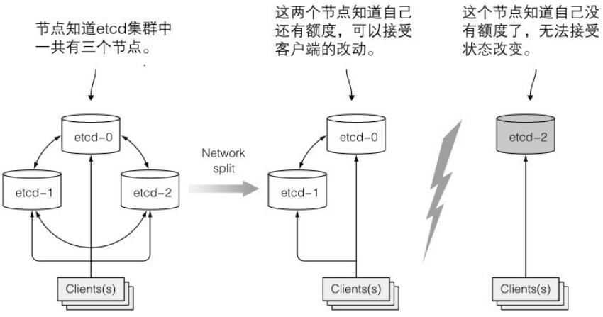

# etcd

etcd是一个分布式的键值储存数据库,K8s使用etcd来持久化储存集群状态和元数据.API服务器是和etcd通信的唯一组件,所有其他组件通过API服务器间接地读写数据到etcd.

## etcdctl

要访问etcd数据库,需要在主节点上安装etcdctl客户端:

```sh
[root@server4-master ~]# curl -L https://github.com/etcd-io/etcd/releases/download/v3.5.2/etcd-v3.5.2-linux-amd64.tar.gz -o etcd-v3.5.2-linux-amd64.tar.gz
[root@server4-master ~]# tar -zxf etcd-v3.5.2-linux-amd64.tar.gz
[root@server4-master ~]# cp etcd-v3.5.2-linux-amd64/etcdctl /usr/local/bin
[root@server4-master ~]# etcdctl version
etcdctl version: 3.5.2
API version: 3.5
```

设置好数据库地址,证书路径等到本地变量:

```sh
[root@server4-master ~]# vi ~/.bashrc
export ETCDCTL_ENDPOINTS=https://127.0.0.1:2379
export ETCDCTL_CACERT=/etc/kubernetes/pki/etcd/ca.crt
export ETCDCTL_CERT=/etc/kubernetes/pki/etcd/healthcheck-client.crt
export ETCDCTL_KEY=/etc/kubernetes/pki/etcd/healthcheck-client.key
export ETCDCTL_API=3
[root@server4-master ~]# source ~/.bashrc
```

之后就可以直接通过命令来访问etcd:

```sh
[root@server4-master ~]# etcdctl get --keys-only --prefix /
```


## 乐观并发控制

乐观并发控制也叫乐观锁.指一段数据包含一个版本数字,而不是锁住该段数据阻止读写操作.

每当更新数据,版本数就会增加.当更新数据时,会检查版本值是否在客户端读取数据时间和提交时间之间被增加过,如果有增加过,更新会被拒绝,客户端必须重新读取新数据,重新尝试更新.

当两个客户端尝试更新同一个数据条目,只有第一个会成功.

所有的K8s包含一个metadata.resourceVersion字段用来保存版本数字,更新对象时客户端需要返回该值到API服务器,服务器检查版本值与etcd中储存的是否匹配,不匹配会拒绝更新.


## 资源储存

etcd版本v2和v3对资源储存格式不一样,版本v2把key储存在一个层级键空间中,使得键值对类似文件系统的文件.每个key可以是一个目录,包含其他key,或者是个常规key,对应一个值.版本v3不支持目录,但由于key格式保持不变,键可以包含斜杠,仍然可以认为它们可以被组织成目录.

k8s储存所有数据到etcd的/registry下,可以使用etcdctl来查询:

```sh
[root@server4-master ~]# etcdctl get --keys-only --prefix /registry | less
/registry/apiextensions.k8s.io/customresourcedefinitions/apiservers.operator.tigera.io
/registry/apiextensions.k8s.io/customresourcedefinitions/bgpconfigurations.crd.projectcalico.org
/registry/apiextensions.k8s.io/customresourcedefinitions/bgppeers.crd.projectcalico.org
/registry/apiextensions.k8s.io/customresourcedefinitions/blockaffinities.crd.projectcalico.org
```

会发现key与资源名称相对应.可以单独查看对应命名空间下的pod列表:

```sh
[root@server4-master ~]# etcdctl get --keys-only --prefix /registry/pods/default
/registry/pods/default/kubia-0
/registry/pods/default/kubia-1
/registry/pods/default/kubia-2
```

查看特定pod在etcd中储存的内容:

```sh
[root@server4-master ~]# etcdctl get /registry/pods/default/kubia-1
kube-controller-managerUpdatevFieldsV1:f:metadata":{"f:generateName":{},"f:labels":{".":{},"f:app":{},"f:controller-revision-hash":{},"f:statefulset.kubernetes.io/pod-name":{}},"f:ownerReferences":{".":{},"k:{\"uid\":\"4142df85-4fb1-4b09-84ab-24ad2d1c309e\"}":{}}},"f:spec":{"f:containers":{"k:{\"name\":\"kubia\"}":{".":{},"f:image":{},"f:imagePullPolicy":{},"f:name":{},"f:ports":{".":{},"k:{\"containerPort\":8080,\"protocol\":\"TCP\"}":{".":{},"f:containerPort":{},"f:name":{},"f:protocol":{}}},"f:resources":{},"f:terminati
```

返回JSON格式的pod定义.


## etcd集群

为了保证高可用,etcd集群常常会部署多个(奇数个)etcd实例.etcd使用RAFT一致性算法来保证对系统的实际状态达成一致.

算法要求集群大部分节点参与才能进行到下一状态,,结果就是集群分裂为两个不互联的节点组.如果一个组成员比另一个组多,大组可以更改集群状态,小组不可以.当两个组重新恢复连接,小组的节点会更新为大组节点的状态.过程如下图所示:




