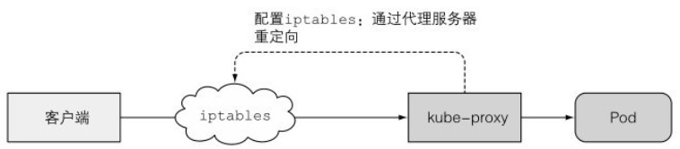

# Proxy

## 代理作用

除了Kubelet,每个工作节点都会运行kube-proxy,用于确保客户端通过API服务器,对服务IP和端口的连接最终能到达支持服务(或其他非Pod服务终端)的某个pod处.

如果由多个pod支撑一个服务,那么代理会发挥对pod的负载均衡作用.

## 代理实现

kube-proxy最初叫做userspace代理,利用实际的服务器集成接收连接,同时代理给pod.为了拦截发往服务IP的连接,代理配置了iptables规则,重定向连接到代理服务器.如下图所示:

当前的kube-proxy仅仅通过iptables或ipvs规则重定向数据包到一个随机选择的后端pod,不再需要一个实际的代理服务器.这个模式也叫iptables代理模式.如下图所示:

两种模式的主要区别是:数据包是否会传递给kube-proxy,是否必须在用户空间处理,或者数据包只会在内核空间处理.两种模式性能有巨大差异.

两种模式另一个区别是:userspace代理模式以轮询模式对连接做负载均衡.而iptables代理模式随机选择pod,在客户连接少时可能不会平均分配流量.

