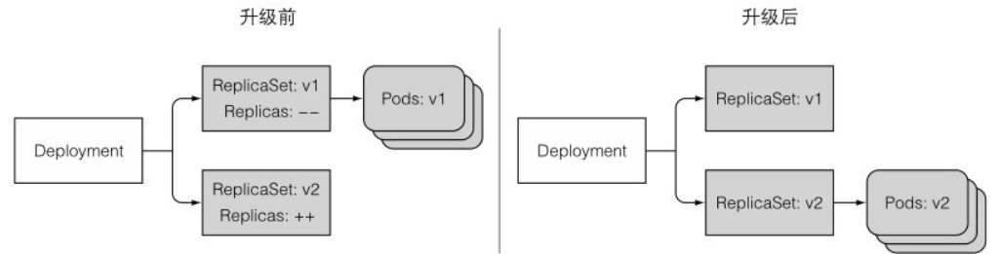
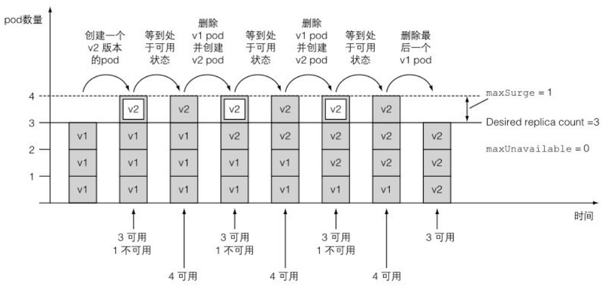
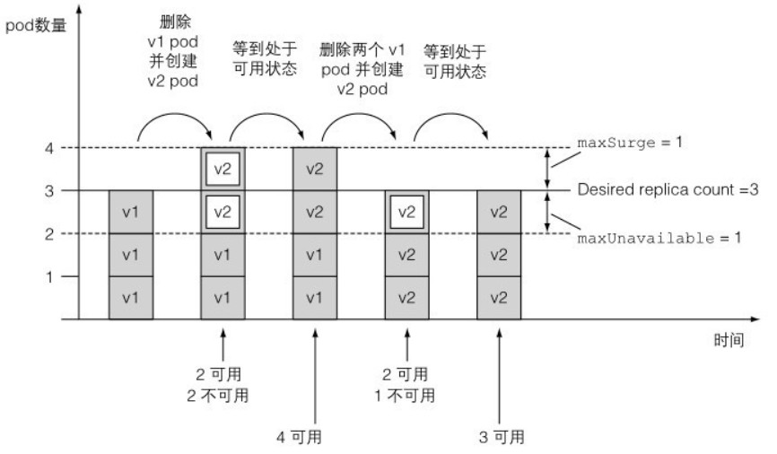

# Deployment

最常用的Controller,可以管理pod的多个副本并确保pod按照期望的状态运行.

## 定义

Deployment是一种更高阶资源,用于部署应用程序并以声明的方式升级应用.创建一个Deployment资源时,RS资源也会随之创建,pod实际由RS创建和管理.Deployment主要负责处理升级应用时两个版本的控制器之间关系.

下面简称Deploy.


## 创建Deploy

创建一个Deploy与创建RC的声明大体一致,只是Deploy声明包含额外部署策略字段.因为Deploy可以同时管理多个版本的pod,所以不需要给Deploy命名中加入版本号:

```sh
[root@server4-master ~]# vi kubia-deploy.yaml
apiVersion: apps/v1
kind: Deployment
metadata:
  name: kubia
spec:
  replicas: 3
  selector:
    matchLabels:
      app: kubia
  template:
    metadata:
      name: kubia
      labels:
        app: kubia
    spec:
      containers:
      - image: luksa/kubia:v1
        name: nodejs
---
apiVersion: v1
kind: Service
metadata:
  name: kubia
spec:
  type: NodePort
  selector:
    app: kubia
  ports:
  - port: 80
    targetPort: 8080
    nodePort: 30002
```

创建Deploy时加入--record选项,可以记录CHANGE-CAUSE信息,也就是声明文件中annotation字段的注解:

```sh
[root@server4-master ~]# kubectl create -f kubia-deploy.yaml --record
Flag --record has been deprecated, --record will be removed in the future
deployment.apps/kubia created
service/kubia created
```

命令kubectl rollout专门用于查询Deploy部署状态:

```sh
[root@server4-master ~]# kubectl rollout status deployment kubia
deployment "kubia" successfully rolled out
[root@server4-master ~]# kubectl get all
NAME                         READY   STATUS        RESTARTS   AGE
pod/kubia-74967b5695-5s68q   1/1     Running       0          10s
pod/kubia-74967b5695-8cxtb   1/1     Running       0          10s
pod/kubia-74967b5695-bwzb9   1/1     Running       0          10s
pod/kubia-74967b5695-jkcjl   0/1     Terminating   0          2m55s

NAME                 TYPE        CLUSTER-IP     EXTERNAL-IP   PORT(S)        AGE
service/kubernetes   ClusterIP   10.96.0.1      <none>        443/TCP        133d
service/kubia        NodePort    10.101.57.66   <none>        80:30002/TCP   10s

NAME                    READY   UP-TO-DATE   AVAILABLE   AGE
deployment.apps/kubia   3/3     3            3           10s

NAME                               DESIRED   CURRENT   READY   AGE
replicaset.apps/kubia-74967b5695   3         3         3       10s
```

新建的pod名字中间多了一串数字,这是pod模板的Hash值.由Deploy创建的RS控制器也带有同样的哈希值.这样Deploy能用来对应和管理一个版本的pod模板.

通过30002端口访问服务来测试pod工作状态:

```sh
[root@server4-master ~]# curl localhost:30002
This is v1 running in pod kubia-74967b5695-5s68q
```


## 升级Deploy

Deploy默认的升级策略是执行滚动更新(RollingUpdate).另一个策略为Recreate,它会一次性删除所有旧版本pod,然后创建新pod.

通过patch命令修改单个或少量资源属性非常有用,但更改Deploy的自有属性不会触发pod的任何更新.这里设置一个时间来减慢滚动更新的速度:

```sh
[root@server4-master ~]# kubectl patch deploy kubia -p '{"spec": {"minReadySeconds": 10}}'
deployment.apps/kubia patched
```

采用set image命令来更改任何包含容器资源中的镜像:

```sh
[root@server4-master ~]# kubectl set image deployment kubia nodejs=luksa/kubia:v2
deployment.apps/kubia image updated
```

通过describe查询可以看到Deploy的方式和RC滚动升级类似,也是先增加新版本pod缩减旧pod,最后完成升级.

```sh
[root@server4-master ~]# kubectl get all
NAME                         READY   STATUS        RESTARTS   AGE
pod/kubia-74967b5695-5s68q   1/1     Running       0          3m40s
pod/kubia-74967b5695-8cxtb   1/1     Terminating   0          3m40s
pod/kubia-74967b5695-bwzb9   1/1     Running       0          3m40s
pod/kubia-bcf9bb974-9kb8x    1/1     Running       0          3s
pod/kubia-bcf9bb974-bqwng    1/1     Running       0          21s
```

如下图所示整个升级过程由运行在K8s上的一个控制器处理和完成,简单又可靠:



如果Deployment中的pod模板引用了一个ConfigMap(Secret)那么更改ConfigMap资源不会触发升级操作,需要创建一个新的CM并修改pod模板引用新的CM.


## 回滚升级

假如升级的版本有问题,可以自动停止升级.首先升级到有错误的版本,这个应用在第5个请求之后会返回内部服务器错误,也就是HTTP状态码500:

```sh
[root@server4-master ~]# kubectl set image deploy kubia nodejs=luksa/kubia:v3
deployment.apps/kubia image updated
[root@server4-master ~]# kubectl rollout status deploy kubia
Waiting for deployment "kubia" rollout to finish: 1 out of 3 new replicas have been updated...
Waiting for deployment "kubia" rollout to finish: 2 out of 3 new replicas have been updated...
Waiting for deployment "kubia" rollout to finish: 1 old replicas are pending termination...
deployment "kubia" successfully rolled out
```

可使用rollout undo命令回滚到上一版本:

```sh
[root@server4-master ~]# kubectl rollout undo deploy kubia
deployment.apps/kubia rolled back
```

undo命令也能在滚动升级过程中运行,并直接停止升级回归老版本.

最后通过rollout history来显示升级版本历史记录:

```sh
[root@server4-master ~]# kubectl rollout history deployment kubia
deployment.apps/kubia 
REVISION  CHANGE-CAUSE
1         kubectl create --filename=kubia-deploy.yaml --record=true
3         kubectl create --filename=kubia-deploy.yaml --record=true
4         kubectl create --filename=kubia-deploy.yaml --record=true
```

滚动升级成功后,老版本RS不会被删掉,K8s保留着完整修改版本历史.历史记录保留数目默认为2,由Deploy中revisionHistoryLimit的属性值来限制,更早的RS都会被删除.

因此可以通过undo命令指定一个特定版本号,来回滚到指定版本:

```sh
[root@server4-master ~]# kubectl rollout undo deploy kubia --to-revision=1
deployment.apps/kubia rolled back
```

--to-revision的参数对应着history上的版本.如果手动删除遗留RS会导致历史版本记录丢失无法回滚.另外扩容操作不会创建版本.


## 滚动升级策略属性

可以在Deploy配置文件spec.strategy.rollingUpdate下修改两个滚动升级策略的属性:

- maxSurge

  决定了Deploy配置中期望的副本数之外,最多允许超出的pod实例数量.默认为25%.比如期望副本数量为4,那么在滚动升级期间,不会运行超过5个pod实例.把百分数转为绝对值会将数字四舍五入.也可直接指定绝对值.

- maxUnavailable

  决定在滚动升级期间,相对于期望副本数能够允许有多少个pod实例处于不可用状态.默认值25%表示可用pod实例的数量不能低于期望副本数的75%.假如期望副本数为4,那么只能有一个pod处于不可用状态,也可以使用绝对值设定.

假设运行副本数量为3,当设置为maxSurge=1, maxUnavailable=0时,表示需要始终保持3个可用的副本,升级中最多运行4个副本数量.每次启动1个新副本,新副本运行正常后,删掉1个旧副本,直到所有旧副本被替换掉.整个过程图示:



extensions/v1beta1版本的Deploy使用不一样的默认值,两个参数都被设置为1,表示允许1个副本不可用状态,升级中最多运行4个副本数量.首先删除1个旧副本,启动2个新副本,新副本运行正常后,继续删除1个旧副本启动1个新副本,直到所有旧副本被替换掉.整个过程图示:




## 暂停滚动更新

可以在更新过程中使用rollout pause暂停升级:

```sh
[root@server4-master ~]# kubectl set image deploy kubia nodejs=luksa/kubia:v4
deployment.apps/kubia image updated
[root@server4-master ~]# kubectl rollout pause deploy kubia
deployment.apps/kubia paused
```

现在应用处于1个新版本pod加3个旧版本pod的混合运行状态,服务的一部分请求将被切换到新的pod.通过这种方式只有一部分用户会访问到新版本,相当于运行了一个金丝雀版本.在验证新版本是否正常工作后,可以将剩余pod继续升级或回滚到上一个版本.

可以把两条命令用&&符号连接:

```sh
[root@server4-master ~]# kubectl set image deploy kubia nodejs=luksa/kubia:v1 && kubectl rollout pause deploy kubia
deployment.apps/kubia image updated
deployment.apps/kubia paused
[root@server4-master ~]# kubectl get all
NAME                         READY   STATUS    RESTARTS   AGE
pod/kubia-74967b5695-ckpf9   1/1     Running   0          53s
pod/kubia-7bddb8bfc7-fjkkg   1/1     Running   0          2m
pod/kubia-7bddb8bfc7-hnjh4   1/1     Running   0          2m12s
pod/kubia-7bddb8bfc7-wtt8g   1/1     Running   0          108s

NAME                 TYPE        CLUSTER-IP     EXTERNAL-IP   PORT(S)        AGE
service/kubernetes   ClusterIP   10.96.0.1      <none>        443/TCP        133d
service/kubia        NodePort    10.101.57.66   <none>        80:30002/TCP   37m

NAME                    READY   UP-TO-DATE   AVAILABLE   AGE
deployment.apps/kubia   4/3     1            4           37m

NAME                               DESIRED   CURRENT   READY   AGE
replicaset.apps/kubia-555774bf68   0         0         0       9m58s
replicaset.apps/kubia-74967b5695   1         1         1       37m
replicaset.apps/kubia-7bddb8bfc7   3         3         3       31m
replicaset.apps/kubia-bcf9bb974    0         0         0       34m
[root@server4-master ~]# curl localhost:30002
This is v3 running in pod kubia-7bddb8bfc7-wtt8g
[root@server4-master ~]# curl localhost:30002
This is v1 running in pod kubia-74967b5695-ckpf9
```

滚动升级的进度无法控制,因此想要进行金丝雀发布的正确方式是,使用两个不同的Deploy并同时调整它们对应的pod数量.


## 恢复滚动升级

在暂停升级期间,撤销命令不起作用,在恢复升级后才进行撤销操作.使用rollout resume来恢复升级.:

```sh
[root@server4-master ~]# kubectl rollout resume deploy kubia
deployment.apps/kubia resumed
[root@server4-master ~]# kubectl rollout undo deploy kubia --to-revision=3
deployment.apps/kubia rolled back
```

暂停部署还能用来阻止更新Deploy而自动触发的滚动升级过程,可以对Deployment进行多次更改,并在完成所有更改后才恢复滚动升级,一旦更改完毕则恢复更新过程.


## 配置就绪探针

使用minReadySeconds属性设置新pod要成功运行多久后,才将其视为可用.当所有容器的就绪探针返回成功时,pod就标记为就绪状态.如果一个新pod运行出错,并且在minReadySeconds时间内它的就绪探针出现了失败,那么新版本的滚动升级将被阻止.一般会将minReadySeconds设置为更高的值,来确保Pod在真正接收实际流量后可以持续保持就绪状态.

使用之前会报错的v3镜像,来测试就绪探针的作用:

```sh
[root@server4-master ~]# vi kubia-v3.yaml
apiVersion: apps/v1
kind: Deployment
metadata:
  name: kubia
spec:
  replicas: 3
  selector:
    matchLabels:
      app: kubia
  minReadySeconds: 10
  strategy:
    rollingUpdate:
      maxSurge: 1
      maxUnavailable: 0
    type: RollingUpdate
  template:
    metadata:
      name: kubia
      labels:
        app: kubia
    spec:
      containers:
      - image: luksa/kubia:v3
        name: nodejs
        readinessProbe:
          periodSeconds: 1
          httpGet:
            path: /
            port: 8080
```

设置maxUnavailabel的值为0确保升级过程中pod被挨个替换.就绪探针GET请求每秒执行1次,到第6秒开始报错.使用apply升级Deploy不仅会更新镜像,还添加了就绪探针以及其他参数:

```sh
[root@server4-master ~]# kubectl apply -f kubia-v3.yaml
Warning: resource deployments/kubia is missing the kubectl.kubernetes.io/last-applied-configuration annotation which is required by kubectl apply. kubectl apply should only be used on resources created declaratively by either kubectl create --save-config or kubectl apply. The missing annotation will be patched automatically.
deployment.apps/kubia configured
```

观察curl输出,可以看到流量并没有转发到v3版本的pod上面,因为新pod未就绪,被从Service的endpoint中移除:

```sh
[root@server4-master ~]# curl localhost:30002
This is v1 running in pod kubia-74967b5695-8kmxn
[root@server4-master ~]# curl localhost:30002
This is v1 running in pod kubia-74967b5695-ckpf9
[root@server4-master ~]# curl localhost:30002
This is v1 running in pod kubia-74967b5695-ls2z2
[root@server4-master ~]# kubectl get po
NAME                     READY   STATUS    RESTARTS   AGE
kubia-67d49c55dd-wcnwd   0/1     Running   0          60s
kubia-74967b5695-8kmxn   1/1     Running   0          4m40s
kubia-74967b5695-ckpf9   1/1     Running   0          10m
kubia-74967b5695-ls2z2   1/1     Running   0          4m28s
[root@server4-master ~]# kubectl describe po kubia-67d49c55dd-wcnwd
Events:
  Type     Reason     Age                     From               Message
  ----     ------     ----                    ----               -------
  Warning  Unhealthy  2m51s (x22 over 3m11s)  kubelet            Readiness probe failed: HTTP probe failed with statuscode: 500
```

之后升级一直处于进行中状态,因为maxUnavailabel为0,所以既不会创建新pod,也不会删除任何原始pod.整个流程如下图所示:


如果没有正确设置minReadySeconds,一旦有以此就绪探针调用成功,便会认为新pod已经可用,因此可以把时间设长一点.

默认情况下滚动升级在10分钟内不能完成会被视为失败.这个时限在spec.progressDeadlineSeconds中设定:

```sh
[root@server4-master ~]# kubectl describe deploy kubia
Name:                   kubia
Namespace:              default
Replicas:               3 desired | 1 updated | 4 total | 3 available | 1 unavailable
StrategyType:           RollingUpdate
MinReadySeconds:        10
RollingUpdateStrategy:  0 max unavailable, 1 max surge
Conditions:
  Type           Status  Reason
  ----           ------  ------
  Available      True    MinimumReplicasAvailable
  Progressing    False   ProgressDeadlineExceeded
OldReplicaSets:  kubia-74967b5695 (3/3 replicas created)
NewReplicaSet:   kubia-67d49c55dd (1/1 replicas created)
```

滚动升级卡住之后,只能通过rollout undo命令来取消滚动升级.