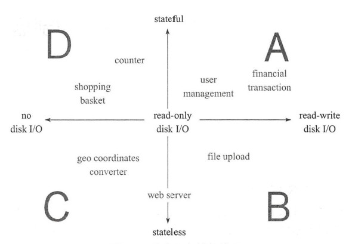
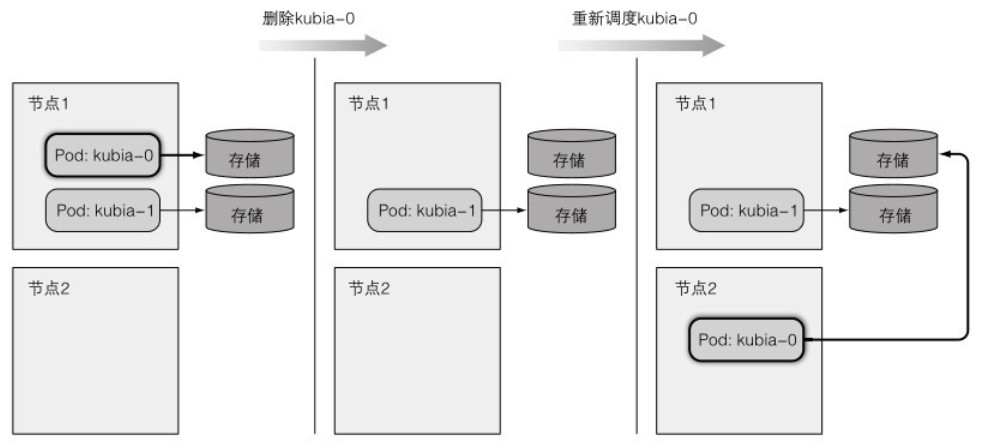

# StatefulSet

下面简称STS.

## 应用状态



可以通过状态和储存两个概念正交于坐标系中,得到四种应用程序类型:

- 象限A中是那些具有读写磁盘需求的有状态应用程序.如各种RDBMS储存系统,分布式储存系统Redis Cluster, MongoDB, ZooKeeper, Cassandra等.
- 象限B包含两类应用程序,一类是那些具有读写磁盘需求的无状态应用程序,另一类是仅需读取权限的无状态应用比如Web服务程序.
- 象限C中是无磁盘访问需求的无状态应用程序.
- 象限D中是无磁盘访问需求的有状态应用程序,比如说淘宝的购物车系统.


## 有状态服务

k8s中pod的管理对象RC, RS, Deploy, DS和Job都是面向无状态的服务,但有很多服务是有状态的,例如MySQL集群, MongoDB集群, Akka集群等.这些集群有一些共同点:

- 每个节点都有固定的身份ID,通过ID互相发现和通信;

- 集群的规模比较固定,不能随意变动;

- 集群里的每个节点都是有状态的,通常会持久化数据到永久储存中;

- 如果磁盘损坏,则集群里的某个节点无法正常运行,集群功能受损.


## StatefulSet定义

StatefulSet保证pod的每个副本在整个生命周期中名称,网络标识和状态相同,其他Controller不提供这个功能.同时StatefuleSet会保证副本按照固定的顺序启动,更新或删除.


## StatefulSet特点

StatefulSet可以看做是Deployment的一个特殊变种,有如下特性:

- StatefulSet里每个pod都有稳定,唯一的网络标识,用来发现集群内其他成员,假设StatefulSet的名字叫kafka,那么第一个pod叫kafka-0,第二个叫kafka-1.

- StatefulSet控制的pod副本启动顺序是受控的,操作第n个pod时,前一个pod已经时运行且准备好的状态.

- StatefulSet里的pod采用稳定的持久化储存卷(PV),删除pod时默认不会删除相关储存卷.

完整可用的StatefulSet通常有三个组件构成: StatefulSet, headless Service和volumeClaimTemplate.

### 稳定的网络标识

由StatefulSet创建的每个pod都有一个从0开始的顺序索引,体现到pod的名称,主机名和固定储存上.

StatefulSet通常与headless Service配合使用.如果解析headless Service的DNS域名,返回Service对应的全部pod的Endpoint列表.StatefulSet在headless Service的基础上又为StatefulSet控制的每个Pod实例创建了一个DNS域名,格式为:`$(podname).$​(headless service name).$(namespace).svc.cluster.local.`

当一个StatefulSet管理的pod实例消失后,StatefulSet会保证重启一个新的拥有与之前pod完全一致名称和主机名的pod实例替换它.

扩容一个StatefulSet会使用下一个还没用到的顺序索引值创建一个新的pod实例.缩容时会先删除最高索引值的实例,每次只会操作一个pod实例,并且在有实例不健康的情况下不允许做缩容操作.

### 稳定的专属储存

有状态的pod的储存必须是持久的,并与pod解耦.StatefulSet需要定义一个或多个卷声明模板,绑定到pod实例上.

在扩容StatefulSet时,会创建新pod和与之关联的一个或多个持久卷声明.缩容时则只会删除pod保留持久卷声明,在重新扩容后,新的pod会与先前的持久卷绑定.


## 创建STS

创建一个简单的应用接受POST请求,把请求中body数据写入/var/data/kubia.txt,在收到GET请求时,返回主机名和储存数据:

```sh
root@ec837c407906:/# cat app.js
const http = require('http');
const os = require('os');
const fs = require('fs');

const dataFile = "/var/data/kubia.txt";

function fileExists(file) {
  try {
    fs.statSync(file);
    return true;
  } catch (e) {
    return false;
  }
}

var handler = function(request, response) {
  if (request.method == 'POST') {
    var file = fs.createWriteStream(dataFile);
    file.on('open', function (fd) {
      request.pipe(file);
      console.log("New data has been received and stored.");
      response.writeHead(200);
      response.end("Data stored on pod " + os.hostname() + "\n");
    });
  } else {
    var data = fileExists(dataFile) ? fs.readFileSync(dataFile, 'utf8') : "No data posted yet";
    response.writeHead(200);
    response.write("You've hit " + os.hostname() + "\n");
    response.end("Data stored on this pod: " + data + "\n");
  }
};

var www = http.createServer(handler);
www.listen(8080);
```

创建基于NFS的持久化储存卷:

```sh
[root@server4-master ~]# cd /srv/pv/
[root@server4-master pv]# mkdir pv001 pv002 pv003
[root@server4-master pv]# echo "/srv/pv/pv001 *(rw,no_root_squash,sync)" >> /etc/exports
[root@server4-master pv]# echo "/srv/pv/pv002 *(rw,no_root_squash,sync)" >> /etc/exports
[root@server4-master pv]# echo "/srv/pv/pv003 *(rw,no_root_squash,sync)" >> /etc/exports
[root@server4-master pv]# exportfs -a
[root@server4-master pv]# showmount -e
Export list for server4-master:
/srv/pv/pv003 *
/srv/pv/pv002 *
/srv/pv/pv001 *
/srv/pv       *
[root@server4-master pv]# exportfs -v
/srv/pv         <world>(sync,wdelay,hide,no_subtree_check,sec=sys,rw,secure,no_root_squash,no_all_squash)
/srv/pv/pv001   <world>(sync,wdelay,hide,no_subtree_check,sec=sys,rw,secure,no_root_squash,no_all_squash)
/srv/pv/pv002   <world>(sync,wdelay,hide,no_subtree_check,sec=sys,rw,secure,no_root_squash,no_all_squash)
/srv/pv/pv003   <world>(sync,wdelay,hide,no_subtree_check,sec=sys,rw,secure,no_root_squash,no_all_squash)
```

可以使用List对象来定义一组pv资源和使用--分隔效果一样.设定storageClassName为nfs:

```sh
[root@server4-master ~]# vi pv-list.yaml
kind: List
apiVersion: v1
items:
- apiVersion: v1
  kind: PersistentVolume
  metadata:
    name: pv001
  spec:
    capacity:
      storage: 10Mi
    accessModes:
      - ReadWriteOnce
    persistentVolumeReclaimPolicy: Retain
    storageClassName: nfs
    nfs:
      path: /srv/pv/pv001
      server: server4-master
- apiVersion: v1
  kind: PersistentVolume
  metadata:
    name: pv002
  spec:
    capacity:
      storage: 10Mi
    accessModes:
      - ReadWriteOnce
    persistentVolumeReclaimPolicy: Retain
    storageClassName: nfs
    nfs:
      path: /srv/pv/pv002
      server: server4-master
- apiVersion: v1
  kind: PersistentVolume
  metadata:
    name: pv003
  spec:
    capacity:
      storage: 10Mi
    accessModes:
      - ReadWriteOnce
    persistentVolumeReclaimPolicy: Retain
    storageClassName: nfs
    nfs:
      path: /srv/pv/pv003
      server: server4-master
[root@server4-master ~]# kubectl create -f pv-list.yaml 
persistentvolume/pv001 created
persistentvolume/pv002 created
persistentvolume/pv003 created
[root@server4-master ~]# kubectl get pv
NAME         CAPACITY   ACCESS MODES   RECLAIM POLICY   STATUS      CLAIM                 STORAGECLASS   REASON   AGE
pv001        10Mi       RWO            Retain           Available                         nfs                     8s
pv002        10Mi       RWO            Retain           Available                         nfs                     8s
pv003        10Mi       RWO            Retain           Available                         nfs                     8s
```

在部署StatefulSet之前,还需要创建一个用于在有状态的pod之间提供网络标识的headless Service,用于pod之间互相发现:

```sh
[root@server4-master ~]# vi kubia-svc-headless.yaml
apiVersion: v1
kind: Service
metadata:
  name: kubia
spec:
  clusterIP: None
  selector:
    app: kubia
  ports:
  - name: http
    port: 80
[root@server4-master ~]# kubectl create -f kubia-svc-headless.yaml
service/kubia created
```

最后是StatefulSet配置,在spec中必须包含serviceName和template字段:

```sh
[root@server4-master ~]# vi kubia-st.yaml
apiVersion: apps/v1
kind: StatefulSet
metadata:
  name: kubia
spec:
  serviceName: kubia
  replicas: 2
  selector:
    matchLabels:
      app: kubia
  template:
    metadata:
      labels:
        app: kubia
    spec:
      containers:
      - name: kubia
        image: luksa/kubia-pet
        ports:
        - name: http
          containerPort: 8080
        volumeMounts:
        - mountPath: "/var/data"
          name: data
  volumeClaimTemplates:
  - metadata:
      name: data
    spec:
      accessModes:
      - ReadWriteOnce
      resources:
        requests:
          storage: 10Mi
      storageClassName: nfs
```

通过一个名为data的PVC模板来为每个pod创建一个持久卷声明,其中要指定storageClassName: nfs来选择前面创建的PV,这样PVC会自动关联到可使用的PV上:

```sh
[root@server4-master ~]# kubectl create -f kubia-st.yaml
statefulset.apps/kubia created
[root@server4-master ~]# kubectl get all
NAME          READY   STATUS              RESTARTS   AGE
pod/kubia-0   1/1     Running             0          13s
pod/kubia-1   0/1     ContainerCreating   0          7s
NAME                 TYPE        CLUSTER-IP   EXTERNAL-IP   PORT(S)   AGE
service/kubernetes   ClusterIP   10.96.0.1    <none>        443/TCP   135d
service/kubia        ClusterIP   None         <none>        80/TCP    29m
NAME                     READY   AGE
statefulset.apps/kubia   1/2     13s
[root@server4-master ~]# kubectl get pvc
NAME           STATUS   VOLUME       CAPACITY   ACCESS MODES   STORAGECLASS   AGE
data-kubia-0   Bound    pv001        10Mi       RWO            nfs            42s
data-kubia-1   Bound    pv002        10Mi       RWO            nfs            36s
[root@server4-master ~]# kubectl get pv
NAME         CAPACITY   ACCESS MODES   RECLAIM POLICY   STATUS      CLAIM                  STORAGECLASS   REASON   AGE
pv001        10Mi       RWO            Retain           Bound       default/data-kubia-0   nfs                     64s
pv002        10Mi       RWO            Retain           Bound       default/data-kubia-1   nfs                     64s
pv003        10Mi       RWO            Retain           Available                          nfs                     64s
```

第二个pod会在第一个pod运行并且处于就绪状态后创建.全部就绪后可以看到有2个PV已经被新创建的pod所绑定.


## 测试STS

因为服务为headless模式,所以不能通过服务来访问服务.可以先在节点上运行代理,再通过curl来通过API服务器与pod通信:

```sh
[root@server4-master ~]# kubectl proxy
Starting to serve on 127.0.0.1:8001
[root@server4-master ~]# curl localhost:8001/api/v1/namespaces/default/pods/kubia-0/proxy/
You've hit kubia-0
Data stored on this pod: No data posted yet
```

使用POST请求发送数据后,再通过GET请求查询:

```sh
[root@server4-master ~]# curl -X POST -d "kubia-0" localhost:8001/api/v1/namespaces/default/pods/kubia-0/proxy/
Data stored on pod kubia-0
[root@server4-master ~]# curl localhost:8001/api/v1/namespaces/default/pods/kubia-0/proxy/
You've hit kubia-0
Data stored on this pod: kubia-0
[root@server4-master ~]# curl localhost:8001/api/v1/namespaces/default/pods/kubia-1/proxy/
You've hit kubia-1
Data stored on this pod: No data posted yet
```

手动删除pod后验证重新调度的pod是否关联了相同的储存:

```sh
[root@server4-master ~]# kubectl delete po kubia-0
pod "kubia-0" deleted
[root@server4-master ~]# kubectl get po -o wide
NAME      READY   STATUS    RESTARTS   AGE     IP               NODE            NOMINATED NODE   READINESS GATES
kubia-0   1/1     Running   0          18s     10.244.244.234   server6-node2   <none>           <none>
kubia-1   1/1     Running   0          8m39s   10.244.244.233   server6-node2   <none>           <none>
```

删除后等待一段时间,kubia-0在另一个节点重建好了,用curl试试看数据是否还在:

```sh
[root@server4-master ~]# curl localhost:8001/api/v1/namespaces/default/pods/kubia-0/proxy/
You've hit kubia-0
Data stored on this pod: kubia-0
```

缩容一个StatefulSet只会删除对应的pod,持久卷声明被卸载但保留.如下图所示:




## 发现节点

集群中伙伴节点能彼此发现是很重要的需求,这样才能找到集群中其他成员.虽然可以通过API服务器通信来获取,但这与K8s的设计理念不符.因此K8s通过一个headless Service创建SRV记录来指向pod的主机名.

可以通过查询DNS记录中的SRV记录,SRV记录用来指向提供服务的服务器的主机和端口号:

```sh
[root@server4-master ~]# kubectl run -it srvlookup --image=tutum/dnsutils --rm --restart=Never -- dig SRV kubia.default.svc.cluster.local

; <<>> DiG 9.9.5-3ubuntu0.2-Ubuntu <<>> SRV kubia.default.svc.cluster.local
;; global options: +cmd
;; Got answer:
;; ->>HEADER<<- opcode: QUERY, status: NOERROR, id: 27077
;; flags: qr aa rd; QUERY: 1, ANSWER: 2, AUTHORITY: 0, ADDITIONAL: 3
;; WARNING: recursion requested but not available

;; OPT PSEUDOSECTION:
; EDNS: version: 0, flags:; udp: 4096
;; QUESTION SECTION:
;kubia.default.svc.cluster.local. IN    SRV

;; ANSWER SECTION:
kubia.default.svc.cluster.local. 30 IN  SRV     0 50 80 kubia-1.kubia.default.svc.cluster.local.
kubia.default.svc.cluster.local. 30 IN  SRV     0 50 80 kubia-0.kubia.default.svc.cluster.local.

;; ADDITIONAL SECTION:
kubia-0.kubia.default.svc.cluster.local. 30 IN A 10.244.244.234
kubia-1.kubia.default.svc.cluster.local. 30 IN A 10.244.244.233

;; Query time: 1 msec
;; SERVER: 10.96.0.10#53(10.96.0.10)
;; WHEN: Fri Mar 18 15:40:53 UTC 2022
;; MSG SIZE  rcvd: 350
```

通过创建一个临时pod来运行dig命令,可以看到ANSWER SECTION显示了两条指向后台headless Service的SRV记录.在ADDITIONAL SECTION中每个pod都拥有独自的一条记录.当一个pod要获取一个StatefulSet里的其他pod列表时,需要做的就是触发一次SRV DNS查询.


## 滚动升级

StatefulSet的升级方式和Deployment一样,推荐先修改配置文件中的镜像或参数,然后使用kubectl apply -f来更新:

```sh
[root@server4-master ~]# vi kubia-st.yaml 
...
  replicas: 3
...
        image: luksa/kubia-pet-peers
...
[root@server4-master ~]# kubectl apply -f kubia-st.yaml 
statefulset.apps/kubia configured
[root@server4-master ~]# kubectl get po
NAME       READY   STATUS        RESTARTS   AGE
dnsutils   1/1     Running       0          43m
kubia-0    1/1     Terminating   0          5h10m
kubia-1    1/1     Running       0          32s
kubia-2    1/1     Running       0          77s
```


## 测试集群数据

当所有pod启动后,可以测试数据储存是否按预期工作.先修改svc为非无头模式后发送一些请求到集群:

```sh
[root@server4-master ~]# vi kubia-svc-peer.yaml
apiVersion: v1
kind: Service
metadata:
  name: kubia-public
spec:
  selector:
    app: kubia
  ports:
  - name: http
    port: 80
    targetPort: 8080
[root@server4-master ~]# kubectl apply -f kubia-svc-peer.yaml 
service/kubia-public created
[root@k8s-master 2]# curl -X POST -d "11:58:04" localhost:8001/api/v1/namespaces/default/services/kubia-public/proxy/
Data stored on pod kubia-1
[root@k8s-master 2]# curl -X POST -d "11:58:04" localhost:8001/api/v1/namespaces/default/services/kubia-public/proxy/
Data stored on pod kubia-1
[root@k8s-master 2]# curl -X POST -d "11:58:04" localhost:8001/api/v1/namespaces/default/services/kubia-public/proxy/
Data stored on pod kubia-2
```

现在三个Pod中都有数据了,测试从服务中读取数据:

```sh
[root@k8s-master 2]# curl localhost:8001/api/v1/namespaces/default/services/kubia-public/proxy/
You've hit kubia-2
Data stored in the cluster:
- kubia-2.kubia.default.svc.cluster.local: 11:58:04
- kubia-1.kubia.default.svc.cluster.local: 11:58:04
- kubia-0.kubia.default.svc.cluster.local: kubia-0
```

通过集群中任意一个节点都能获取到所有伙伴节点,然后收集它们的数据.


## 处理节点失效

一个有状态pod必须保证创建替代pod之前不再运行.当一个节点突然失效,k8s并不知道节点的状态,不知道pod是否还在运行,是否还存在,是否能被客户端访问,还是Kubelet停止了上报节点状态.只有StatefulSet在明确知道一个pod不再运行后才会有所动作.这个信息由管理员删除pod或整个节点来明确.

模拟一次节点故障.先查看目前运行状态:

```sh
[root@server4-master ~]# kubectl get po -o wide
NAME      READY   STATUS    RESTARTS   AGE   IP               NODE            
kubia-0   1/1     Running   0          29m   10.244.191.226   server5-node1   
kubia-1   1/1     Running   0          30m   10.244.191.225   server5-node1   
kubia-2   1/1     Running   0          12s   10.244.191.227   server5-node1   
```

发现所有pod都运行在node1.把node1的网络断开,稍等2分钟后查询节点信息:

```sh
[root@server4-master ~]# kubectl get node
NAME             STATUS     ROLES                  AGE    VERSION
server4-master   Ready      control-plane,master   135d   v1.22.3
server5-node1    NotReady   <none>                 135d   v1.22.3
server6-node2    Ready      <none>                 135d   v1.22.3
[root@server4-master ~]# kubectl get pod -o wide
NAME      READY   STATUS    RESTARTS   AGE     IP               NODE           
kubia-0   1/1     Running   0          119s    10.244.191.228   server5-node1   
kubia-1   1/1     Running   0          38m     10.244.191.225   server5-node1  
kubia-2   1/1     Running   0          8m10s   10.244.191.227   server5-node1   
```

可以看到node已变为NotReady状态,但pod状态没有更新.如果运行delete命令,因为节点上kubelet无法接收到命令,所以pod的状态会一直显示Terminating.

再过一段时间,pod的状态会变成Unknown,有个配置可以调整未知状态持续多久,pod自动从节点上驱除.

假如节点重连上了,删除命令会被正确执行并在空闲节点上新建pod.如果节点永远消失了,只能通过强制删除pod来解决.通过删除命令加上--force和grace-period 0两个参数来强制删除:

```sh
[root@server4-master ~]# kubectl delete po kubia-0 --force --grace-period 0
warning: Immediate deletion does not wait for confirmation that the running resource has been terminated. The resource may continue to run on the cluster indefinitely.
pod "kubia-0" force deleted
[root@server4-master ~]# kubectl get po -o wide
NAME      READY   STATUS    RESTARTS   AGE    IP               NODE            
kubia-0   1/1     Running   0          19s    10.244.244.245   server6-node2   
kubia-1   1/1     Running   0          39m    10.244.191.225   server5-node1   
kubia-2   1/1     Running   0          9m7s   10.244.191.227   server5-node1   
```

pod强制删除后会在node2节点上新建,一般只有确认节点永远不能用的情况下才使用强制删除.

假如把断开网络的node1节点重新连上,pod的状态会从Unknown变为正常运行.