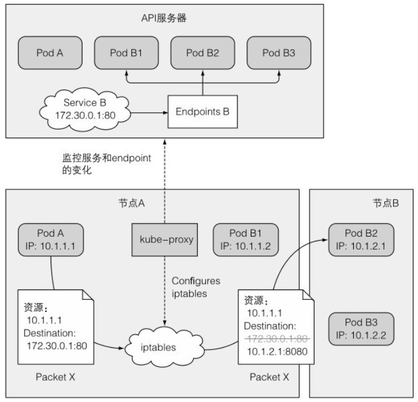

# 基本概念

## 定义和作用

在K8s中不再能用记录pod IP方式让pod间互相通信,因为pod是活动的,会随着调度分配更换IP地址.K8s提供一种叫服务的资源,来解决pod间通信问题.每个Service其实就是微服务构架中的一个微服务.

服务的主要工作通过标签选择器选定一组pod对象,并为这组pod提供单一不变的接入点(固定IP),客户端通过访问此地址来访问后面任一pod对象.

若集群存在DNS附件,它会在Service创建时为其自动配置一个DNS名称以便客户端进行服务发现.本质上来说Server是一个四层代理服务器.

## 服务原理

每个Service有其自己稳定的IP地址和端口,客户端通过连接该IP和端口使用服务.IP地址是虚拟的,没有被分配给任何网络接口,当数据包离开节点时也不会列为数据包的源或目的IP地址,所以Service的IP无法ping通.

和Service相关的任何事情都是由每个节点上运行的kube-proxy处理.一开始proxy确实起到代理作用,对每个进来的连接,连接到一个pod,这是用户空间代理模式.

现在使用的iptables代理模式性能更好.当在API服务器中创建一个Service时,会立即分配虚拟IP地址.之后API服务器会通知所有节点上的proxy客户端新服务的信息.然后每个proxy都会让该服务在自己的运行节点上可寻址.主要通过建立iptables规则,确保目的地为服务的IP/端口对的数据包被解析,目的地址被修改,这样数据包就会被重定向到支持服务的一个pod.

除了监控Service的更改,proxy也监控对Endpoint对象的更改.Endpoint对象在每次新创建或删除pod时都会发生变更,当pod的就绪状态发生变化或标签发生变化就会落入或超出服务的范畴.

如下图所示proxy在Service中起到的作用:

上面例子有一个包从节点A的pod A要发送到服务B.节点A的iptables规则处理包的目标地址为服务的IP和端口(172.30.0.1:80),通过iptables规则匹配,将匹配到的地址和端口172.30.0.1:80替换为随机选中的pod B2的IP和端口,就好像客户端pod A直接发送数据包给pod B而没经过Service.

运行在每个Node上的Proxy进程其实就是一个智能的软件负载均衡器,在内部实现服务的负载均衡与会话保持机制.

## 外部连接的特性

当客户通过节点端口连接到服务时,随机选择的pod并不一定在接收连接的同一节点上运行,例如接收服务pod运行在node1,而服务在node2,必然会造成不必要的跳转.可以通过将服务配置为仅将外部通信重定向到接收连接节点上运行的pod.

具体操作是修改服务spec.externalTrafficPolicy为Local.假如节点上没有本地pod存在则连接将挂起,因此需要确保负载平衡器将连接转发给至少具有一个pod的节点.

有一个问题是,原先均匀分配给pod的流量,变为按节点平均分配.假如一个节点一个pod,另一个节点两个pod,原先每个pod接收流量为1/3,设置流量不转发后,变成一个pod承担1/2流量,另外两个分别承担1/4流量.

在没配置流量不转发,当通过节点端口接收到连接时,会对数据包执行源网络地址转换(SNAT),因此数据包的源IP将发生更改,后端pod无法看到实际的客户端IP.这种时候上面的配置能保留客户端IP,因为接受连接的节点和目标pod节点之间没有额外跳跃.

## 排除连接故障

首先确保从集群内连接到服务的集群IP,而不是从外部.

不要通过ping来判断服务是否可访问,服务的集群IP是虚拟IP.

如果已经定义了就绪探针,确保返回成功,否则该pod不会成为服务一部分.

要确认某个容器是服务的一部分,使用get endpoints来检查相应的端点对象.

如果通过FQDN来访问服务没用,查看是否可以使用集群IP访问.

尝试直接连接到pod IP以确认pod正在接收正确端口上的连接.

如果甚至无法通过pod的IP访问应用,确保应用不是仅绑定到本地主机.