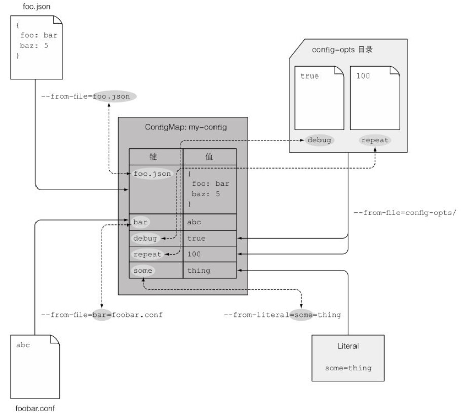

# ConfigMap资源

## 定义和作用

应用配置的关键在于能够在多个环境中区分配置选项,将配置从应用程序源码中分离,K8s允许将配置选项分离到单独的资源对象ConfigMap中.ConfigMap本质上就是一个键值对映射,值可以是字符串,也可以是完整的配置文件.示例图如下:



应用无须直接读取ConfigMap,映射的内容通过环境变量或卷文件的形式传给容器,命令行参数的定义中可以通过引用变量语法引用环境变量,因而可以达到将ConfigMap的条目当做命令行参数传递给进程的效果.

pod通过名称引用ConfigMap,因此可以在多环境中使用相同的pod定义描述,同时配置值不同以适应不同环境.


## 指定容器环境变量

如果Docker镜像有自定义参数可以配置,如下Dockerfile中所示:

```sh
#!/bin/bash
trap "exit" SIGINT
echo Fortune sleep every $INTERVAL seconds
mkdir -p /bar/htdocs
while :
do
  echo $(date) Writing fortune to /var/htdocs/index.html
  /usr/games/fortune > /var/htdocs/index.html
  sleep $INTERVAL
done
```

那么想要在k8s中设置自定义参数可以在spec.containers.env中声明:

```sh
spec:
  containers:
  - image: fortune
    env:
    - name: INTERVAL
      value: "30"
    name: html-generator
```

也可以使用$(VAR)语法在环境变量值中引用其他环境变量:

```sh
spec:
  containers:
  - image: fortune
    env:
    - name: FIRST_VAR
      value: "foobar"
    - name: SECOND_VAR
      value: "$(FIRST_VAR)2000"
```


## 创建ConfigMap

可以直接通过命令行来创建一个最简单的ConfigMap:

```sh
[root@server4-master ~]# kubectl create configmap fortune-config --from-literal=sleep-interval=5
configmap/fortune-config created
```

这条指令创建了名为fortune-config的configmap,仅包含单映射条目sleep-interval=5.可以通过添加多个--from-literal参数创建包含多条目的ConfigMap:

```sh
[root@server4-master ~]# kubectl create configmap fortune-config --from-literal=one=1 --from-literal=two=11
```

通过观察YAML格式的定义描述,可以自定义配置文件,通过create -f来创建ConfigMap.

可以直接从硬盘中读取文件,并将文件内容单独储存为ConfigMap中的值.如把当前目录下my.config文件内容存为键名devconfig的值.:

```sh
[root@k8s-master 2]# kubectl create configmap my-config --from-file=devconfig=my.config
```

通过多次使用--from-file参数可以增加多个文件条目.另外还可以用--from-file指定目录,kubectl会为文件夹中的每个文件单独创建条目,键名为文件名:

```sh
[root@server4-master ~]# kubectl create configmap my-config-dir --from-file=k8s
configmap/my-config-dir created
```

ConfigMap可以混合使用多种类型配置,例如一个my-config同时包含键值对和文件:

```sh
[root@server4-master ~]# kubectl create configmap my-config --from-file=foo.json --from-file=bar=foobar.conf --from-file=config-opts/ --from-literal=some=thing
```


## 传递ConfigMap

将值传给pod中的容器有三种方式.如果引用的ConfigMap不存在,容器会启动失败,也可以设置optional: true对引用可选.

- 通过环境变量传递键值

  需要在spec.containers.env.valueFrom字段中指定:

  ```sh
  spec:
    containers:
    - image: fortune
      env:
      - name: INTERVAL
        valueFrom:
          configMapKeyRef:
            name: fortune-config
            key: sleep-interval
  ```

  这里传递了一个环境变量INTERVAL,值取自fortune-config中键sleep-interval的值,再由容器内的进程读取.

- 传递整个ConfigMap中的键值

  在spec.containers中加入envFrom字段来传递整个ConfigMap中的键值对:

  ```sh
  spec:
    containers:
    - image: fortune
      envFrom:
      - prefix: CONFIG_
        configMapRef:
          name: my-cofig-map
  ```

  上面设置所有导入的环境变量包含前缀CONFIG_,若不设置前缀,环境变量的名称与ConfigMap中的键名相同,若键名不合法时不会自动转换.

- 传递ConfigMap条目作为命令行参数

  在字段spec.containers.args中无法直接引用ConfigMap的条目,但可以利用ConfigMap条目初始化某个环境变量,然后再在参数字段中引用该变量:

  ```
  spec:
    containers:
    - image: fortune
      env:
      - name: INTERVAL
        valueFrom:
          configMapKeyRef:
            name: fortune-config
            key: sleep-interval
      args: ["$(INTERVAL)"]
  ```


## 使用configMap卷

由于ConfigMap中可以包含完整配置文件内容,想要暴露给容器时可以借助configMap卷.configMap卷会将ConfigMap中的每个条目暴露出一个文件,运行在容器中的进程通过读取文件内容获得对应条目值.

例如将目录中的nginx配置文件和interval文件一起创建名为fortune-config的ConfigMap:

```sh
[root@server4-master configmap-files]# echo "25" > interval
[root@server4-master configmap-files]# vi advertise-task.iot.com.conf 
server {
    listen 80;
    server_name advertise-task.iot.com;
    location / {
        proxy_pass http://advertise-task.iot.com.dev;
    }
}
[root@server4-master configmap-files]# kubectl create configmap fortune-config --from-file=../configmap-files/
configmap/fortune-config created
[root@server4-master ~]# kubectl get configmaps fortune-config -o yaml
apiVersion: v1
data:
  interval: |
    25
  advertise-task.iot.com.conf: |
    server {
        listen 80;
        server_name advertise-task.iot.com;
        location / {
            proxy_pass http://advertise-task.iot.com.dev;
        }
    }
kind: ConfigMap
metadata:
  creationTimestamp: "2022-03-15T14:01:15Z"
  name: fortune-config
  namespace: default
  resourceVersion: "580367"
  uid: 9a4c9cb4-c2d2-424c-9d57-ac3fe1851260
```

将configMap卷内文件挂载到/etc/nginx/conf.d/目录下:

```sh
spec:
  containers:
  - image: nginx:alpine
    name: web-server
	volumeMounts:
	- name: config
	  mountPath: /etc/nginx/conf.d
	  readOnly: true
  volumes:
    - name: config
	  configMap:
	    name: fortune-config
```

也可以单独指定需要挂载的configMap卷内文件.这里将configMap卷内配置文件advertise-task.iot.com.conf重命名为at.conf并挂载到指定目录下.:

```sh
spec:
  volumes:
    - name: config
	  configMap:
	    name: fortune-config
	    items:
	    - key: advertise-task.iot.com.conf
	      path: at.conf
```

使用上面方法挂载卷,容器内本身包含同名目录会隐藏,被挂载的目录替代.想要单独挂载文件而不是目录,需要在spec.containers.volumeMounts下面加入subPath字段:

```sh
spec:
  containers:
  - image: nginx:alpine
    name: web-server
	volumeMounts:
	- name: config
	  mountPath: /etc/nginx/conf.d/advertise-task.iot.com.conf
	  subPath: advertise-task.iot.com.conf
	  readOnly: true
```

configMap卷中所有文件的默认权限是644,可以在spec.volumes.configMap中加入defaultMode来改变默认权限:

```sh
spec:
  volumes:
    - name: config
	  configMap:
	    name: fortune-config
	    defaultMod: "6600"
```

将ConfigMap作为卷挂载可以达到配置热更新的效果,无需重启或重建pod.在修改了ConfigMap配置后,可以通过kubectl exec命令来手动载入更新的配置:

```sh
[root@server4-master ~]# kubectl edit configmap fortune-config
[root@server4-master ~]# kubectl exec fortune -c web-server -- nginx -s reload
```

但如果挂载的单个文件,ConfigMap更新后对应的文件不会被封信.

