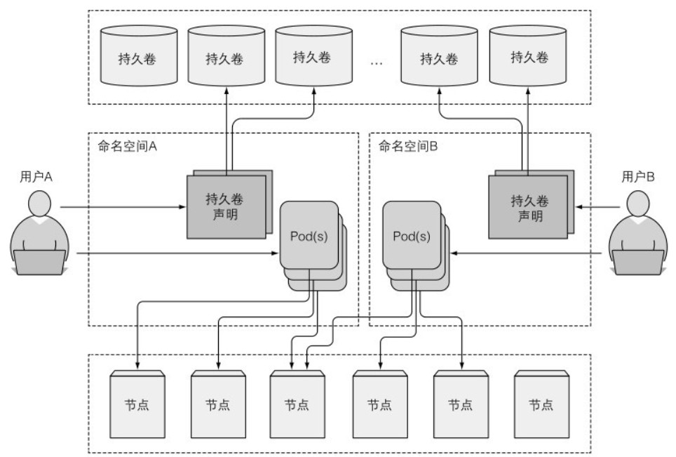
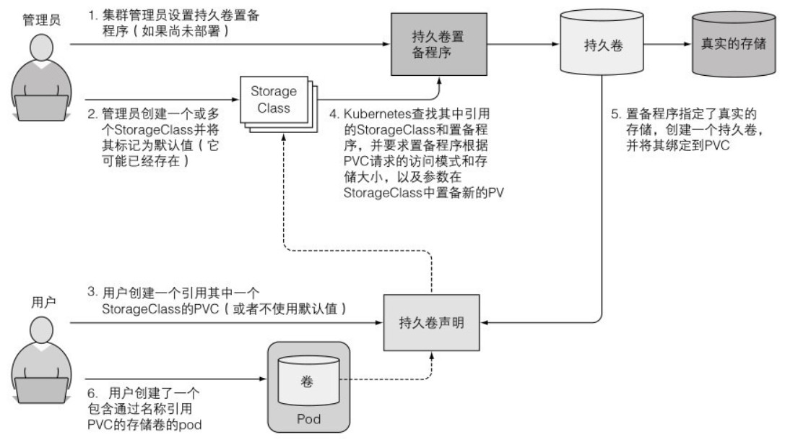

# 持久卷和持久卷声明

## 定义

在集群中为了使应用正常请求储存资源,同时避免处理基础设施细节,引入了两个新资源,分别是持久卷(PersistentVolume, PV)和持久卷声明(PersistentVolumeClaim, PVC).

当集群用户需要在其pod中使用持久化储存时,首先创建持久卷声明清单,指定所需最低容量要求和访问模式,由API服务器分配持久卷并绑定到持久卷声明中.

持久卷声明可以当做pod中的一个卷来使用,其他用户不能使用相同的持久卷,除非先通过删除持久卷声明释放.

PV和PVC的关系如下图:




## 安装NFS文件系统

在所有节点上安装:

```sh
[root@server4-master ~]# yum install nfs-utils rpcbind -y
[root@server4-master ~]# systemctl enable --now nfs
Created symlink from /etc/systemd/system/multi-user.target.wants/nfs-server.service to /usr/lib/systemd/system/nfs-server.service.
```

在nfs服务器上启动:

```sh
[root@server4-master ~]# systemctl enable --now rpcbind
```

配置服务器上的共享目录:

```sh
[root@server4-master ~]# mkdir /srv/pv
[root@server4-master ~]# chown nfsnobody:nfsnobody /srv/pv
[root@server4-master ~]# chmod 755 /srv/pv
[root@server4-master ~]# echo -e "/srv/pv *(rw,no_root_squash,sync)">/etc/exports
[root@server4-master ~]# exportfs -r
[root@server4-master ~]# exportfs
/srv/pv         <world>
[root@server4-master ~]# showmount -e 192.168.2.204
Export list for 192.168.2.204:
/srv/pv *
```

修改最大同时连接用户数:

```sh
[root@server4-master ~]# echo "options sunrpc tcp_slot_table_entries=128" >> /etc/modprobe.d/sunrpc.conf
[root@server4-master ~]# echo "options sunrpc tcp_max_slot_table_entries=128" >>  /etc/modprobe.d/sunrpc.conf
[root@server4-master ~]# sysctl -w sunrpc.tcp_slot_table_entries=128
sunrpc.tcp_slot_table_entries = 128
```

创建新的挂载点:

```sh
[root@server4-master ~]# mkdir -p /srv/pv/pv001 /srv/pv/pv002
[root@server4-master ~]# echo -e "/srv/pv/pv001 *(rw,no_root_squash,sync)">>/etc/exports
[root@server4-master ~]# echo -e "/srv/pv/pv002 *(rw,no_root_squash,sync)">>/etc/exports
[root@server4-master ~]# exportfs -r
[root@server4-master ~]# systemctl restart rpcbind && systemctl restart nfs
[root@server4-master ~]# showmount -e 192.168.2.204
Export list for 192.168.2.204:
/srv/pv/pv002 *
/srv/pv/pv001 *
/srv/pv       *
```


## 创建持久卷

配置一个1GB大小供mongodb使用的持久卷:

```sh
[root@server4-master ~]# vi mongodb-pv.yaml
apiVersion: v1
kind: PersistentVolume
metadata:
  name: mongodb-pv
spec:
  capacity:
    storage: 1Gi
  accessModes:
  - ReadWriteOnce
  - ReadOnlyMany
  persistentVolumeReclaimPolicy: Retain
  nfs:
    path: /srv/pv
    server: 192.168.2.204
[root@server4-master ~]# kubectl create -f mongodb-pv.yaml 
persistentvolume/mongodb-pv created
[root@server4-master ~]# kubectl get pv
NAME         CAPACITY   ACCESS MODES   RECLAIM POLICY   STATUS      CLAIM   STORAGECLASS   REASON   AGE
mongodb-pv   1Gi        RWO,ROX        Retain           Available                                   4s
```

持久卷不属于任何命名空间,它和节点一样是集群层面的资源.


## 创建持久卷声明

如果pod需要用到之前创建的持久卷,需要建立一个持久卷声明:

```sh
[root@server4-master ~]# vi mongodb-pvc.yaml
apiVersion: v1
kind: PersistentVolumeClaim
metadata:
  name: mongodb-pvc
spec:
  resources:
    requests:
      storage: 1Gi
  accessModes:
  - ReadWriteOnce
  storageClassName: ""
[root@server4-master ~]# kubectl create -f mongodb-pvc.yaml
persistentvolumeclaim/mongodb-pvc created
[root@server4-master ~]# kubectl get pvc
NAME          STATUS   VOLUME       CAPACITY   ACCESS MODES   STORAGECLASS   AGE
mongodb-pvc   Bound    mongodb-pv   1Gi        RWO,ROX                       4s

```

查看PVC状态可以看到PVC已经与对应的PV绑定.其中访问模式简写含义如下:

- RWO(ReadWriteOnce):仅允许单个节点挂载读写.

- ROX(ReadOnlyMany):允许多个节点挂载只读.

- RWX(ReadWriteMany):允许多个节点挂载读写.

其中节点代表着k8s节点,而不是pod的数量.

```sh
[root@server4-master ~]# kubectl get pv
NAME         CAPACITY   ACCESS MODES   RECLAIM POLICY   STATUS   CLAIM                 STORAGECLASS   REASON   AGE
mongodb-pv   1Gi        RWO,ROX        Retain           Bound    default/mongodb-pvc                           12m
```

再次查看pv状态可以看到已经被绑定到pvc的声明中,其中CLAIM中的default表示默认命名空间.虽然持久卷属于集群,但持久卷声明只能在特定的命名空间创建,所以持久卷和持久卷声明只能被同一命名空间内的pod创建使用.还可以使用selector来对PV应用标签选择器.


## 使用持久卷声明

在pod中使用持久卷,需要在pod的卷中引用PVC名称:

```sh
[root@server4-master ~]# vi mongodb-pod.yaml
apiVersion: v1
kind: Service
metadata:
  name: mongodb
spec:
  type: NodePort
  ports:
  - port: 27017
    targetPort: 27017
    nodePort: 30000
  selector:
    app: kubia
---
apiVersion: v1
kind: Pod
metadata:
  name: mongodb
  labels:
    app: mongo
spec:
  containers:
  - image: mongo
    name: mongodb
    volumeMounts:
    - name: mongodb-data
      mountPath: /data/db
    ports:
    - containerPort: 27017
      protocol: TCP
  volumes:
  - name: mongodb-data
    persistentVolumeClaim:
      claimName: mongodb-pvc
[root@server4-master ~]# kubectl create -f mongodb-pod.yaml 
pod/mongodb created
```

注意,虽然PV是全局资源,但PVC是属于命名空间,只有同一命名空间的pod才可调用.


## 删除持久卷

在持久卷被使用时不能直接删除,需要先删除使用的pod和pvc.空间释放处理机制ReclaimPolicy有三种:

- Retain

  删除pv后,依据设置的释放规则Retain,硬盘中的文件依然存在,重新创建pv,pvc,pod后文件和上一次运行一样.

  使用Retain手动回收策略只有删除和重建持久卷才能恢复可用.

- Recycle

  删除PVC后会删除卷的内容并使卷可用于再次声明.

- Delete

  删除底层储存.


## 动态化持久卷

在K8s中可以通过创建一个持久卷配置,并定义一个或多个StorageClass对象,从而让用户每次通过持久卷声明请求时自动创建一个新的持久卷.获取动态的持久卷步骤如下图:



不同的后端储存需要不同的置备程序(provisioner).下面以NFS文件系统为例,首先部署nfs-client:

```sh
[root@k8s-master html]# echo "/root/3/html *(rw,sync,no_root_squash)" >> /etc/exports
[root@k8s-master ~]# vi nfs-dp.yaml
kind: Deployment
apiVersion: extensions/v1beta1
metadata:
  name: nfs-client-provisioner
spec:
  replicas: 1
  strategy:
    type: Recreate
  template:
    metadata:
      labels:
        app: nfs-client-provisioner
    spec:
      serviceAccount: nfs-client-provisioner
      containers:
        - name: nfs-client-provisioner
          image: jmgao1983/nfs-client-provisioner
          volumeMounts:
            - name: nfs-client-root
              mountPath: /persistentvolumes
          env:
            - name: PROVISIONER_NAME
              value: mynfs
            - name: NFS_SERVER
              value: 192.168.2.113
            - name: NFS_PATH
              value: /srv/pv
      volumes:
        - name: nfs-client-root
          nfs:
            server: 192.168.2.113
            path: /srv/pv
[root@k8s-master ~]# kubectl create -f nfs-dp.yaml
deployment.extensions/nfs-provisioner created
[root@k8s-master ~]# kubectl get deployment
NAME              READY   UP-TO-DATE   AVAILABLE   AGE
nfs-provisioner   1/1     1            1           29s
```

建立StorageClass资源:

```sh
[root@k8s-master ~]# vi mongodb-pv-sc.yaml
apiVersion: storage.k8s.io/v1
kind: StorageClass
metadata:
  name: fast
provisioner: mynfs
[root@k8s-master ~]# kubectl create -f mongodb-pv-sc.yaml
storageclass.storage.k8s.io/fast created
[root@k8s-master ~]# kubectl get sc
NAME   PROVISIONER   AGE
fast   mynfs         9s
```

创建一个pod引用SC:

```sh
[root@k8s-master ~]# vi nginx.yaml
apiVersion: apps/v1beta1
kind: StatefulSet
metadata:
  name: web
spec:
  serviceName: "nginx1"
  replicas: 2
  template:
    metadata:
      labels:
        app: nginx1
    spec:
      containers:
      - name: nginx1
        image: nginx:latest
        volumeMounts:
        - mountPath: "/mnt"
          name: test
  volumeClaimTemplates:
  - metadata:
      name: test
      annotations:
        volume.beta.kubernetes.io/storage-class: "fast"
    spec:
      accessModes: [ "ReadWriteOnce" ]
      resources:
        requests:
          storage: 1Gi
"nginx.yaml" [New] 28L, 556C written
[root@k8s-master ~]# kubectl create -f nginx.yaml
statefulset.apps/web created
```

创建ServiceAccount和角色:

```sh
[root@k8s-master ~]# vi serviceaccount.yaml
apiVersion: v1
kind: ServiceAccount
metadata:
  name: nfs-client-provisioner
[root@k8s-master ~]# kubectl create -f serviceaccount.yaml
serviceaccount/nfs-client-provisioner created
[root@k8s-master ~]# kubectl get sa
NAME                     SECRETS   AGE
default                  1         3d14h
nfs-client-provisioner   1         16s
[root@k8s-master ~]# vi clusterrole.yaml
kind: ClusterRole
apiVersion: rbac.authorization.k8s.io/v1
metadata:
  name: nfs-provisioner-runner
rules:
  - apiGroups: [""]
    resources: ["persistentvolumes"]
    verbs: ["get", "list", "watch", "create", "delete"]
  - apiGroups: [""]
    resources: ["persistentvolumeclaims"]
    verbs: ["get", "list", "watch", "update"]
  - apiGroups: ["storage.k8s.io"]
    resources: ["storageclasses"]
    verbs: ["get", "list", "watch"]
  - apiGroups: [""]
    resources: ["events"]
    verbs: ["watch", "create", "update", "patch"]
  - apiGroups: [""]
    resources: ["services", "endpoints"]
    verbs: ["get"]
  - apiGroups: ["extensions"]
    resources: ["podsecuritypolicies"]
    resourceNames: ["nfs-provisioner"]
    verbs: ["use"]
"clusterrole.yaml" [New] 24L, 735C written
[root@k8s-master ~]# vi clusterrolebinding.yaml
kind: ClusterRoleBinding
apiVersion: rbac.authorization.k8s.io/v1
metadata:
  name: run-nfs-provisioner
subjects:
  - kind: ServiceAccount
    name: nfs-client-provisioner
    namespace: default
roleRef:
  kind: ClusterRole
  name: nfs-provisioner-runner
  apiGroup: rbac.authorization.k8s.io
[root@k8s-master ~]# kubectl create -f clusterrole.yaml -f clusterrolebinding.yaml
clusterrole.rbac.authorization.k8s.io/nfs-provisioner-runner created
clusterrolebinding.rbac.authorization.k8s.io/run-nfs-provisioner created
```

验证一下是不是会自动新建PV:

```sh
[root@k8s-master ~]# kubectl get pv |grep web
pvc-d2423554-6b6e-4c65-9209-e739abe7c653   1Gi        RWO            Delete           Bound       default/test-web-0   fast                    2m28s
pvc-d430fa25-d4e4-4971-961f-80be40b8d9dc   1Gi        RWO            Delete           Bound       default/test-web-1   fast                    2m12s
[root@k8s-master ~]# kubectl get pvc |grep web
test-web-0   Bound    pvc-d2423554-6b6e-4c65-9209-e739abe7c653   1Gi        RWO            fast           13m
test-web-1   Bound    pvc-d430fa25-d4e4-4971-961f-80be40b8d9dc   1Gi        RWO            fast           2m36s
[root@k8s-master ~]# kubectl get storageclass
NAME   PROVISIONER   AGE
fast   mynfs         19m
[root@k8s-master ~]# kubectl get pod |grep web
web-0                                    1/1     Running   0          8m43s
web-1                                    1/1     Running   0          3m29s

[root@k8s-master ~]# kubectl scale statefulset web --replicas=3
statefulset.apps/web scaled
[root@k8s-master ~]# kubectl get pod |grep web
web-0                                    1/1     Running             0          9m32s
web-1                                    1/1     Running             0          4m18s
web-2                                    0/1     ContainerCreating   0          4s
[root@k8s-master ~]# ll /srv/pv/
total 0
drwxrwxrwx 2 root root 6 Jul 22 17:34 default-test-web-0-pvc-d2423554-6b6e-4c65-9209-e739abe7c653
drwxrwxrwx 2 root root 6 Jul 22 17:35 default-test-web-1-pvc-d430fa25-d4e4-4971-961f-80be40b8d9dc
drwxrwxrwx 2 root root 6 Jul 22 17:39 default-test-web-2-pvc-ffc2b763-2dd8-4a5b-a565-86dd416eba36
```

