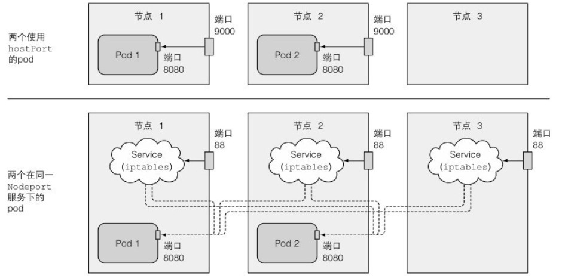

# 命名空间

每个pod都有自己的网络,PID,IPC命名空间.这些命名空间将容器中的进程与其他容器或宿主机中的进程隔离开来.

## 网络命名空间

部分pod(特别是系统pod)需要在宿主节点的默认命名空间中运行,以允许它们看到和操作节点级别的资源和设备.

当pod需要使用宿主节点上的网络配适器时,可以通过将pod spec中的hostNetwork设置为true,来使用宿主节点的网络命名空间.这种情况下pod和宿主节点共享网络接口.

可以创建一个使用宿主节点默认网络命名空间的pod:

```sh
[root@server4-master ~]# vi pod-host-network.yaml 
apiVersion: v1
kind: Pod
metadata:
  name: pod-host-network
spec:
  hostNetwork: true
  containers:
  - image: alpine
    name: main
    command: ["/bin/sleep", "999999"]
[root@server4-master ~]# kubectl create -f pod-host-network.yaml 
pod/pod-host-network created
[root@server4-master ~]# kubectl exec pod-host-network -- ifconfig
ens37     Link encap:Ethernet  HWaddr 00:0C:29:FB:AF:1E  
          inet addr:192.168.2.205  Bcast:192.168.2.255  Mask:255.255.255.0
          inet6 addr: fe80::ff32:c0f:6cf:bfea/64 Scope:Link
          inet6 addr: fe80::9e57:89b4:bf98:c4d7/64 Scope:Link
          inet6 addr: 240e:383:404:aa00:a7a8:7fd6:fa4e:470d/64 Scope:Global
          inet6 addr: fe80::b1c4:1b6c:9cd9:7815/64 Scope:Link
          UP BROADCAST RUNNING MULTICAST  MTU:1500  Metric:1
          RX packets:7563380 errors:0 dropped:584670 overruns:0 frame:0
          TX packets:7392819 errors:0 dropped:0 overruns:0 carrier:0
          collisions:0 txqueuelen:1000 
          RX bytes:4215026725 (3.9 GiB)  TX bytes:2918526795 (2.7 GiB)
```

通过命令展示端口,发现能查看到宿主机的网卡.K8s控制平面组件通过pod部署时,这些pod都会使用hostNetwork选项.


## 绑定节点端口

可以通过配置pod模板中spec.containers.ports.hostPort字段,来绑定容器的端口到节点端口.

对于使用hostPort的pod,访问宿主节点的端口连接会被直接转发到pod对应端口上.而通过NodePort服务暴露端口,连接会转发到随机pod上.

同时NodePort服务会把端口绑定在所有节点上,即使节点上没有pod.而hostPort则只能在有pod的节点上访问,而且同一个节点上不能有两个相同pod,否则会端口冲突.其区别如下图所示:



创建一个带有hostPort选项的pod:

```sh
[root@server4-master ~]# vi kubia-hostport.yaml
apiVersion: v1
kind: Pod
metadata:
  name: kubia-hostport
spec:
  containers:
  - name: kubia
    image: luksa/kubia
    ports:
    - containerPort: 8080
      hostPort: 9000
      protocol: TCP
[root@server4-master ~]# kubectl create -f kubia-hostport.yaml
pod/kubia-hostport created
[root@server4-master ~]# kubectl get po -o wide
NAME               READY   STATUS    RESTARTS   AGE    IP               NODE            
kubia-hostport     1/1     Running   0          18s    10.244.244.250   server6-node2  
```

查询到pod运行在node2上,可以通过node2的IP:9000来访问.

hostPort功能最初用于暴露通过DS部署在每个节点上的系统服务,也用来保证一个pod的两个副本不被调度到同一节点上.


## PID和IPC命名空间

pod spec中的hostPID和hostIPC选项与hostNetwork相似,当设为true时,pod中的容器会使用宿主节点的PID和IPC命名空间,可以看到宿主机上的全部进程或通过IPC机制与它们通信.

创建一个共享宿主机PID和IPC命名空间的pod:

```sh
[root@server4-master ~]# vi host-pid.yaml
apiVersion: v1
kind: Pod
metadata:
  name: host-pid
spec:
  hostPID: true
  hostIPC: true
  containers:
  - name: main
    image: alpine
    command: ["/bin/sleep", "999999"]
[root@server4-master ~]# kubectl create -f host-pid.yaml
pod/host-pid created
```

测试在容器中查看与关闭宿主机进程:

```sh
[root@server4-master ~]# kubectl exec host-pid -- ps aux | grep top
 4974 root      0:00 top
[root@server4-master ~]# kubectl exec host-pid -- kill -9 4974
```

