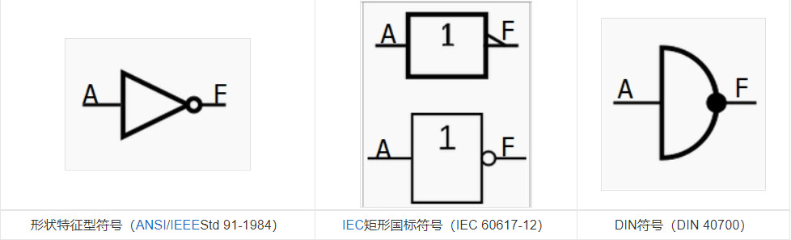
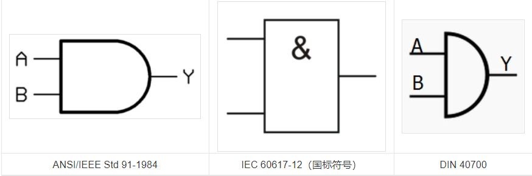
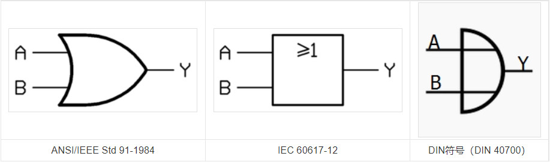
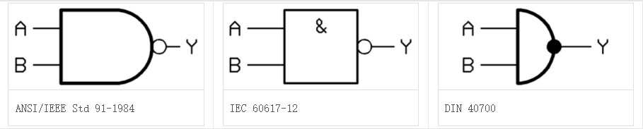
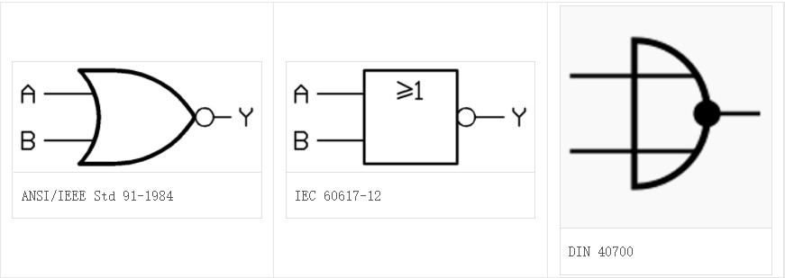
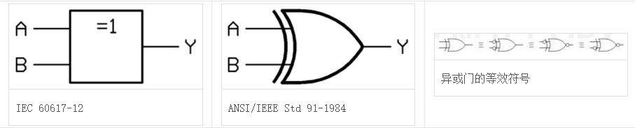
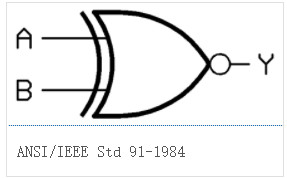
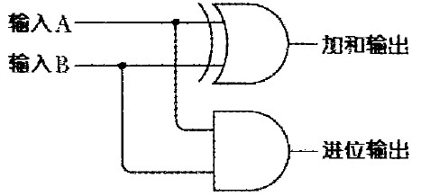
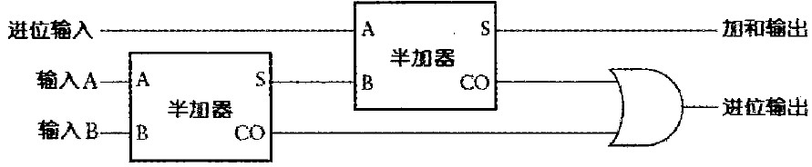

# 软件基础

## 数字系统

计算机以真空管通电与否来代表1和0,这种只有1/0,逢2进1位的表示法称为二进制.常用的进制还有八进制和十六进制.现实生活使用的数字系统是十进制.

二进制表示前缀0b,八进制前缀0o,十六进制前缀0x.

### 二进制转十进制

例如要将二进制1101101转为十进制,手动计算方法如下:
$$
1101101=1*2^6+1*2^5+0*2^4+1*2^3+1*2^2+0*2^1+1=64+32+0+8+4+0+1=109
$$

在bash中可以使用echo $(())来直接转换:

```sh
[root@server2 ~]# echo $((2#1101101))
109
```

### 十进制转二进制

例如将十进制109转回二进制:

	109/2=54...1
	054/2=27...0
	027/2=13...1
	013/2=06...1
	007/2=03...0
	003/2=01...1
	001/2=00...1

将商除到0为止,把所有的余数从下往上读,得到的就是二进制结果1101101.

在bash中可以通过调用bc来计算:

```sh
[root@server2 ~]# echo "obase=2;ibase=10;109"|bc -l
1101101
```

### 二进制转十六进制

例如要将二进制1101101转为十六进制.

因为四位二进制恰好等于一位十六进制,所以先将二进制数字从低位到高位分为四位一组,高位不足四位在前面补0:

0110 1101

然后将每一组转为对应的十六位进制数:

6 D

得到转换结果0x6D.

### 十六进制转二进制

例如将十六进制0x6D转为二进制.

原理同二进制转十六进制,将每位十六进制单独拿出来

6 D

将每位转为对应的二进制:

0110 1101

得到转换结果1101101.

### 计算单位

计算机中常用的计算单位有下面一些:

- **容量单位**

  - **比特**(bit): 二进制单位,只记录0或1.

  - **字节**(Byte): 储存记录用的单位, 1Byte = 8bit. 1KB = 1024Byte. 再往上有GB,TB,PB,EB,ZB等单位.

- **速度单位**

  - **运算速度**: Hz代表秒分之一,CPU运算速度常使用MHz或GHz. 1MHz = 1000*1000Hz

  - **网络传输**: bps意思是bit per second每秒多少比特,常见的网卡速度100Mbps意即每秒传输100Mbits,转为实际文件传输速度等于12.5MB/s

    

## 编码系统

计算机只能识别数字,所以通过编码系统处理将文字转为数字储存.

### 编码过程

编码就是依据一个编码对照表,将文字转为对应编码表中的编号,把编号数字存入文件中.

读取时则再次依据对照表还原成文字显示出来.

如果选择的编码表和实际不符,转出来的就是所谓的"乱码".

常用的有编码表有:ASCII, GB2312, Unicode

### ASCII编码

美国信息交换标准码(ASCII, American Standard Code For Information Interchange)为每个字符指定7位(最左边的位被忽略掉,占用1Bytes的记录),因此总共可以表示128个字符,即从二进制0000000到1111111.

ASII码中包含33个控制字符,52个字母(65\~90,97\~122),10个数字(48\~57),32个标点符号以及空白符

### GB2312编码

简体中文最常用的是GB2312编码,每个中文字会占用2Bytes.

理论上有2^16^=65536个记录位置,实际只收录了一万三千多个中文字.

### Unicode编码

Unicode编码也叫UTF8或统一码.基本上包含了所有语言的文字.


## 逻辑门

主要的逻辑电路基本单元有下面一些.

### 非门(NOT Gate)

又称非电路,反相器,倒相器,逻辑否定电路.当其输入端为高电平1时输出端为低电平0,当其输入端为低电平0时输出端为高电平1.也就是说输入端和输出端的电平状态总是反相的.

非门的真值表:

| 输入A | 输出Y |
| ----- | ----- |
| 0     | 1     |
| 1     | 0     |

逻辑符号表示如下:




### 与门(AND Gate)

又称与电路,逻辑积,逻辑与电路.当所有的输入同时为高电平1时,输出才为高电平1.否则输出为低电平0.

与门的真值表:

| 输入A | 输入B | 输出Y |
| ----- | ----- | ----- |
| 0     | 0     | 0     |
| 0     | 1     | 0     |
| 1     | 0     | 0     |
| 1     | 1     | 1     |

逻辑符号表示如下:



### 或门(OR Gate)

又称或电路,逻辑和电路.只要输入中有一个为高电平时1,输出就为高电平1;只有当所有的输入全为低电平0时,输出才为低电平0.

或门的真值表:

| 输入A | 输入B | 输出F |
| ----- | ----- | ----- |
| 0     | 0     | 0     |
| 0     | 1     | 1     |
| 1     | 0     | 1     |
| 1     | 1     | 1     |

逻辑符号表示如下:



### 与非门(NAND Gate)

是与门和非门的叠加.若当输入均为高电平(1),则输出为低电平(0);若输入中至少有一个为低电平(0),则输出为高电平(1).与非门可以看作是与门和非门的叠加.

与非门真值表:

| A    | B    | Y    |
| ---- | ---- | ---- |
| 0    | 0    | 1    |
| 0    | 1    | 1    |
| 1    | 0    | 1    |
| 1    | 1    | 0    |

逻辑符号表示如下:



### 或非门(NOR Gate)

实现逻辑或非功能.有多个输入端,1个输出端,多输入或非门可由2输入或非门和反相器构成.只有当两个输入A和B为低电平(0)时输出为高电平(1).也可以理解为任意输入为高电平(1),输出为低电平(0).

或非门真值表:

| 输入A | 输入B | 输出Y |
| ----- | ----- | ----- |
| 0     | 0     | 1     |
| 0     | 1     | 0     |
| 1     | 0     | 0     |
| 1     | 1     | 0     |

逻辑符号表示如下:



### 异或门(XOR Gate)

是数字逻辑中实现逻辑异或的逻辑门.多输入异或门可由两输入异或门构成.若两个输入的电平相异,则输出为高电平1;若两个输入的电平相同,则输出为低电平0.即如果两个输入不同,则异或门输出高电平1.

异或门真值表:

| A    | B    | 输出Y |
| ---- | ---- | ----- |
| 0    | 0    | 0     |
| 0    | 1    | 1     |
| 1    | 0    | 1     |
| 1    | 1    | 0     |

逻辑符号表示如下:



### 同或门(XNOR gate)

也称为异或非门,在异或门的输出端再加上一个非门就构成了异或非门.当2个输入端中有且只有一个是低电平0时,输出为低电平0.亦即当输入电平相同时,输出为高电平1.

同或门真值表:

| 输入A | 输入B | 输出F |
| ----- | ----- | ----- |
| 0     | 0     | 1     |
| 0     | 1     | 0     |
| 1     | 0     | 0     |
| 1     | 1     | 1     |

逻辑符号表示如下:



### 加法计算器

可以使用两种基本逻辑门来计算两个二进制数相加的结果:

- 加法位

  加法位的计算结果由XOR异或门实现

  | +加和 | 0    | 1    |
  | ----- | ---- | ---- |
  | **0** | 0    | 1    |
  | **1** | 1    | 0    |

- 进位位

  进位位的计算结果由AND与门实现

  | +进位 | 0    | 1    |
  | ----- | ---- | ---- |
  | **0** | 0    | 0    |
  | **1** | 0    | 1    |

将它们连起来就成为半加器(Half Adder):



为了将可能产生的进位位纳入下一次运算,需要对三个二进制数进行加法运算,最终将两个半加器和一个或门连接起来成为一个全加器(Full Adder):



首先这一次计算两个二进制数A和B的和得到进位和加和输出,然后将加和输出与上一次计算结果的进位输出相加得到另外一个进位和加和输出,最后将两次的进位输出做或运算,与上一步得出的加和输出在一起传递给下一环节.


## 软件程序

程序一般分为操作系统和应用程序.

### 操作系统

操作系统(OS, Operating System)也是一组程序,用于管理计算机的所有活动以及驱动系统中的所有硬件.

操作系统内核直接参考硬件规格写成,用于管理硬件,所以同一个操作系统不能在不同的硬件构架下运行.

操作系统功能主要有:

- **系统调用接口**(System call interface):

  方便程序员通过接口与内核通信,利用硬件资源.

- **程序管理**(Process Control):

  一部计算机可以同时运行很多软件,一般管运行中的程序叫进程.进程可以在前台也可以在后台运行,内核控制着系统管理运行在系统上的所有进程.

- **内存管理**(Memory Management):

  因为程序代码和数据都必须载入到内存中运行,所以内存控制非常重要.

  交换空间(虚拟内存)功能用于物理内存不足时提功内存交换(swap)功能.

  内存储存单元按组划分成很多块,这些块称为页面(Page).内核将每个内存页面放在物理内存或交换空间中,然后维护一个内存页面表,自动把一段时间未访问的内存页面复制到交换空间(Swapping Out).当程序要访问一个已被换出的内存页面时,内核必须从物理内存换出另外一个内存页面给它让出空间,然后从交换空间换入请求的内存页面.

- **文件系统管理**(Filesystem Management):

  负责对多种文件系统的支持,管理数据输入输出工作,文件格式支持等.

- **设备驱动**(Device Driver):

  管理硬件的驱动.驱动程序相当于应用程序和硬件设备的中间人,允许内核与设备之间交换数据.


### 应用程序

应用程序是参考操作系统提供的开发接口所开发出来的软件,这些软件通常针对特定功能利用.


