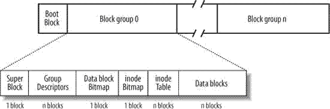

# 文件系统

## 查看文件系统支持

Linux系统现支持的文件系统格式如下:

| **文件系统** | **描** **述**                                                |
| ------------ | ------------------------------------------------------------ |
| ext          | Linux扩展文件系统(Extended Filesystem),最早的Linux文件系统   |
| ext2         | 第2代扩展文件系统,在ext的基础上提供了更多的功能.ext2支持undelete(反删除)和大文件. |
| ext3         | 第3代扩展文件系统,支持日志功能.ext3支持大文件.但不支持反删除(undelete)操作 |
| ext4         | 第4代扩展文件系统，支持高级日志功能                          |
| hpfs         | OS/2高性能文件系统                                           |
| jfs          | IBM日志文件系统                                              |
| iso9660      | ISO 9660文件系统(CD-ROM)                                     |
| minix        | MINIX文件系统                                                |
| msdos        | 微软的FAT16                                                  |
| ncp          | Netware文件系统                                              |
| nfs          | 网络文件系统                                                 |
| ntfs         | 支持Microsoft NT文件系统                                     |
| proc         | 访问系统信息                                                 |
| ReiserFS     | 高级Linux文件系统,支持大文件,支持反删除,几乎能恢复90%以上的数据,有时能恢复到100%. |
| smb          | 支持网络访问的Samba SMB文件系统                              |
| sysv         | 较早期的Unix文件系统                                         |
| ufs          | BSD文件系统                                                  |
| umsdos       | 建立在msdos上的类Unix文件系统                                |
| vfat         | Windows 95文件系统（ FAT32）                                 |
| XFS          | 高性能64位日志文件系统                                       |

可以通过查看fs目录了解支持的文件系统有哪些:

```sh
[root@101c7 /]# ls -l /lib/modules/$(uname -r)/kernel/fs
total 20
-rw-r--r--. 1 root root 5992 Aug 31 11:05 binfmt_misc.ko.xz
drwxr-xr-x. 2 root root   25 Sep  7 05:54 btrfs
drwxr-xr-x. 2 root root   30 Sep  7 05:54 cachefiles
drwxr-xr-x. 2 root root   24 Sep  7 05:54 ceph
```

查看系统目前已加载到内存中支持的文件系统:

```sh
[root@101c7 /]# cat /proc/filesystems 
nodev   sysfs
nodev   rootfs
nodev   ramfs
```

整个Linux系统都是通过虚拟文件系统(VIrtual Filesystem Switch)的内核功能去读取文件系统.虚拟文件系统会管理各种文件系统中的数据,统一提供给系统调用使用.


## Ext文件系统结构

Linux中分区格式化的意义在于选择文件系统,按照文件系统标准将数据初始化.

在选择ext文件系统格式化后,磁盘结构变为一个引导扇区(有装系统)+N个块组(Block Group).如下图:



启动扇区占大小为1KB,所以如果block大小设为为1024B的话,启动扇区会存在0号block.而在block大小大于1024B时,0号block前面是启动扇区,后面跟着superblock占用1K.

每个块组又包含分为六个区域:

- **SuperBlock**

  记录文件系统的整体信息,包括inode/block的总量,使用量,剩余量,以及文件系统的格式与相关信息;

- **文件系统描述(File System Description)**

    这个区段可以描述每个块组的起止block号码.

    说明块组每个区段(superblock,inode,data,bitmap)的block起止号码.

- **块对照表(Block Bitmap)**

  块对照表用来辅助块组找到可用的block写数据.

  删除文件时将对应block号码标记为未使用.

- **Inode对照表(Inode Bitmap)**

  与块对照表功能类似,用来记录使用与未使用的inode号码.

- **Inode Table** 

  记录文件的属性,一个文件占用一个inode,同时记录此文件的数据所在的block号码;

- **Data Block**

  实际记录文件的内容,如果文件太大时,会占用多个block.

与FAT文件系统对比:

- Linux文件系统每个inode与block都有编号,读取文件时先读取inode记录,得到文件实际存放的block号码,将整个文件读取出来.这种数据访问方法称为索引式文件系统(indexed allocation).
- FAT格式没有inode存在,每个block号码都记录在前一个block当中.读取文件时必须一个个追踪,硬盘转很多圈才能读到最后一个block.因此需要磁盘碎片整理,将同一个文件所属的block汇合在一起提升搜寻效率.

### 数据块(Data Block)

放置文件内容的地方,在Ext2中支持block大小有1KB,2KB和4KB.格式化时可以选择块大小,每个块都有编号.

不同块大小支持分区大小和单文件大小有所不同:

| Block大小          | 1KB  | 2KB   | 4KB  |
| ------------------ | ---- | ----- | ---- |
| 最大单一文件限制   | 16GB | 256GB | 2TB  |
| 最大文件系统总容量 | 2TB  | 8TB   | 16TB |

每个block内最多放置一个文件数据,如果文件超过block大小会占用多个block,而小于block大小,剩余容量也不能再被利用.

### Inode表格(Inode Table)

inode的内容主要记录文件的属性及文件实际数据存放的block号码.

inode记录的文件数据有下面这些:

- 该文件的访问模式(read/write/execute);
- 该文件的所有者与组(owner/group);
- 该文件的大小;
- 该文件创建或状态改变的时间(ctime);
- 最近一次读取的时间(atime);
- 最近修改的时间(mtime);
- 定义文件特性的标志(flag),比如SUID等;
- 该文件真正内容的指向(pointer).

inode的特点:

- 每个inode大小均固定为128Bytes(ext4和xfs可设置到256Bytes);
- 每个文件都仅占用一个inode;
- 文件系统能创建的文件数量与inode数量有关;
- 系统读取inode时,会匹配inode上记录权限与用户是否符合,符合才继续读取block内容.

inode记录方式:

- 每个inode记录block号码的区域定义为:12个直接,1个间接,1个双间接和1个三间接记录区
- 12个直接记录能直接取得block号码,间接则是再拿一个block来当作记录block号码的记录区.双间接和三间接则是block再次指向下一个记录编号的block号码,以此最多三层指向.
- 以1k大小block块计算,总共能记录的文件大小为:$(12*1K)+(1K/4B=256K)+(256*256K)+(256*256*256K)=16GB$​
- 现在使用256Bytes容量大小的inode,还可以记录更多文件系统信息,包括ACL及SELinux类型等.记录的单一文件大小达16TB且单一文件系统总容量可达1EB

### 超级块(Superblock)

超级块是记录整个文件系统相关信息的地方,一般Superblock的大小为1024Bytes.

超级块记录的信息有:

- block与inode的总量;
- 未使用与已使用的inode/block数量;
- block与inode的大小;
- 文件系统的挂载时间,最近一次写入数据的时间,最近一次检验磁盘(fsck)的时间等;
- 一个valid bit数值,若此文件系统已被挂载则值为0,未挂载为1.

因为superblock非常重要,所以除了第一个块组中含有superblock外,其他块组中可能存在superblock备份,用来关键时进行救援修复.

### 查询文件系统详情

使用dumpe2fs命令可以查询ext文件系统信息.例如查询设备sdb1:

```shell
[root@101c7 /]# dumpe2fs /dev/sdb1
dumpe2fs 1.42.9 (28-Dec-2013)
Filesystem volume name:   <none>
Last mounted on:          <not available>
Filesystem UUID:          3789ee36-8f38-441c-ac01-c0a9ca8171a1
Filesystem magic number:  0xEF53
Filesystem revision #:    1 (dynamic)
Filesystem features:      has_journal ext_attr resize_inode dir_index filetype needs_recovery sparse_super large_file
Filesystem flags:         signed_directory_hash 
Default mount options:    user_xattr acl
Filesystem state:         clean
Errors behavior:          Continue
Filesystem OS type:       Linux
Inode count:              65536
Block count:              261888
Reserved block count:     13094
Free blocks:              253344
Free inodes:              65525
First block:              0
Block size:               4096
Fragment size:            4096
Reserved GDT blocks:      63
Blocks per group:         32768
Fragments per group:      32768
Inodes per group:         8192
Inode blocks per group:   512
Filesystem created:       Thu Sep  9 15:10:34 2021
Last mount time:          Thu Sep  9 15:11:11 2021
Last write time:          Thu Sep  9 15:11:11 2021
Mount count:              1
Maximum mount count:      -1
Last checked:             Thu Sep  9 15:10:34 2021
Check interval:           0 (<none>)
Reserved blocks uid:      0 (user root)
Reserved blocks gid:      0 (group root)
First inode:              11
Inode size:               256
Required extra isize:     28
Desired extra isize:      28
Journal inode:            8
Default directory hash:   half_md4
Directory Hash Seed:      32744b35-d887-4ba9-9431-c5a9d63b9474
Journal backup:           inode blocks
Journal features:         (none)
Journal size:             16M
Journal length:           4096
Journal sequence:         0x00000002
Journal start:            1


Group 0: (Blocks 0-32767)
  Primary superblock at 0, Group descriptors at 1-1
  Reserved GDT blocks at 2-64
  Block bitmap at 65 (+65), Inode bitmap at 66 (+66)
  Inode table at 67-578 (+67)
  32183 free blocks, 8181 free inodes, 2 directories
  Free blocks: 585-32767
  Free inodes: 12-8192
Group 1: (Blocks 32768-65535)
  Backup superblock at 32768, Group descriptors at 32769-32769
  Reserved GDT blocks at 32770-32832
  Block bitmap at 32833 (+65), Inode bitmap at 32834 (+66)
  Inode table at 32835-33346 (+67)
  32189 free blocks, 8192 free inodes, 0 directories
  Free blocks: 33347-65535
  Free inodes: 8193-16384
...
```

可以看到这块磁盘格式化成ext3文件系统后的inode/block数量,目前状态为clean正常等,这些就是superblock所记录的内容.后面以Group开头的段为一个个块组信息.


## 文件与目录数据结构

每个文件或目录都会占用一个inode,且可依据文件内容的大小来分配多个block给该文件使用.

### 目录

当在系统中新建一个目录时,至少会分配一个inode与一个block给该目录.

- **inode记录本目录相关权限,属性与本目录block号码**.
- **block记录在这个目录下的文件名与该文件(或目录)对应的inode号码**.

例如使用ls -i查看目录ext333内文件所占用inode号码:

```sh
[root@101c7 ext333]# ls -li
total 16
12 -rw-r--r--. 1 root root     0 Sep  9 15:37 fist.log
11 drwx------. 2 root root 16384 Sep  9 15:10 lost+found
```

first.log文件的inode号码是12,lost+found目录的inode号码是11,这些就是记录在ext333目录block中的数据.

再查看一下目录占用的大小:

```sh
[root@101c7 ext333]# ll -dh /ext333/lost+found/ /ext333/
drwxr-xr-x. 3 root root 4.0K Sep  9 15:37 /ext333/
drwx------. 2 root root  16K Sep  9 15:10 /ext333/lost+found/
```

可以看到ext333目录大小为4KB,而分区时设置的一个block大小也是4KB,因此它使用了1个block来记录文件和目录inode号码信息.另外lost+found目录大小16KB,说明记录信息太多1个block不够用,分配了4个block来记录.

### 文件

当新建一个一般文件时,系统会分配一个inode与相对于该文件大小的block数量给该文件.

假设block大小4KB,inode大小为128B,要新建100KB大小的文件,那么会分配到1个inode与25个block来储存该文件.由于inode只有12个直接指向,因此还要额外分配1个block来作为block号码记录用,文件实际上需要26个block来储存.

### 目录树读取

inode本身并不记录文件名,文件名的记录在目录的block当中.所以给目录w权限,代表的实质操作是修改目录的block数据.

**删除一条文件记录(rm操作),修改一条文件指向inode记录(mv命令),或者新增一条文件指向inode记录(cp命令).**

对应的便是在目录下对文件或目录进行删除/重命名/新增操作.

以下面记录为例:

```sh
[root@101c7 ext333]# ll -di /ext333/ /ext333/lost+found/ /ext333/lost+found/pass 
2 drwxr-xr-x. 3 root root  4096 Sep  9 15:37 /ext333/
11 drwx------. 2 root root 16384 Sep  9 15:54 /ext333/lost+found/
14 -rw-r--r--. 1 root root     5 Sep  9 15:54 /ext333/lost+found/pass
```

假设root要读取/ext333/lost+found/pass这个文件时,顺序是这样的:

1. 通过挂载点的信息找到inode号码为2的ext333目录,查询2号inode内容,得到目录权限配置为755.由于存在x权限,因此用户可以进入到ext333目录中.由于存在r权限,因此用户可以读取目录ext333的block内容.
2. 通过读取ext333目录的block内容,得到lost+found目录的inode号码为11.继续查询11号inode内容,得知权限为rwx,因此继续进入lost+found目录,并读取目录的block内容.
3. 通过读取目录lost+found的block内容得知pass文件的inode号码为14.继续查询14号inode内容,得到权限为rw.由于存在r权限,因此获得数据实际存放的block地址.
4. 读取pass文件的block内容.

### 新增文件

新增文件一个文件或目录时,文件系统行为是:

1. 先确定用户对于欲添加文件的目录有没有w和x权限,有才能添加;
2. 根据inode bitmap找到没有使用的inode号码,将新文件权限/属性写入;
3. 根据block bitmap找到没有使用的block号码,并将实际数据写入到block中,并更新inode的block指向数据;
4. 将写入的inode与block数据同步更新inode bitmap越block bitmap,并更新superblock的内容

inode table与data block称为数据存放区域,其他如super block,block bitmap与inode bitmap等区域被称为metadata(中间区域).

## 日志文件系统

Linux中有3中广泛使用的日志文件方法,每种的保护等级都不相同:

| 方法     | 描述                                                         |
| -------- | ------------------------------------------------------------ |
| 数据模式 | 索引节点和文件都会被写入日志.所有写到储存设备的数据都要写两次,数据安全但性能差. |
| 有序模式 | 只有索引节点数据会被写入日志,数据写入成功后删除.             |
| 回写模式 | 只有索引节点数据会被写入日志,但不控制文件数据何时写入.       |

默认情况下ent3文件系统使用有序模式的日志.ReiserFS和XFS文件系统使用回写模式的日志.

### 异步处理(Asynchronously)

当系统加载一个文件到内存后,如果长久没有改动,在内存区段的文件数据会被设置为clean.如果更改了,则设置为dirty.系统会不定时将内存中设置为dirty的数据写回磁盘.这个过程叫做异步处理.

- 系统会将常用的文件数据放置在主储存器的缓冲区,以加速文件系统的读写;
- 可以通过sync命令将dirty数据写回到硬盘;
- 正常关机时,会调用sync将内存中数据写回到硬盘;
- 非正常关机时,可能会造成数据损毁.日志文件系统下次启动会读取日志文件并处理上次留下的未写入的数据.

### 数据不一致状态(Inconsistent)

假如文件写入过程中突然断电,写入的数据仅有inode table和data block,最后一个同步更新中间数据的步骤没有完成就会发生数据不一致情况.

在Ext2文件系统中发生这个问题,系统在重启后会通过Super Block当中记录的valid bit(是否有挂载)与文件系统的state等状态判断是否强制进行数据一致性的检查,需要的话运行磁盘扫描程序.

### 日志文件系统(Journaling file system)

为了避免文件系统不一致的情况发生,在文件系统中规划出一个块,用来记录写入或修订文件时的步骤.

- 当系统要写入一个文件时,会先在日志记录块中记录某个文件准备要写入的信息;
- 当完成数据与元数据更新后,在日志记录块当中完成该文件的记录.
- 这样当出现问题时,系统只要去检查日志记录块就知道哪个文件发生了问题,针对该问题做一致性检查即可.

上面的/dev/sdb1中,journal块指向inode 8号记录,具有16MB容量处理日志.


## XFS文件系统

由于Ext文件系统在格式化时,采用的是预先规划处所有inode/block/metadata等数据.在磁盘容量小时问题不大,处理按TB计的大硬盘时,光是格式化都要花去很长时间.

而XFS是针对大文件和数据设计的日志式文件系统,Ext文件系统有的功能XFS都具备,因此被作为CentOS 7中的默认文件系统.

XFS文件系统在数据分布上主要划分为三部分:数据区,文件系统活动登录区和实时运行区.

### 数据区(Data Section)

数据区结构基本同Ext文件系统一样,包括inode/data block/superblock等数据,而且也是分为多个储存区群组(Allocation Groups)来分别放置文件系统所需数据.

每个储存区群组都包含了:

- 整个文件系统的superblock
- 剩余空间管理机制
- inode的分配与追踪

此外inode与block都是系统需要用时,才动态配置产生.block容量可以设置成512Bytes到64KB,inode的容量可以设置成256Bytes到2MB.这是与Ext文件系统的主要区别.

### 文件系统活动登录区(Log Section)

在登录区主要被用来记录文件系统的变化,有点像日志系统.文件的变化会在这里记录下来,直到变化完整写入到硬盘后,记录才会终止.

在遇到突发情况而造成文件系统损毁时,系统会检查登录区,看系统之前正在操作的文件,再检查文件是否正确,依次修复文件系统.

由于此区块读写频繁,因此可以指定单独的磁盘作为XFS文件系统作为日志区.

### 实时运行区(Realtime Section)

当有文件要被创建时,XFS会在实时运行区找一个到数个extent区块,将文件放置在这个区块内,等到分配完成再写入到data section的inode和block中.

extent区块在格式化时可以指定,范围从4K到1GB.一般默认设置为64KB容量.

### 查询文件系统详情

在XFS文件系统中,使用xfs_info命令来查看分区详情.

```sh
[root@101c7 ext333]# xfs_info /dev/mapper/centos-root
meta-data=/dev/mapper/centos-root isize=512    agcount=4, agsize=1113856 blks
         =                       sectsz=512   attr=2, projid32bit=1
         =                       crc=1        finobt=0 spinodes=0
data     =                       bsize=4096   blocks=4455424, imaxpct=25
         =                       sunit=0      swidth=0 blks
naming   =version 2              bsize=4096   ascii-ci=0 ftype=1
log      =internal               bsize=4096   blocks=2560, version=2
         =                       sectsz=512   sunit=0 blks, lazy-count=1
realtime =none                   extsz=4096   blocks=0, rtextents=0
```

下面简单解释下字段含义:

- 第1行:
  - isize=512 指定inode的容量每个512B大小
  - agcount=4 是储存区群组的个数4个.可以设置成CPU核心的数量来搭配.
  - agsize=1113856 blks 每个储存区群组具有1113856个block
- 第2行:
  - sectsz=512 指逻辑扇区容量设置为512Bytes
- 第4行
  - bsize=4096 指每个block大小为4KB,可以用bsize*blocks得到分区总容量17821696KB≈16GB
  - blocks=4455424 指系统总共有4455424个blocks,可以由agsize*agcount算得
- 第5行
  - sunit=0 和RAID的stripe设置有关
  - swidth=0 和RAID的工作盘数量有关
- 第7行
  - internal表示这个登录区的位置在文件系统内,而不是外部设备
  - bsize=4096 登录区block大小为4KB
  - blocks=2560 登录区block总数2560,可以算得登录区大小为10M
- 第9行
  - extsz=4096 指extent大小为4KB
