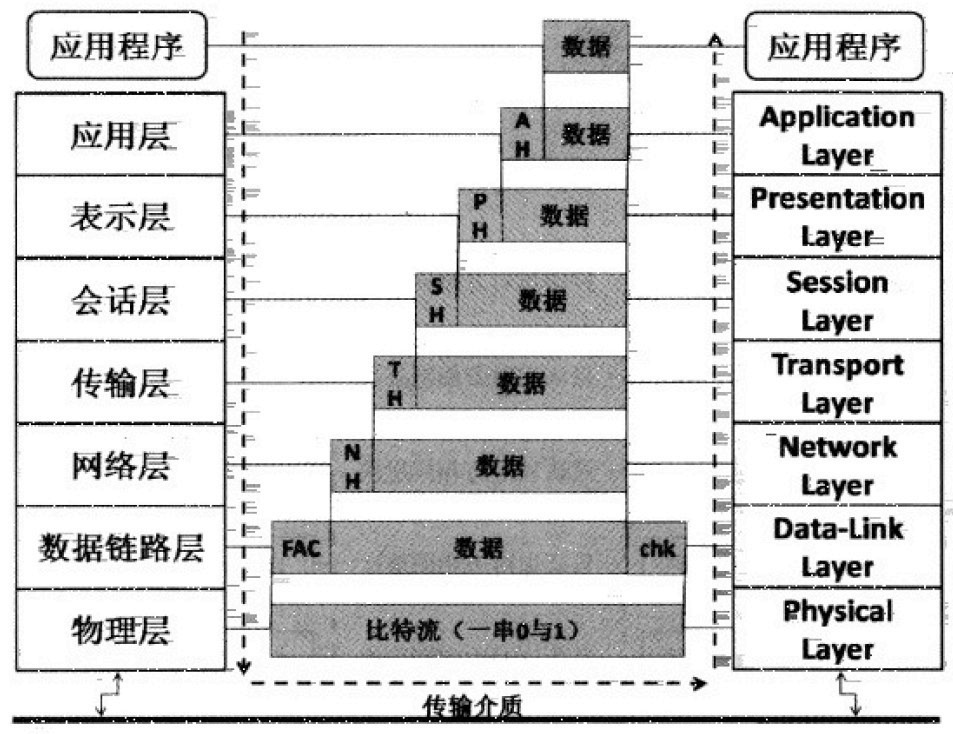
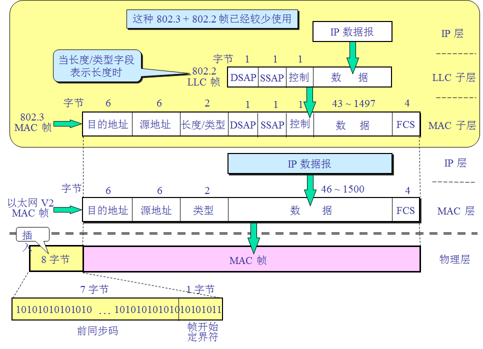
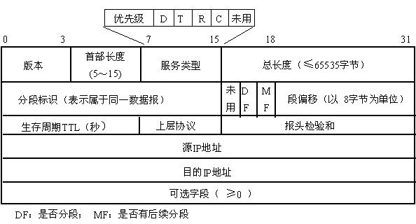
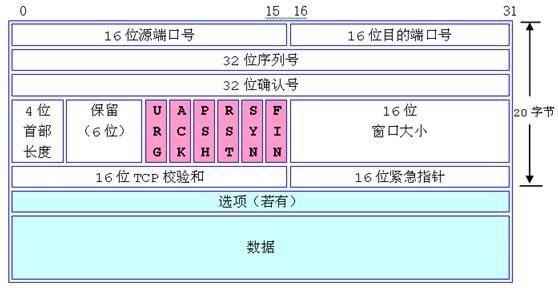
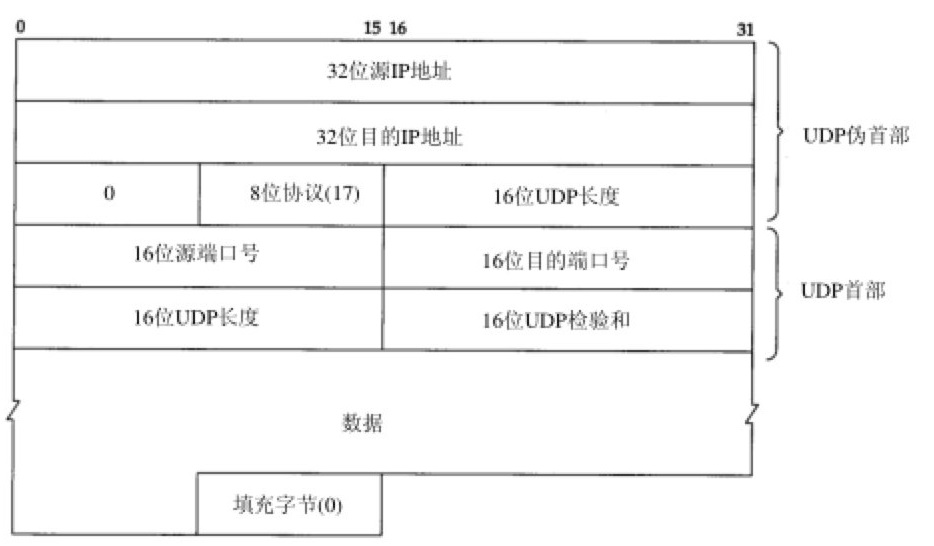

# 网络基础

## 基本概念

Internet(1980s)由ARPANET(1970s)发展而来.

### 网络硬件

组成计算机网络的组件大致有下面这些:

- 节点(Node): 节点是具有网络地址(IP)设备的统称.
- 服务器(Server): 提供数据给用户的主机就能被称为一台服务器.
- 工作站(Workstation): 任何可以在网络输入的设备都可以是工作站.
- 客户端(Client): 主动发起连接去请求数据的,就可以称为客户端.
- 网卡(NIC, Network Interface Card): 用于提供网络连接的设备.
- 网络接口: 利用软件设计出来的网络接口,主要提供网络地址(IP).
- 网络拓扑(Topology): 各个节点在网络上面的链接方式,通常指物理连接方式.
- 网关(Gateway): 具有两个以上的网络接口,可以连接两个以上不同网段的设备叫网关设备.

### 网络范围

依据网络的大小范围分为两类:局域网(LAN, Local Area Network)和广域网(WAN, Wide Area Network).

### OSI七层协议

OSI(Open System Interconnection)七层协议是将整个网络连接过程分为数个层次(Layer),每个层次都有特定的独立功能.这样可以针对不同层次来写程序,每个层次之间的功能互不干扰.

越接近硬件的层次为底层,越接近应用的层次为高层,无论接收还是发送端,每一层都只认识对方同一层次的数据.数据通过层层包装后发送数据,再由接收方层层解包.总体情况如下图表示:



上层包裹会放入下层数据中,而数据前面则是这个数据的报头.比较特殊的是第二层,它分为两个子层来处理数据.

每一层负责的任务如下:

- Layer 1 **物理层**(Physical Layer)

  由于网络传输介质只能传送0和1,因此物理层必须定义所使用的传输设备的电压与信号等,同时还必须了解数据帧转成比特流的编码方式,最后连接实际创数介质并发送/接受比特信号.

- Layer 2 **数据链路层**(Data-Link Layer)

  这一层比较特殊,因为下层是实体定义,上层是软件封装的定义.因此第二层又分两个子层进行数据的转换操作:

  - 面向硬件主要负责的是MAC(Madia Access Control),也称这个数据包裹为MAC数据帧(Frame),MAC是网络接口设备所能处理的主要数据包,也是被物理层编码成比特流的数据.MAC必须要经过通信协议来取得网络介质的使用权,目前最常用的是IEEE 802.3的以太网络协议.

  - 面向软件部分则是由逻辑链接层(LLC, Logical Link Control)所控制,主要处理来自上层的数据包(Packet)并转成MAC的格式,负责的工作包括信息交换,流量控制,失误问题的处理等.

- Layer 3 **网络层**(Network Layer)

  网络地址(IP, Internet Protocol)就是在这一层定义.同时也定义出计算机之间的连接建立,终止与保持,数据包的传输路径选择等,因此这层除了IP外,就是数据包能否到达目的地路由的概念了.

- Layer 4 **传输层**(Transport Layer)

  这层定义了发送端与接收端的连接技术,如TCP/UDP技术.同时包括该技术的数据包格式,数据包的发送,流程控制,传输过程的检查与重新发送等,以确保各个资料数据包可以正确无误地到达目的端.

- Layer 5 **会话层**(Session Layer)

  定义了两个地址之间连接信道的连接与中断.此外也可建立应用程序之间的会话,提供其他加强型服务.如网络管理,建立与断开,会话控制等.会话层用来确定网络服务建立的连接.

- Layer 6 **表示层**(Presentation Layer)

  将来自本地应用程序的数据格式转换或重新编码成网络的标准格式,然后再交给下面的传输层等来处理.所以这层主要定义的是网络服务之间的数据格式转换,包括数据的加密解密.

- Layer 7 **应用层**(Application Layer)

  应用层本身不属于应用程序所有,而是再定义应用程序如何进入该层的沟通接口,以将数据接收或发送给应用程序,并最终展示给用户.

### TCP/IP

其实TCP/IP也是使用OSI七层协议的观念,只是简化为四层:

- OSI七层协议中的数据链路层和物理层,在TCP/IP中统一为网络接口层.
- 网络层没变,主要应用是IP/ICMP.
- 传输层也没变,主要应用是TCP/UDP.
- 而应用层,表示层和会话层合并称为应用层.相关应用有HTTP,FTP,SSH,SMTP等.

用网页浏览器举例,一个网站浏览的过程像这样:

1. 应用程序: 打开浏览器输入网址按下回车后,网址和相关数据会被浏览器包成数据包,向下开始传输.
2. 应用层: 由应用层提供的HTTP通信协议,将浏览器的数据封装起来,并给予一个应用层报头,丢给传输层.
3. 传输层: 由于HTTP为可靠连接,因此将数据丢入TCP封装内,并给予一个TCP封装的报头,然后传给网络层.
4. 网络层: 将TCP数据封装到IP数据包内,再给予一个IP包头(来源与目标IP),传给网络接口层.
5. 网络接口层: 如果使用以太网络时,IP会根据CSMA/CD标准,封装到MAC数据帧中,并给予MAC帧头,再转成比特流后,利用传输介质开始传送.
6. 服务器接收到数据包后,以反方向解开,交给对应的层次进行分析,最后WWW服务软件获知请求的数据内容,将数据依循上面流程一层层封装,传送到用户手上.


## TCP/IP网络接口层相关协议

TCP/IP最底层的网络接口层主要与硬件关系密切,下面分段解析相关硬件和协议.

### 广域网设备

广域网上使用的设备较多,最常见的有以下一些:

- 传统电话拨号连接PPP协议(Point-to-Point Protocol)

  早期网络通过调制解调器加上电话线以及电脑的九针串行端口,通过PPP协议拨号获得网络IP参数来上网.速度很忙且与占用电话线路.PPP支持TCP/IP,NetBEUI,IPX/SPX等通信协议.

- 整合服务数字网络(ISDN, Integrated Services Digital Network)

  利用电话线路来联网,只是连接两端都需要有ISDN的调制解调器来提供连接功能.ISDN的传输有多种信道可以使用,并能将多个信道整合应用,因此速度可以翻倍提升.例如美国规格使用23个以上信道来连接,每个B信道速度约64Kbps,总速度可达1.5Mbps左右

- 非对称数字用户环路(**ADSL**, Asymmetric Digital Subscriber Line)的PPPoE协议(PPP over Ethernet)

  也是通过电话线来拨号取得IP,不过使用的是电话的高频部分,与一般语音电话的频率不同,因此不影响电话使用.由于在中国上传/下载的带宽不同,因此才被陈伟非对称的环路.ADSL同样使用调制解调器,只是它通过PPPoE的方法,将PPP仿真在以太网卡上,因此电脑需要通过一张网卡来连接到调制解调器,并通过拨号程序来取得新的接口(ppp0).

- 电缆调制解调器(Cable Modem)

  通过有线电视使用的缆线作为网络信号介质,同样需要具备调制解调器来连接到ISP,以取得网络参数来上网.Cable Modem的带宽主要是共享型,所以通常具有区域性.

### 局域网设备

局域网环境中,最常用的就是以太网,其次还有光纤信道等.

早前IEEE所制订的以太网络标准为802.3的IEEE **10BASE5**,这个标准定义是:10代表传输速度10Mbps,BASE表示采用基带信号进行传输,5表示每个网络节点之间最长可达500米.

传输介质也就是网线使用的是类似传统电话线的双绞线(Twisted Pair Ethernet),IEEE将这种线路的以太网传输方式制定成10BASE-T的标准.**10BASE-T**使用的是10Mbps全速运行且采用非屏蔽双绞线(UTP)的网线.此外10BASE-T的UTP网线可以使用星形连接(Star),也就是以一个集线器为中心来连接各网络设备的方法.

后来IEEE制定了802.3u这个支持到100Mbps传输速度的100BASE-T标准,这个标准同10BASE-T差异不大,只是双绞线制作需要更精良,同时也已经支持使用了四对绞线的网线,也就是目前很常见的8芯网线.这种网线常称为五类线(CAT5, Category 5).这种传输速度的以太网就被称为Fast Ethernet.

至于千兆网络Gigabit Ethernet使用的网线等级为CAT5e或CAT 6.每当传输速度增加,线材的电磁效应互相干扰会加强,因此对网线的要求更严格.

RJ-49网络接口因为每条芯线的对应不同分为568A与568B接头:

| 接头/线序 | 1    | 2    | 3    | 4    | 5    | 6    | 7    | 8    |
| --------- | ---- | ---- | ---- | ---- | ---- | ---- | ---- | ---- |
| 568A      | 白绿 | 绿   | 白橙 | 蓝   | 白蓝 | 橙   | 白棕 | 棕   |
| 568B      | 白橙 | 橙   | 白绿 | 蓝   | 白蓝 | 绿   | 白棕 | 棕   |

对于100Mbps网络,实际使用的只有1,2,36芯,根据网线连接不同设备线序不同,又分两种连接方式:

- 交叉线: 一边568A一边568B的接头时叫交叉线,用在直连两台主机的网卡.

- 直连线: 两头都是568A或568B时叫直连线,用来连接主机网卡与网络设备.

### CSMA/CD

以太网重心是以太网卡,每张网卡出产时都会有个MAC地址(Media Access Control).以太网卡之间数据传输标准是CSMA/CD(Carrie Sense Multiple Access With Collision Detection).

假如有主机A和主机B通过10Mbps集线器(Hub)物理连接在一起,A到B数据传输流程如下:

1. 监听介质使用情况(Carrier Sense): A主机发送网络数据包前,需要先对网络介质进行监听,确认没人在用时才发出.
2. 多点传输(Multiple Access): A主机所发送的数据会被集线器复制一份,然后发送给所有连接到此集线器的主机.但因为目标主机是B,其他主机会将数据帧丢弃.
3. 冲突检测(Collision Detection): 该数据帧附有检测能力,假若数据发送时网络阻塞,那么这些数据帧就会被损毁,在等待超时时间过后,A主机会重新发送一次原数据包.

### MAC封装格式

CSMA/CD发送出去的数据帧其实就是MAC,整个网络硬件上面传送数据的最小单位.这个数据帧上面有两个很重要的数据,目标与来源网卡的MAC地址.MAC数据帧的内容如下所示:



MAC地址范围从00:00:00:00:00:00到FF:FF:FF:FF:FF:FF这6Bytes中,前3Bytes为厂商代码,后3Bytes是配置码.这个MAC地址直连仅在局域网内使用,在广域网中MAC地址会跟随网络设备变化.

数据帧内的数据大小范围46Bytes到1500Bytes.当最小46Bytes数据量时,加上包内其他固定18Bytes数据量,则数据帧总大小最少64Bytes.假如实际数据量不足46Bytes则会填充到46Bytes.

### MTU最大传输单元

标准以太网数据帧所能传送的数据量最大值也叫最大传输单元(MTU, Maximum Transmission Unit).标准定义为1500Bytes,不过每种网络接口的MTU都不相同,有定义为1492Bytes的MTU(802.2+802.3组合封装).超过MTU的数据包会被拆解分发.

在千兆网中另有一个参数叫巨帧(Jumbo Frame),等同于MTU的作用,一般定义到9000Bytes.但由于大多数网络设备都使用MTU标准,因此巨帧只使用于内部网络传输数据,以此提高网速.

### 集线器与交换机

使用集线器的网络共享设备之间可能会发生冲突,交换机(Switch)可以解决这一问题.

在一个支持OSI第二层的交换机上,会有一个特别的内存,用来记录每个交换机端口与其连接的网卡MAC地址.当传输数据时直接通过交换机内存再转给目标主机,这样克服了数据包冲突问题.

交换机端口有全双工/半双工(full-duplex/half-duplex)两种工作模式,全双工表示端口上行和下行带宽可同时达到端口速度.半双工则是上行和下行共享端口速度,类似于集线器工作模式.

交换机拥有自动协调网口速度功能(Auto-negotiation,又叫N-Way),可以自动协调出最高的传输速度来通信.此外交换机还能自动识别交叉线或直连线来自适应.


## TCP/IP网络层相关数据包

Internet其实就是TCP/IP这个通信协议的通称,由Inter NIC所管理.

### IP数据包封装

目前IP分为IPv4和IPv6,IPv6用来解决IPv4地址不足的问题,地址位可达128位.

IPv4封装报头格式如下:



下面分别说明:

- 版本(Version)

  声明这个IP数据包的版本,比如IPv4或IPv6.

- IP报头长度(IHL, Internet Header Length)

  告知这个IP数据包的报头长度,以4个字节为一个单位记录IP报头长度.

- 服务类型(Type Of Service)

  这个项目内容为PPPDTRCU,表示这个IP数据包的服务类型:

  - PPP: 表示这个数据包的优先级,目前很少使用.
  - D: 若为0表示一般延迟(Delay),若为1表示低延迟.
  - T: 若为0表示一般传输量(Throughput),若为1表示高传输量.
  - R: 若为0表示一般可靠度(Reliability),若为1表示高可靠度.
  - C: 若为0表示选择一般路由(Router),若为1表示选择最快路由.
  - U: 保留未被使用

- 总长度(Total Length)

  指这个IP数据包的总容量,包括报头与数据部分(Data)部分,最大可达65535Bytes(64KB).

- 识别码(Identification)

  当IP数据包太大进行分割后,这个字段用来标记分段的数据属于哪个IP数据包.

- 特殊标志(Flags)

  其字段为0DM:

  - D: 为0表示可以分段,为1表示不可分段.
  - M: 为0表示此IP为最后分段,为1表示非最后分段

- 分段偏移(Fragment Offset)

  表示这个IP分段在原始IP数据包中的位置,以8字节为1单位编号.有了总长度,识别码,特殊标志和分段偏移后,就能将IP分段重组为IP数据包了.

- 生存时间(TTL, Time to Live)

  指这个IP数据包的生存时间,范围为0~255.当这个IP数据包通过一个路由器时,TTL就会减1,TTL等于0时,数据包会被直接丢弃.

- 协议代码(Protocol Number)

  来自传输层和网络层本身的数据都放置在IP数据包中,这个字段用来记录每种数据包的内容.代码含义如下表:

  | IP内代码 | 数据包协议名称                           |
  | -------- | ---------------------------------------- |
  | 1        | ICMP(Internet Control Message Protocol)  |
  | 2        | IGMP(Internet Group Management Protocol) |
  | 3        | GGP(Gateway-to-Gateway Protocol)         |
  | 4        | IP(IP in IP encapsulation)               |
  | 6        | TCP(Transmission Control Protocol)       |
  | 8        | EGP(Exterior Gateway Protocol)           |
  | 17       | UDP(User Datagram Protocol)              |

- 报头校验码(Header Checksum)

  用于检查这个IP报头是否存在错误.

- 来源IP地址(Source Address)

  32位长度的IP地址.

- 目标IP地址(Destination Address)

  和来源IP地址对应的目标IP地址.

- 其他参数(Options)

  提供额外的功能,包括安全处理机制,路由记录,时间戳,严格与宽松的来源路由等.

- 补齐项目(Padding)

  用来补齐Options内容不足时的位数32 bits.

### IP地址组成与分级

IP地址由32个0或1组成,为了便于记忆将其分为4段,每段8个字节转成十进制能表达范围0~255,也就是最常见到IP地址的写法了.

IP前三组数字叫做网络号码(Net_ID),后面一组数字叫主机号码(Host_ID).在**同一网段**定义就是在同一个物理网段内,主机IP具有相同的Net_ID,并具有独特的Host_ID.

在同一网段内Host_ID不可重复,此外Host_ID=0代表整个网段地址(Network IP),而Host_ID=255表示为广播地址(Broadcast IP).

为了方便管理IP地址,Inter NIC将整个IP网段分为五个段:

- Class A: 0.0.0.0~127.255.255.255
- Class B: 128.0.0.0~191.255.255.255
- Class C: 192.0.0.0~223.255.255.255
- Class D: 224.0.0.0~239.255.255.255
- Class E: 240.0.0.0~255.255.255.255

其中Class D用来组播(multicast)用,Class E则是保留没有使用的网段.

### IP种类与获得

在IPv4中IP只有两种:

- 公共IP(Public IP)

  由Inter NIC所统一规划的IP,只有这种IP才能上互联网.

- 私有IP(Private IP)

  或叫保留IP,不能直接连上互联网的IP,主要用于局域网内的主机连接规划.私有IP总共有三段:

  - Class A: 10.0.0.0~10.255.255.255
  - Class B: 172.16.0.0~172.31.255.255
  - Class C: 192.168.0.0~192.168.255.255

此外还有特殊Loopback IP网段(127.0.0.0/8),也叫lo网络,当初被用来作为测试操作系统内部循环所用的一个网络,同时也能够提供给系统内部原本就需要使用网络接口的服务使用.

例如在没有安装网卡的情况下,想要测试安装的服务可不可以顺利工作,这时就可以用到这个内部环回网络了.默认的主机(localhost)IP是127.0.0.1,所以如果启动了WWW服务器,只用在本机浏览器上用127.0.0.1就可以直接服务了.

IP地址的取得方式有两种:

- 手动配置静态(Static)IP地址

  直接编辑配置文件指定IP相关参数

- 自动获得(DHCP)IP地址

  在局域网内有一台主机或设备负责管理所有计算机的网络设备,客户端网络启动时主动向该服务器要求取得IP参数,获取之后配置在本机上.

### 子网掩码

Netmask或称Subnet mask也就是子网掩码,用来将IP段划分为多个子网.其表示方式是用位数表达已被占用的地址.例如占用8位用十进制表示就是255.0.0.0,占用占用23位用十进制表示就是255.255.254.0

例如192.168.1.0 255.255.255.0表示此IP段的Host_ID=192.168.1已经被占用不可更改,只能修改Net_ID,也就是IP可用的范围192.168.1.0~192.168.1.255.

又例如192.168.1.0 255.255.255.128同样表示此IP段的Host_ID=192.168.1已经被占用不可更改,剩下的Net_ID拆开来看:

- 二进制00000000=十进制0,代表第一个可用的Net_ID=0;
- 二进制10000000=十进制128,也就是子网掩码占用了25位;
- 二进制01111111=十进制127,代表能更改的Net_ID最大值到127;

- 因此整个网段可用IP范围192.168.1.0~192.168.1.127.

第二个子网192.168.1.128 255.255.255.128,同样将Net_ID拿出来看:

- 二进制10000000=十进制128,代表第二个子网Net_ID从128开始算起;
- 二进制10000000=十进制128,子网掩码占用不可更改的位没有变化;
- 二进制11111111=十进制255,代表第二个子网能更改的Net_ID最大值到255;

- 因此第二个网段可用IP范围192.168.1.128~192.168.1.255.

再举例,假如IP地址和子网掩码设置为192.168.1.43 255.255.255.240,计算IP段的范围:

- 二进制00101011=十进制43,此为设置IP的Net_ID值;
- 二进制11110000=十进制240,可得子网掩码占用的位数28位;
- 二进制00100000=十进制32,此为网段开始IP的Net_ID值;
- 二进制00101111=十进制47,此为网段结束IP的Net_ID值;
- 可得此网段IP范围192.168.1.32~192.168.1.47,除去表示网段的地址192.168.1.32和表示广播的地址192.168.1.47,共14个可用地址.下一网段从48也就是二进制00110000开始

总结一下,子网掩码位数和网段内可用IP数的关系为(子网掩码位数小于等于30):IP数=2^32-子网掩码位数^-2

### 路由网关

在同一个局域网内,可以通过IP广播的方式来实现数据传输,而非局域网数据传输依靠路由器来帮忙.

网关(Gateway)/路由器(Router)的功能就是负责在不同网络之间的数据包传递(IP Forwarding),并且具有管理路由表的功能.因此主机的IP和网关IP一定要在同个网段内.

假设network1(192.168.0.0/24)的user1要与network2(192.168.1.0/24)的user2通信,过程是这样:

1. 当user1有数据包需要发送时,主机会查阅IP数据包报头的目标IP地址;
2. 如果目标IP和本机IP在同一网段,则直接通过局域网将数据传给对方;
3. 但是user2与user1不在同一网络,因此user1的主机会分析自己的路由表中是否有其他符合的路由设置值,没有的话将IP数据包发送给默认路由器(Default Gateway)处理;
4. 路由器接收到user1的数据包后也分析路由表,找到了user2的地址信息,于是将user1的数据包发送给user2.

### ARP/RARP

以太网主要通过MAC地址传输数据,所以网络地址解析协议(ARP, Address Resolution Protocol)用于局域网环境下,通过发送ARP数据包查询目标IP对应的MAC地址,并将记录写入本机ARP Table中(记在内存中保留20分钟).

RARP(Revers ARP)是反向网络解析协议,顾名思义作用是通过MAC地址获得目标IP地址.

可以通过arp -n命令本机已经记录的ARP Table数据:

```sh
[root@server201 ~]# arp -n
Address                  HWtype  HWaddress           Flags Mask            Iface
192.168.2.1              ether   e0:4f:bd:b8:8b:e0   C                     ens33
192.168.2.102            ether   10:7b:44:91:aa:08   C                     ens33
192.168.2.101            ether   0c:9d:92:83:db:35   C                     ens33
```

也可以通过-s和-d命令来手动添加删除记录:

```sh
[root@server201 ~]# arp -s 192.168.2.202 05:3E:43:9B:AF:FD
```

由于ARP Table会动态更新,所以一般不需要修改它.

### ICMP协议

ICMP全称Internet Control Message Protocol,即因特网信息控制协议.ICMP是一个错误检测与报告机制,主要用来确保网络的连接状态与连接的正确性.

ICMP通过IP数据包来进行数据传送,有很多的类别可以检测与报告,下面一些比较常见:

| 代号 | 类别名称与意义                                               |
| ---- | ------------------------------------------------------------ |
| 0    | Echo Reply(代表一个响应信息)                                 |
| 3    | Destination Unreachable(表示目的地不可达)                    |
| 4    | Source Quench(当路由器负载过高时,此类别码可让发送端停止发送  |
| 5    | Redirect(用来重构路由的路径信息)                             |
| 8    | Echo Request(请求响应信息)                                   |
| 11   | Time Exceeded for a Datagram(当在某些路由传送过程中超时,可告知来源设备该数据包已被忽略) |
| 12   | Parameter Problem on a Datagram(当一个ICMP数据包重复之前错误时,回复关于参数错误的信息) |
| 13   | Timestamp Request(要求对方送出时间信息,用以计算路由时间差异,以满足同步性协议的要求) |
| 14   | Timestamp Reply(用以响应Timestamp Request信息)               |
| 15   | Information Request(在RARP协议应用之前,用来在开机时取得网络信息) |
| 16   | Information Reply(用以响应Information Request信息)           |
| 17   | Address Mask Request(用来查询子网mask的配置信息)             |
| 18   | Address Mask Reply(响应子网mask的查询信息)                   |

发送ICMP数据包最常用的是ping和traceroute命令.


## TCP/IP传输层相关数据包

网络层的IP数据包只负责将数据送到目标主机,数据包是否被接收成功是传输层来控制.

### TCP协议

传输层的数据打包成TCP数据包,报头内容如下:



下面分别说明:

- 源端口&目标端口(Source Port & Destination Port)

  指定数据发送的端口和目标端口,可以说是TCP数据包上最重要的参数.由于是16位,因此端口最大可达65535号.服务器与客户端要达成连接的话,两边都要有一个对应端口建立连接信道,让数据通过这个信道进行沟通.

- 数据包序号(Sequence Number)

  由于TCP数据包必须放入IP数据包中,如果TCP数据太大时,就需要进行分段,这个字段用来记录每个数据包的序号,可以让接收端将TCP的数据重组.

- 回应序号(Acknowledge)

  为了确认服务端确实收到了客户端的数据包,服务端会将回应序号响应给客户端.

- 数据补偿(Data Offset)

  为了确认整个TCP数据包的大小,需要这个标志来说明数据包字段的起始位置.

- 保留(Reserved)

  未使用的保留字段

- 控制标志码(Control Flag)

  用来说明连接的状态,整个字段有6个比特,分别代表6个句柄.若为1表示启动:

  - URG(Urgent): 若为1代表该包为紧急数据包,接收端应该要紧急处理,Urgent Point也会被启用.
  - ACK(Acknoledge): 若为1代表这个包为响应数据包.
  - PSH(Push Function): 若为1代表要求对方立即传送缓冲区内的其他对应数据包,无需等待缓冲区满了才送.
  - RST(Reset): 若为1代表连接会被马上结束,而无需等待终止确认手续.这是个强制结束的连接,发送方已断线.
  - SYN(Synchronous): 若为1表示发送端希望双方建立同步处理,也就是要求建立连接.
  - FIN(Finish): 若为1表示传送结束,所以通知对方数据完毕,是否同一断线,只是发送方还在等待对方的响应.

- 滑动窗口(Window)

  用来控制数据包的流量,可以告知对方目前本机的缓冲器(Receive Buffer)还可以接收数据包.当Window=0时代表缓冲器已经满了,所以要暂停传输数据.

- 确认校验码(Checksum)

  当数据要由发送端发送前,会进行一个校验动作,并将该动作的校验值标注在这个字段上.接收者收到这个数据包后,会再次对数据包进行验证,对比Checksum值,如果不符会假设数据包已损坏,进而要求对方重新发送此数据包.

- 紧急数据(Urgent Pointer)

  这个字段在URG=1时才起作用,可以告知紧急数据所在的位置.

- 任意数据(Options)

  目前此字段仅应用于表示接收端可以接收的最大数据段容量,若此字段不使用,表示可以使用任意数据段的大小.

- 补足字段(Padding)

  如同IP数据包需要有固定的32bits包头一样,Options由于字段长度不固定,所以也需要Padding字段来加以补齐.

在Linux下面,启动小于1024号以下的端口需要root身份开启,所以又叫特权端口.客户端一般都会用大于1024且没被在使用的端口号来请求数据.

由于网络是双向的,要达成连接必须服务器和客户端均提供IP与端口才行.这个成对的数据称为Socket Pair,也就是来源IP+来源端口(Source Address + Source Port)对应目的IP+目的端口(Destination Address + Destination Port)

### TCP三次握手

TCP被称为可靠数据传输协议,是通过许多机制来实现,其中最重要的就是三次握手(Three-way Handshake)功能:

- 数据包发起

  当客户端想要对服务端连接时,必须送出一个请求连接的数据包,客户端使用一个大于1024号的随机端口作沟通端口.在TCP报头当中带有SYN=1,Sequence=1001的主动连接.

- 数据包接收与确认数据包发送

  当服务器接到这个数据包,并确定要接收这个数据包后,就会开始制作一个同时带有SYN=1,ACK=1的数据包,其中Acknowledge的号码是要给客户端确认用,所以该数字会比上一步骤里的Sequence号码加一Acknowledge=1002.服务器也要确认客户端确实可以接收数据包才行,所以也会发送一个Sequence=2001的数据包给客户,并等待客户给服务端的回应.

- 回送确认数据包

  当客户端收到来自服务器端的Acknowledge=1002后,就能够确认之前哪个请求数据包被正确接收.接下来如果客户端也同意与服务器端建立连接,会再次发送一个ACK=1, Acknowledge=2002确认数据包给服务器.

- 最后取得确认

  若一切顺利,服务端收到ACK=1, Acknowledge=2002的数据包后,就能建立起这次连接了.

这就是网络双向确认,无论服务端还是客户端,都必须通过一次SYN与ACK来建立连接,总共三次会话.

### UDP协议

UDP协议全称User Datagram Protocol即用户数据报协议.UDP不提供可靠的传输模式,接收端在接收到数据包后,不会回复响应数据包(ACK)给客户端.报头数据如下:



由于不需要确认对方是否正确收到数据,故报头数据较少,所以UDP可以在数据区填入更多内容.


## 路由

路由主要功能是规划网络数据包的传递方式与方向.

### 路由器

路由器的主要功能是转发网络数据包.详细点说,路由器会分析来源端数据包的IP包头,在包头内找到要送达的目标IP,通过路由器本身的路由表来将数据包向下一个目标(Next Hop)传送.

Linux本身具有转发数据包的能力,因此也叫软路由.转发功能默认情况下没有开启,可以手动设置并启用:

```sh
[root@server201 ~]# cat /proc/sys/net/ipv4/ip_forward
0
[root@server201 ~]# echo "net.ipv4.ip_forward = 1" >> /etc/sysctl.conf
[root@server201 ~]# sysctl -p
net.ipv4.ip_forward = 1
```

### 路由表

在Linux系统下的路由表是由小网络排列到大网络,路由表主要按下面几种情况来设计:

- 依据网络接口产生的IP而存在的路由

  当主机上有几个网络接口存在就会有对应路由,这个路由用来指向网络接口所在同一网段通过的网关或网口.

- 手动或默认路由

  使用route命令添加路由时,所规划的路径必须要网口或IP可以直达(Broadcast)的情况才行.例如指定192.168.3.0/24网段通过ens37端口访问:

  ```sh
  [root@server201 ~]# route add -net 192.168.3.0 netmask 255.255.255.0 dev ens37
  [root@server201 ~]# route -n
  Kernel IP routing table
  Destination     Gateway         Genmask         Flags Metric Ref    Use Iface
  0.0.0.0         192.168.2.1     0.0.0.0         UG    100    0        0 ens33
  192.168.2.0     0.0.0.0         255.255.255.0   U     100    0        0 ens33
  192.168.3.0     0.0.0.0         255.255.255.0   U     0      0        0 ens37
  ```

  这样指定以后才可以添加一条比如指向192.168.3.110的路由.

- 动态路由

  除了使用命令增加和自动产生的路由,还可以通过路由器与路由器之间协商以实现动态路由的环境.不过需要额外安装软件,例如zebra或Quagga.

Linux的路由规则通过内核实现,所有路由表的规则都是在内核功能中,也就是运行在内存中.

### 网络地址转换

网络地址转换(NAT, Network Address Translation)可以实现IP共享的功能.NAT服务器本身就是一个路由器,比路由器只是多了一个IP转换功能.

路由器的IP转发负责让两个网段能互相沟通,而IP转换负责公共IP和私有IP之间沟通.

Linux的NAT服务器可以通过修改数据包的IP包头数据的来源或目标IP,让来自私有IP的数据包可以转成NAT服务器的公共IP,直接连上互联网.

### 单网卡绑多IP

一个网卡具有多个IP的功能被称为IP Alias.

IP Alias功能最大用途是拿来应急.例如电脑前面接了可配置交换机和路由,它们IP不在同一个网段,默认使用本机IP只能访问其中一个设备.这时用IP Alias新建一个虚拟端口,配置另外一个设备同网段IP,就能在不修改主IP的情况下访问两个设备了.

由于IP Alias都是由实体网卡仿真的,所以状态也会随着实体网卡变化.如果想要保留虚拟网卡设置,可以在/etc/sysconfig/network-scripts下面建立同名的配置文件.

### 
