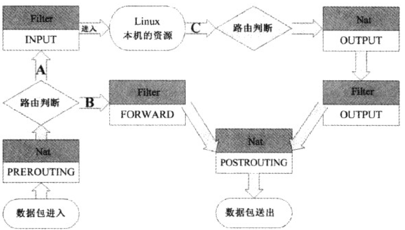
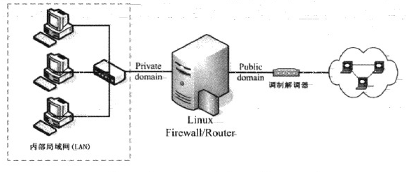
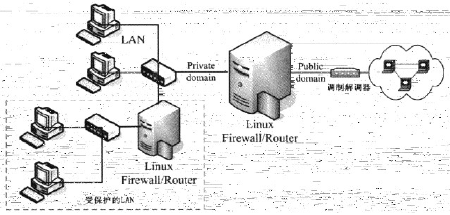
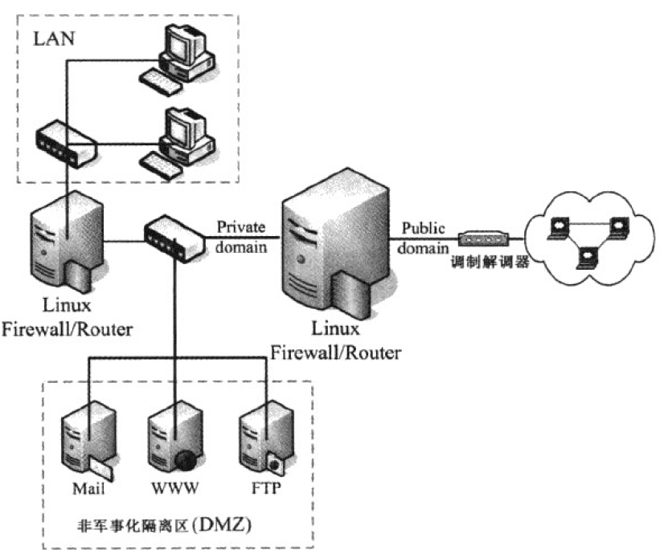

# 网络安全

## 网络传输流程

当一个安全配置的服务器要接收外来数据时,可以分为以下阶段:

- **防火墙的分析**

  Linux系统内建防火墙机制,因此首先连接要通过防火墙.

- **服务的基本功能**

  在应用层面来看,某些软件带有控制访问功能.例如httpd.conf配置文件内可以规定某些IP来源不能使用httpd这个服务来取得主机的数据.

- **SELinux对网络服务的权限控制**

  为了避免前一个步骤的权限误用,或者是程序有问题所造成的安全问题,SELinux可以针对网络服务的权限设置一些规则,让程序能够拥有的功能有限.这样即使httpd真的被攻击取得root的使用权,所能操作的范围也被控制在/var/www/html里面,无法对系统造成进一步威胁.

- **使用主机的文件系统资源**

  主要是文件系统的权限设置,如果文件权限错误,用户依然可能无法获得网页数据.


## 常见攻击手段

下面介绍一些常见的攻击手法及防范措施:

- **暴力破解密码**

  假如别人知道了你的主机地址,可以利用端口扫描工具(如NMAP)来扫描主机,得出主机上面运行的服务,例如邮箱服务.接下来使用脚本来尝试惯用管理员账号如admin的密码,通过密码字典就能破解一些简单密码,取得管理权限.

  不过现在很多软件都有密码输入次数限制,连续输入错误到一定次数,会限制攻击者访问.此时攻击者可以用代理池来更换IP地址继续破解,不过耗时耗力,所以现在比较少见了.

  对于此类攻击,设置一个不易破解的密码最重要.其次可以设定密码修改策略,提高密码破解难度.

- **利用程序漏洞主动攻击**

  程序Bug可能造成安全问题,导致系统权限被攻击者掌握.由于程序问题被公开后,网上会出现针对漏洞的攻击程序代码,很容易被别有用心的人拿来使用,因此这类攻击比较常见.

  针对解决方法也很简单:保持系统更新,关闭掉不需要的软件和服务即可.

- **利用社会工程学欺骗**

  社会工程学欺骗方式很多,有些甚至完全不需要懂电脑技术,例如通过邮件和仿制网站钓鱼,来骗取用户账号密码.

  只要记住不要随便透露账号密码信息,多留意下网站网址或交流对象身份即可.

- **利用程序功能的被动攻击**

  在一些利用浏览器漏洞的网站上,只是打开页面就能运行网站上插入的恶意代码,进而使主机遭受攻击.

  作为应对,记得更新浏览器和设置好不要自动下载运行文件.

- **蠕虫和木马的Rootkit**

  蠕虫会让主机一直发送数据包向外攻击.木马则是在主机中开启一个后面(端口),来进一步控制主机.

  Rootkit是指可以取得root权限的一群工具组,主要也是通过主机的程序漏洞进行攻击.很多Rootkit本身就是蠕虫或木马,主要通过下载安装带有Rootkit的软件来传播,一旦被绑架非常不好追踪与去除.

  作为防范最重要的一点是别下载安装来路不明的程序,另外可以安装防范扫描Rootkit的软件,确保万无一失.

- **DDoS攻击**

  DDoS(Distributed Denial of Service)叫分布式拒绝攻击,通过分散在世界各地的僵尸计算机进行高频率的请求,从而让正常请求无法处理.

  最常见的是SYN Flood攻击法,发送带有SYN的TCP数据包请求连接,但将服务器的回复确认数据包丢弃,造成服务器一直处于等待状态.一旦此类数据包过多,服务器的端口被占用完毕,便不能继续提供服务了.

  现在的云服务商和CDN服务商都有一定的抵御DDoS攻击能力,会自动阻断不正常的请求和流量,因此可以按需要购买.

总之完善好防火墙规则,自动更新软件与定时检查日志,是应对网络攻击最基础的工作.


## IPv4的内核管理功能

在/proc/sys/net/ipv4/目录中还有不少内核的网络功能设置,可以通过置1开启.如果要开机启动可以将值写入到/etc/sysctl.conf文件中.并运行sysctl -p.

### tcp_syncookies

SYN Cookie模块可以用来抵御DoS攻击,在系统用来启动随机连接的端口(1024~65535)即将用完时会自动启动.

当启动SYN Cookie时,主机在发送SYN/ACK确认数据包前,会要求客户端在短时间内回复一个序号,这个序号包含许多原SYN数据包内的信息,包括IP和端口等.若客户端可以回复正确序号,主机就确认数据包可信,并发送SYN/ACK数据包.否则抛弃数据包.

这个设置值由于违反TCP的三次握手规定,所以可能造成某些服务的延迟现象,例如SMTP.因此不适合用在负载已经很高的服务器内,因为负载太高的主机有时会让内核误判遭受SYN Flooding的攻击.

### icmp_echo_ignore

使用大量大尺寸ping包送往服务器,可造成服务器带宽满载或失去响应,这种攻击方式被称为ping flooding和ping of death.

可以通过防火墙取消ICMP类型8的ICMP数据包回应,也可以调整内核参数来取消ICMP回应.设置文件有两个icmp_echo_ignore_all拒绝所有ping回应,icamp_echo_ignore_broadcasts仅有ping broadcast地址时才取消ping回应.

### conf/*/

网口配置目录下面有一些参数设置:

- rp_filter: 称为逆向路径过滤(Reverse Path Filtering),可以通过分析网口的路由信息,配合数据包的来源地址,来分析数据包是否合理.
- log_martians: 启动记录不合法的IP来源功能,例如来自127.0.0.0或192.168.0.0的IP不应该应用于互联网.记录写到/var/log/messages日志文件中.
- accept_source_route: 允许来源路由.一般不设置.
- accept_redirects: 允许实体网络内不同IP网段不通过路由器传递信息.不建议开启.
- send_redirects: 与上一个类似,此值为发送一个ICMP redirect数据包.不建议开启.


## 访问控制列表

访问控制列表(TCP Wrappers)通过服务器程序的外挂(tcpd)来处置.这种机制主要分析服务器程序来管理.系统会检查/etc/hosts.allow与/etc/hosts.deny的配置,来过滤某些IP与端口.

并非所有软件都可以通过配置文件管理,只有Super Daemon(Xinetd)所管理的服务和支持Libwrap.so模块的服务才能使用访问控制列表.

对于allow和deny文件的优先规则如下:

- 先以/etc/hosts.allow进行对比,符合规则的放行.
- 再以/etc/hosts.deny进行对比,符合规则的阻挡.
- 若不在这两个文件内,则予以放行.

例如定义rsync可以让局域网192.168.1.0/24和10.1.1.2使用,其他来源不允许使用rsync.修改配置文件:

```sh
[root@server1 ~]# vi /etc/hosts.allow
ALL: 127.0.0.1
rsync: 192.168.1.0/255.255.255.0 10.1.1.2
[root@server1 ~]# vi /etc/hosts.deny 
rsync: ALL
```


## 防火墙

防火墙就是通过定义一些有序规则,并管理进入到网络内的主机数据包的一种机制.只要能够分析与过滤进出管理的网络数据包的数据,就可以称为防火墙.防火墙最大的功能就是限制某些服务的访问来源.

网络数据包一般有四个基本信息,就是来源与目标的IP与端口.防火墙即对数据包报头进行分析,根据设定的规则来对数据包进行放行或丢弃.防火墙在OSI七层协议中具体作用如下:

- 第二层: 可以针对来源与目标的MAC进行阻挡.
- 第三层: 主要针对来源与目标的IP,以及ICMP的类别进行阻挡.
- 第四层: 针对TCP/UDP的端口进行阻挡,也可以针对TCP的状态来处理.

防火墙又分为硬件和软件防火墙.硬件防火墙是由厂商设计好的主机硬件,硬件操作系统主要以提供数据包数据的过滤机制为主,并将其他不必要的功能拿掉.而软件防火墙本身就是保护系统网络安全的一套软件.


## 数据包过滤防火墙

所谓数据包过滤(IP Filtering或Net Filter),就是分析进入主机的网络数据包,将包头数据提取出来进行分析,以决定该连接为放行或阻止的机制.数据包过滤防火墙简单地说就是iptables或firewall提供的防火墙功能,它主要分析OSI的第2到4层,控制MAC, IP, ICMP, TCP和UDP的端口与状态(SYN,ACK等).

防火墙由Linux内核所处理,因此性能非常好.根据内核不同所用防火墙软件不一样:

- Version 2.0: 使用ipfwadm防火墙
- Version 2.2: 使用ipchains防火墙
- Version 2.4 or 2.6: 使用iptables防火墙

这里主要以iptables为主.

### 规则顺序

防火墙规则有顺序关系,数据包会按照规则定义顺序一条条对比.如果匹配到一条规则会执行后面定义的动作,并忽略之后的规则.如果没有匹配的规则,则使用默认策略决定数据包的去向.

### 表与链

防火墙中可以定义多个表格(Table),每个表格都定义出自己的默认策略和规则(链Chain),以用于不同用途.默认情况下分三个功能的表: 管理本机进出的Filter,管理后端主机(防火墙内部机器)的NAT,管理特殊标志使用的Mangle.

- **Filter**(过滤器)

  主要与进入Linux本机的数据包有关,是默认的table.

  - INPUT: 与本机数据包接受有关.
  - OUTPUT: 与本机数据包发送有关.
  - FORWARD: 与本机无关,可以传递数据包到后端主机中,与NAT的table相关性较高.

- **NAT**(地址转换)

  NAT是Network Address Translation的缩写,主要用来进行源与目标地址和端口的转换.

  - PREROUTING: 在进行路由判断之前所要进行的规则(DNAT/REDIRECT).
  - POSTROUTING: 在进行路由判断之后所要进行的规则(SNAT/MASQUERADE).
  - INPUT: 与接受数据包有关.
  - OUTPUT: 与发送数据包有关.

- **Mangle**(破坏者)

  与特殊的数据包的路由标志有关,较少使用.

各表的相关性如下图所示:



从上图可以看出iptables可以控制三种数据包流向:

- 路径A: 数据包进入Linux主机使用资源.在路由判断后确定是向Linux主机请求的数据包,主机通过Filter的INPUT链来进行控制.
- 路径B: 数据包通过Linux主机转发,没有使用主机资源,目标是后端主机.在路由判断之前进行数据包报头修订后,发现数据包目标地址是防火墙后端主机,数据包通过路径B移动.主要经过的链是Filter的FORWARD以及NAT的POSTROUTING,PREROUTING.
- 路径C: 数据包由Linux本机发出,可能是响应客户端要求,或者主动发送的数据包.先通过路由判断决定输出路径后,再通过Filter的OUTPUT链来传送,最后经过NAT的POSTROUTING链.

### 规则查询

防火墙查询与设置都使用iptables命令,命令格式为: `iptables [-t tables] [-L] [-nv]`

和规则查询有关的选项如下:

| 选项 | 说明                                                  |
| ---- | ----------------------------------------------------- |
| -t   | 后面接tables,例如nat或filter.不带此参数默认查询filter |
| -L   | 列出目前的table的规则                                 |
| -n   | 不解析IP对应主机名                                    |
| -v   | 列出详细信息,包括数据包传输状态,相关网口等.           |

例如查询nat table中4条链的规则:

```sh
[root@server1 ~]# iptables -t nat -L -n
Chain PREROUTING (policy ACCEPT)
target     prot opt source               destination         

Chain INPUT (policy ACCEPT)
target     prot opt source               destination         

Chain OUTPUT (policy ACCEPT)
target     prot opt source               destination         

Chain POSTROUTING (policy ACCEPT)
target     prot opt source               destination  
```

其中policy就是默认策略,其他项目解释如下:

- target: 代表进行的操作:ACCEPT允许,REJECT拒绝,DROP丢弃.
- prot: 代表使用的数据包协议: TCP, UDP, ICMP.
- opt: 额外的选项说明.
- source: 规则匹配来源IP.
- destination: 规则匹配目标IP.

可以使用iptables-save命令来查询完整规则:

```sh
[root@server1 ~]# iptables-save -t filter
# Generated by iptables-save v1.4.21 on Fri Oct  8 23:48:44 2021
*filter
:INPUT ACCEPT [2470:186319]
:FORWARD ACCEPT [0:0]
:OUTPUT ACCEPT [1687:123767]
COMMIT
# Completed on Fri Oct  8 23:48:44 2021
```

其中星号*开头的是表格,冒号:开头的是链.

### 清空规则

清除规则使用的命令格式: `iptables [-t table] [-FXZ]`

选项说明:

| 选项 | 说明                         |
| ---- | ---------------------------- |
| -F   | 清除所有已定制规则           |
| -X   | 清除所有用户自定义的tables   |
| -Z   | 将所有链的计数与流量统计归零 |

例如清掉所有filter table的规则,但不改变默认策略:

```sh
[root@server1 ~]# iptables -F;iptables -X;iptables -Z
```

### 定义默认策略

定义默认策略(Policy)使用命令: `iptables [-t table] -P [INPUT, OUTPUT, FORWARD] [ACCEPT, DROP]`

例如将本机的INPUT设置为DROP,其他设置为ACCEPT:

```sh
[root@server1 ~]# iptables -P INPUT DROP
[root@server1 ~]# iptables -P OUTPUT ACCEPT
[root@server1 ~]# iptables -P FORWARD ACCEPT
[root@server1 ~]# iptables-save
```

### 自定义规则

使用iptables自定义规则语法如下: 

`iptables [-AI 链名] [-io 网口] [-p 协议] [-s 源地址] [--sport 端口范围] [-d 目标地址] [--dport 端口范围] -j [ACCEPT|DROP|REJECT|LOG]`

选项说明:

| 选项    | 说明                                                   |
| ------- | ------------------------------------------------------ |
| -A      | 在链的最后新增一条规则.                                |
| -I      | 插入一条规则,默认在链最前面插入.                       |
| -i      | 数据包接收的网口,例如eth0.需要与INPUT链配合.           |
| -o      | 数据包发送的网口,需要与OUTPUT链配合.                   |
| -p      | 设置规则适用的数据包格式,例如tcp,udp,icmp,all          |
| -s      | 来源IP/网络,可以指定具体IP或网段                       |
| -d      | 目标IP/网络,例如192.168.1.104或192.168.1.0/24          |
| --sport | 限制来源端口号码,可以设置连续端口,例如1055:1100        |
| --dport | 限制目标端口号码,针对端口操作需要与-p参数配合才能成功. |
| -j      | 后面接针对数据包的操作                                 |

例如将lo口设置为受信任设备,不管数据包来源与目标,只要来自lo口都予以接受:

```sh
[root@server1 ~]# iptables -A INPUT -i lo -j ACCEPT
[root@server1 ~]# iptables -L -nv
Chain INPUT (policy ACCEPT 86 packets, 7740 bytes)
 pkts bytes target     prot opt in     out     source               destination         
   12   702 ACCEPT     all  --  lo     *       0.0.0.0/0            0.0.0.0/0  
```

上面命令没有指定-s和-d参数,则默认代表该项目完全接受.

设置接受来源192.168.2.234的包,拒绝192.168.2.230的包:

```sh
[root@server2 ~]# iptables -A INPUT -i ens33 -s 192.168.2.234 -j ACCEPT
[root@server2 ~]# iptables -A INPUT -i ens33 -s 192.168.2.230 -j DROP
[root@server2 ~]# iptables-save 
# Generated by iptables-save v1.4.21 on Sat Oct  9 00:58:26 2021
*filter
:INPUT ACCEPT [74:6754]
:FORWARD ACCEPT [0:0]
:OUTPUT ACCEPT [33:3160]
-A INPUT -s 192.168.2.234/32 -i ens33 -j ACCEPT
-A INPUT -s 192.168.2.230/32 -i ens33 -j DROP
COMMIT
# Completed on Sat Oct  9 00:58:26 2021
```

设置屏蔽本机端口2021:

```sh
[root@server2 ~]# iptables -A INPUT -i ens33 -p tcp --dport 2021 -j DROP
```

屏蔽10000~20000端口带syn标记的TCP数据包:

```sh
[root@server2 ~]# iptables -A INPUT -i ens33 -p tcp --sport 10000:20000 --dport 10000:20000 --syn -j DROP
```

### 删除规则

删除规则使用命令:`iptables [-t table] -D [chain] line-numbers`

首先需要获取规则在表链中的序号:

```sh
[root@server2 ~]# iptables -L -t nat --line-numbers
Chain PREROUTING (policy ACCEPT)
num  target     prot opt source            destination         
1    REDIRECT   tcp  --  10.1.1.0/24       anywhere     tcp dpt:http redir ports 3128
```

然后用行号删除指定规则:

```sh
[root@server2 ~]# iptables -t nat -D PREROUTING 1
```

### 外挂模块

在早前版本的防火墙中,需要分别在INPUT和OUTPUT链中添加规则才能实现双向通信,这样表会变得相当冗长.现在的iptables可以通过一个状态模块来分析数据包是否为响应包,是的话直接放行.这样就不用考虑向INPUT链添加对应规则了.

加载模块使用-m参数,常用的有mac和state模块.指定-m state模块后可以使用--state接数据包状态:

| 状态        | 说明                                |
| ----------- | ----------------------------------- |
| INVALID     | 无效数据包,例如数据破损的数据包状态 |
| ESTABLISHED | 已经连接成功的连接状态              |
| NEW         | 想要新建立连接的数据包状态          |
| RELATED     | 表示数据包与发送出去的数据包有关    |

例如设置只要已建立连接或已发出请求相关的数据包就予以通过:

```sh
[root@server2 ~]# iptables -A INPUT -m state --state RELATED,ESTABLISHED -j ACCEPT
```

针对局域网内网卡MAC地址进行限制:

```sh
[root@server2 ~]# iptables -A INPUT -m mac --mac-source aa:bb:cc:dd:ee:ff -j ACCEPT 
```


## NAT服务器

网络地址转换是通过iptables修改IP数据包报头数据中来源或目标IP地址和端口.在NAT table中的链POSTROUTING用来修改源IP,链PREROUTING用来修改目标IP.

NAT有两种,来源NAT(SNAT, Source NAT)针对局域网访问互联网,目标NAT(DNAT, Destination NAT)针对局域网内服务器服务互联网.

### SNAT

当内网主机通过nat服务器发送互联网请求包时,POSTROUTING链将数据包报头来源的内网IP替换成nat服务器的外网IP,记录数据包序号和转换的IP地址信息后,将数据包发送出去.

当数据包返回通过nat服务器时,iptables会分析数据包的序号.如发现序号有记录,PREROUTING链会将目标IP替换成对应的内网IP,并转发给对应主机.

例如将内部10.1.1.0/24网段的IP伪装成外网口ens37的IP:

```sh
[root@server2 iptables]# iptables -t nat -A POSTROUTING -s 10.1.1.0/24 -o ens37 -j MASQUERADE
```

也可以指定多个对外IP轮流使用:

```sh
[root@server2 iptables]# iptables -t nat -A POSTROUTING -o ens37 -j SNAT --to-source 192.168.2.230-192.168.2.240
```

### DNAT

当内网中有提供HTTP服务的服务器时,必须通过nat服务器映射端口,也就是将自身80端口与nat服务器80端口绑定.nat服务器接收到客户端发送的HTTP请求数据包后,PREROUTING链会将目标IP替换成内网HTTP服务器IP并发送给它.

当内网HTTP服务器回应数据包通过nat服务器时,通过POSTROUTING链将源IP替换成nat服务器外网IP,并发送出去.

例如将内网http服务器10.1.1.2的端口指向外网端口ens33:

```sh
[root@server2 ~]# iptables -t nat -A PREROUTING -i ens33 -p tcp --dport 80 -j DNAT --to-destination 10.1.1.2:80
```

也可以将本机的8080端口转发到80端口:

```sh
[root@server1 ~]# iptables -t nat -A PREROUTING -p tcp --dport 8080 -j REDIRECT --to-ports 80
```


## 防火墙配置

常见的防火墙与网络布线配置有下面几种:

### 客户端防火墙

当Linux主机作为客户端且不提供网络服务时,基本防火墙设置如下:

- 规则归零: 清除所有已存在的规则;
- 默认策略: 除了将INPUT设为DROP外,其他默认ACCEPT;
- 信任本机: 由于lo对本机来说很重要,因此必须设置为信任设备;
- 回应数据包: 让本机通过主动向外发出请求而响应的数据包可以进入本机;
- 信任用户: 可在想要让本地网络的来源使用主机资源时设置.

可以将防火墙规则写入脚本中:

```sh
#!/bin/bash

# 1.清除规则
iptables -F
iptables -X
iptables -Z

# 2.设置默认策略
iptables -P INPUT DROP
iptables -P OUTPUT ACCEPT
iptables -P FORWARD ACCEPT

# 3.定制各项规则
iptables -A INPUT -i ens37 -s 192.168.2.101 -j ACCEPT
iptables -A INPUT -i lo -j ACCEPT
iptables -A INPUT -i ens37 -m state --state RELATED,ESTABLISHED -j ACCEPT

# 4.保存配置
iptables-save
```

### 单一网络防火墙

防火墙至少有两个接口,将可信任的内部局域网与不可信任的外部因特网分开,由防火墙全权掌控到局域网内的所有数据包.



假设上面的Linux服务器作为防火墙和内部LAN的路由器使用,配置如下:

- 对外网口ens33,IP配置192.168.2.254/24,网关192.168.2.1.
- 对内网口ens37,IP配置10.1.1.1/24.
- 默认开放HTTP,HTTPS,SSH端口.

针对防火墙的脚本内容如下:

```sh
[root@server2 iptables]# vi iptables.rules
#!/bin/bash

# 定义参数
OUTIF='ens33'
INIF='ens37'
INNET='10.1.1.0/24'
export OUTIF INIF INNET

# 针对互联网卡设置###################
# 1.设置内核参数
echo "1" >/proc/sys/net/ipv4/tcp_syncookies
echo "1" >/proc/sys/net/ipv4/icmp_echo_ignore_broadcasts
for i in /proc/sys/net/ipv4/conf/*/{rp_filter,log_martians}; do
    echo "1" >$i
done
for i in /proc/sys/net/ipv4/conf/*/{accept_source_route,accept_redirects,send_redirects}; do
    echo "0" >$i
done

# 2.清除规则,设置默认策略及开放lo与相关设置值
iptables -F
iptables -X
iptables -Z
iptables -P INPUT DROP
iptables -P OUTPUT ACCEPT
iptables -P FORWARD ACCEPT
iptables -A INPUT -i lo -j ACCEPT
iptables -A INPUT -m state --state RELATED,ESTABLISHED -j ACCEPT

# 3.启动额外的防火墙script模块
if [ -f /root/iptables/iptables.deny ]; then
    sh /root/iptables/iptables.deny
fi
if [ -f /root/iptables/iptables.allow ]; then
    sh /root/iptables/iptables.allow
fi
if [ -f /root/iptables/iptables.http ]; then
    sh /root/iptables/iptables.http
fi

# 4.允许某些类型的ICMP数据包进入
AICMP="0 3 3/4 4 11 12 14 16 18"
for x in $AICMP; do
    iptables -A INPUT -i $OUTIF -p icmp --icmp-type $x -j ACCEPT
done

# 5.允许某些服务的进入
iptables -A INPUT -p TCP -i $OUTIF --dport 21 --sport 1:65534 -j ACCEPT  # FTP
iptables -A INPUT -p TCP -i $OUTIF --dport 22 --sport 1:65534 -j ACCEPT  # SSH
iptables -A INPUT -p TCP -i $OUTIF --dport 25 --sport 1:65534 -j ACCEPT  # SMTP
iptables -A INPUT -p TCP -i $OUTIF --dport 53 --sport 1:65534 -j ACCEPT  # DNS
iptables -A INPUT -p UDP -i $OUTIF --dport 53 --sport 1:65534 -j ACCEPT  # DNS
iptables -A INPUT -p TCP -i $OUTIF --dport 80 --sport 1:65534 -j ACCEPT  # HTTP
iptables -A INPUT -p TCP -i $OUTIF --dport 110 --sport 1:65534 -j ACCEPT # POP3
iptables -A INPUT -p TCP -i $OUTIF --dport 443 --sport 1:65534 -j ACCEPT # HTTPS

# 针对局域网网卡设置####################
# 1.先加载一些有用的模块
modules="ip_tables iptable_nat ip_nat_ftp ip_nat_irc ip_conntrack ip_conntrack_ftp ip_conntrack_irc"
for mod in $modules; do
    testmod=$(lsmod | grep "^${mod} " | awk '{print $1}')
    if [ "$testmod" == "" ]; then
        modprobe $mod
    fi
done

# 2.清除NAT table的规则
iptables -F -t nat
iptables -X -t nat
iptables -Z -t nat
iptables -t nat -P PREROUTING ACCEPT
iptables -t nat -P POSTROUTING ACCEPT
iptables -t nat -P OUTPUT ACCEPT

# 3.开启内网SNAT
if [ "$INIF" != "" ]; then
    iptables -A INPUT -i $INIF -j ACCEPT
    echo "1" >/proc/sys/net/ipv4/ip_forward
    if [ "$INNET" != "" ]; then
        iptables -t nat -A POSTROUTING -s $INNET -o $OUTIF -j MASQUERADE
    fi
fi

# 4. NAT服务器内局域网中服务器端口转发
iptables -t nat -A PREROUTING -p tcp -i $OUTIF --dport 80 -j DNAT --to-destination 192.168.2.234:80

# 5. 保存规则
iptables-save
```

在/root/iptables目录下可以填写额外规则:

```sh
[root@server2 iptables]# vi iptables.allow
#!/bin/bash
iptables -A INPUT -i $OUTIF -s 192.168.2.0/24 -j ACCEPT
[root@server2 iptables]# vi iptables.deny
#!/bin/bash
iptables -A INPUT -i $OUTIF -s 192.168.2.230 -j DROP
[root@server2 iptables]# chmod 700 iptables.*
```

可以将脚本写入/etc/rc.d/rc.local文件中来开机执行:

```sh
[root@server2 iptables]# vi /etc/rc.d/rc.local
/root/iptables/iptables.rules
```

### 内网防火墙

一般防火墙对局域网内防备不会很严格,如果局域网内有高度机密的子网,可以增设防火墙保护.



### 网络服务器防火墙

如果有架设对外提供网络服务的服务器,可以将服务器放在两台防火墙中间,这样可使服务器免于内部和外部网络的攻击.服务器所在区域也被称为非军事化隔离区(DMZ).




